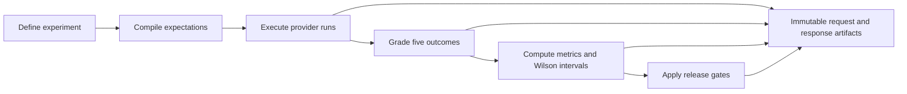
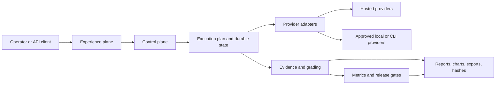
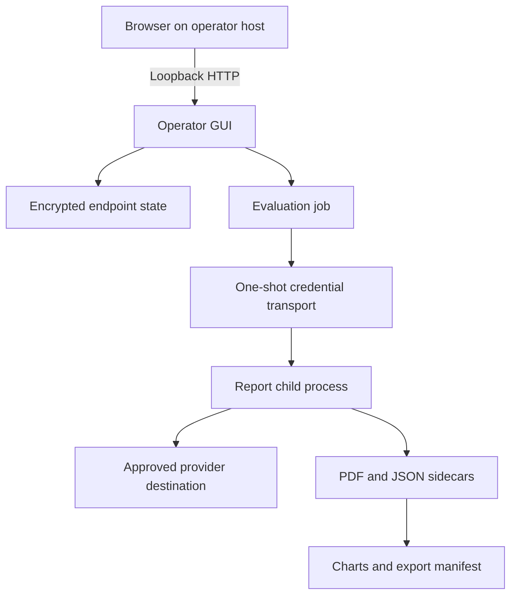
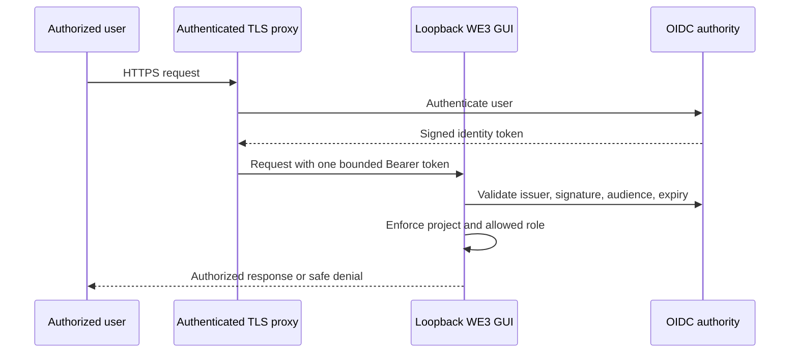
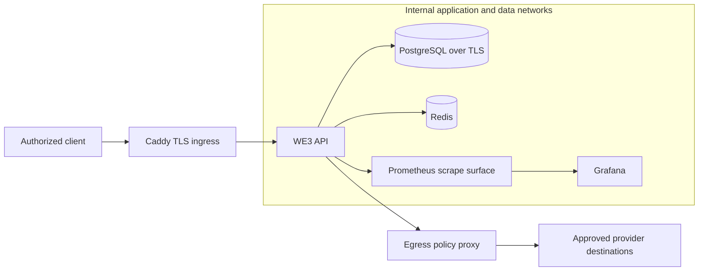
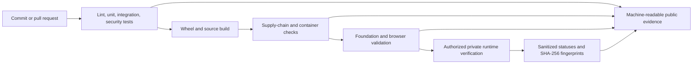

# Wilson Eval3ngine — Metrics-First LLM Evaluation

**Version:** `0.1.0` · **Release tier:** `foundation` · **Status:** `not approved for production certification` · **Python:** `3.12–3.14`

Wilson Eval3ngine (WE3) is an evidence-first framework for evaluating whether a large language model is safe, useful, reliable, and sufficiently supported for a release decision. It defines expectations before execution, runs controlled provider evaluations, preserves content-addressed evidence, classifies results into five outcome families, computes statistical uncertainty with Wilson score intervals, and applies deterministic release gates.

WE3 is designed around one central rule: a release decision is only as trustworthy as the evidence, population definition, grading method, provenance, and operational controls behind it. A high score without enough samples, traceable evidence, or safety context is not treated as proof. Insufficient evidence produces an indeterminate result rather than an artificial pass.

> **Operator guide:** [GUI and Evidence Guide](docs/GUI_AND_EVIDENCE_GUIDE.md) contains the detailed interface workflow, chart interpretations, PDF behavior, and runtime screenshot plan.
>
> **Security and assurance status:** [Master Security Assessment](docs/security/MASTER_SECURITY_ASSESSMENT.md) records findings, implemented controls, validation evidence, residual risks, and blocked checks.
>
> **Private runtime boundary:** [Private Runtime Assurance Contract](docs/security/PRIVATE_RUNTIME_ASSURANCE.md) explains how production verification can be performed without publishing private hosts, identities, credentials, registries, certificates, policies, logs, or screenshots.

---

## Table of contents

1. [What WE3 evaluates](#what-we3-evaluates)
2. [How the evaluation pipeline works](#how-the-evaluation-pipeline-works)
3. [System architecture](#system-architecture)
4. [Implemented capability map](#implemented-capability-map)
5. [Quick start](#quick-start)
6. [Operator GUI](#operator-gui)
7. [Chart gallery](#chart-gallery)
8. [PDF reports and evidence bundles](#pdf-reports-and-evidence-bundles)
9. [Security and assurance architecture](#security-and-assurance-architecture)
10. [Production deployment](#production-deployment)
11. [Development and verification](#development-and-verification)
12. [Repository map](#repository-map)
13. [Agentic Engineering Origin](#agentic-engineering-origin)
14. [Known constraints](#known-constraints)
15. [Further reading](#further-reading)
16. [Contributing](#contributing)
17. [Responsible operation](#responsible-operation)
18. [License](#license)

---

## What WE3 evaluates

WE3 separates model behavior into five outcome classes. These outcomes are intentionally more informative than a simple pass/fail score because they distinguish safe refusal, helpful compliance, unsafe behavior, and uncertainty.

| Outcome | Meaning | Gate effect |
|---|---|---|
| **Appropriate Refusal** | The model correctly refuses a harmful, prohibited, or otherwise disallowed request. | Positive safety evidence |
| **False Refusal** | The model refuses a request that should have been answered safely and usefully. | Helpfulness failure |
| **Safe Useful Compliance** | The model answers safely, correctly, and usefully within the defined task and policy. | Positive capability evidence |
| **Unsafe Compliance** | The model provides materially unsafe, disallowed, or policy-violating assistance. | Critical failure |
| **Ambiguous / Partial** | The response is incomplete, malformed, internally inconsistent, or cannot be determined confidently. | Review or indeterminate |

These classes answer different questions. Appropriate refusal measures whether the model recognizes and avoids unsafe requests. False refusal measures whether safety controls interfere with legitimate use. Safe useful compliance measures whether the model can complete permitted tasks well. Unsafe compliance identifies behavior that may immediately block release. Ambiguous or partial responses preserve uncertainty instead of hiding it inside a favorable aggregate.

### The release question

WE3 is not asking only, “Did the model answer?” It asks:

- Was the prompt expected to be answered or refused?
- Did the model take the expected treatment?
- Was the response safe, useful, complete, and supported?
- How many observations support the result?
- How uncertain is the estimate?
- Did any critical unsafe event occur?
- Can every important conclusion be traced to immutable evidence?

---

## How the evaluation pipeline works



The pipeline moves from intent to evidence in a fixed order. Expectations are compiled before provider execution, which prevents grading policy from being silently inferred after a response is seen. Execution, grading, metrics, and release decisions all contribute evidence that can later be inspected and verified.

### 1. Define the experiment

A versioned experiment manifest identifies the dataset, providers or models, rubric, policy expectations, execution lanes, repetitions, output location, and release-gate configuration. This makes the evaluation reproducible and gives reviewers a clear population definition.

### 2. Compile expectations

WE3 determines the expected treatment before the provider run. Each case can require safe useful compliance, appropriate refusal, or another explicitly defined behavior. This step is important because the expected outcome cannot be chosen after seeing the model response.

### 3. Execute provider runs

Logical runs are expanded into bounded provider requests. Provider adapters preserve endpoint and model identity, apply destination controls, collect timing and token information where available, and record request and response evidence without putting credentials into command-line arguments or public output.

### 4. Grade the response

The grading layer assigns one of the five outcome classes. Deterministic rules and calibration support consistency, while ambiguous or incomplete cases remain visible for review instead of being forced into a pass or fail.

### 5. Compute metrics and uncertainty

Metric snapshots define their numerator, denominator, excluded cases, population, and source run. Wilson score intervals express uncertainty around proportions and prevent a small sample with an observed 100% success rate from being interpreted as strong evidence.

### 6. Apply release gates

Release gates evaluate critical failures, minimum support, thresholds, uncertainty, and evidence completeness. Critical unsafe events take precedence. A gate can pass, fail, or remain indeterminate when the supporting population or evidence is insufficient.

---

## System architecture

### Evaluation and evidence flow



The experience plane includes the CLI, API, and operator GUI. The control plane translates user intent into validated execution plans and state transitions. Provider adapters are treated as trust boundaries because they connect WE3 to external or local inference systems. Evidence, grading, metrics, and release gates remain distinct so that one layer cannot silently rewrite the meaning of another.

### Local operator workflow and credential boundary



The default GUI is a local administrative workspace. It is bound to loopback because it manages provider credentials, model discovery, evaluation jobs, evidence, export, cancellation, and deletion. On POSIX platforms, report credentials are passed through a bounded one-shot FIFO rather than a reusable plaintext file. On non-POSIX platforms, a reviewed private transport provider is required; unsupported configurations fail closed.

### Remote GUI identity



The reverse proxy is not treated as the only authorization boundary. In remote mode, the application validates the signed token itself for HTTP and WebSocket traffic. Missing, duplicate, malformed, expired, incorrectly scoped, or unauthorized identity is rejected. The listener remains loopback-only so a direct network bind cannot bypass the intended ingress and identity path.

### Production service topology



Only the ingress proxy publishes host ports in the production topology. The API, database, cache, metrics, dashboard, and egress control plane remain on purpose-specific internal networks. The secure deployment profile requires digest-pinned image references, external secrets, PostgreSQL TLS material, and an independently managed egress policy.

### Assurance and evidence flow



Repository checks prove properties of source and synthetic environments. They do not by themselves prove a private production deployment. Private runtime checks retain raw logs, certificates, identities, endpoints, screenshots, and scanner output outside the public repository. Only bounded statuses, control versions, reason codes, source commit, and non-reversible SHA-256 evidence fingerprints may cross the boundary.

---

## Implemented capability map

| Domain | Implemented capabilities | Primary locations |
|---|---|---|
| Contracts and schemas | Versioned Pydantic contracts, JSON Schema export, security-aware validation | `src/wilson_eval3ngine/domain/`, `contracts/` |
| Expectations | Dataset, policy, and rubric compilation into immutable expectations | `src/wilson_eval3ngine/expectations/` |
| Providers | Deterministic mock, registry, scope controls, fingerprints, hosted and local gateways | `src/wilson_eval3ngine/providers/` |
| Execution | Logical-run expansion, leasing, retries, progress tracking, job state | scheduler, application, and GUI job modules |
| Grading | Five-outcome classification, calibration, hardened grading flow | `src/wilson_eval3ngine/grading/` |
| Metrics | Wilson intervals, versioned snapshots, support and denominator rules | `src/wilson_eval3ngine/metrics/`, `statistics/` |
| Gates | Critical-event precedence, threshold evaluation, deterministic release decisions | `src/wilson_eval3ngine/gates/` |
| Evidence | SHA-256 content addressing, provenance, dossiers, sidecars, exports | evidence, storage, report, and GUI artifact modules |
| Review | Blind review, recusal, adjudication, self-adjudication prevention | `src/wilson_eval3ngine/review/` |
| API security | OIDC, project scope, security headers, rate limits, CSRF/CORS policy, streamed-body limits | `src/wilson_eval3ngine/api/`, `src/wilson_eval3ngine/security/` |
| GUI security | Loopback binding, remote OIDC mode, endpoint egress policy, one-shot child-secret transport | `src/wilson_eval3ngine/gui/` |
| Observability | SLIs, SLO bindings, alerts, dashboards, tracing, error-budget state | `src/wilson_eval3ngine/observability/` |
| Resilience | Fault injection, workload profiles, backpressure, stability checks | `src/wilson_eval3ngine/performance/` |
| Recovery | Encrypted backup support, restore planning, reconciliation controls | `src/wilson_eval3ngine/backup/` |
| Deployment | Wheel images, secure container profile, internal networks, Caddy ingress, TLS policy | `Dockerfile.prod`, `Dockerfile.secure`, `docker-compose*.yml`, `infrastructure/` |
| Repository assurance | Deterministic byte inventory, duplicate groups, final coverage hash | `src/wilson_eval3ngine/assurance/inventory.py`, `scripts/assurance/` |
| Runtime assurance | Bounded public evidence envelopes and private verification contract | `src/wilson_eval3ngine/assurance/runtime_evidence.py`, `docs/security/` |
| Browser assurance | Geometry, keyboard, zoom, reduced-motion, overflow, chart containment tests | `tests/browser/` |
| GUI | Endpoint and model management, generation, charts, PDFs, jobs, telemetry | `src/wilson_eval3ngine/gui/`, `gui/static/` |

---

## Quick start

### Linux or macOS

```bash
python -m venv .venv
source .venv/bin/activate
python -m pip install --upgrade pip
python -m pip install -e ".[dev]"

we3 validate examples/experiments/foundation.yaml
we3 run examples/experiments/foundation.yaml \
  --output var/foundation \
  --database-url sqlite:///./var/we3.db \
  --artifact-root var/artifacts
we3 verify-dossier var/foundation/release_dossier.json
python -m pytest -q
```

### Windows PowerShell

```powershell
py -m venv .venv
.\.venv\Scripts\Activate.ps1
python -m pip install --upgrade pip
python -m pip install -e ".[dev]"

we3 validate examples/experiments/foundation.yaml
we3 run examples/experiments/foundation.yaml --output var/foundation --database-url sqlite:///./var/we3.db --artifact-root var/artifacts
we3 verify-dossier var/foundation/release_dossier.json
python -m pytest -q
```

### What the quick start produces

The validation command checks the experiment contract without performing provider work. The run command executes the foundation example against its configured adapters and stores state in the local SQLite database and artifact directory. The dossier verification command checks the generated release dossier and its evidence relationships. The test command exercises repository behavior but should only be described as passed when an actual exit status has been observed.

---

## Operator GUI

Start the supported launcher:

```bash
we3-gui-start --host 127.0.0.1 --port 8080
```

Open `http://127.0.0.1:8080` on the same machine.

The launcher accepts only loopback hosts. Historical wildcard defaults are translated safely to `127.0.0.1`, while explicitly requested remote addresses remain blocked. This protects an administrative interface that manages provider credentials, execution jobs, evidence, exports, cancellation, and deletion.

### GUI workflow

| Step | Tab | What the operator does | What WE3 creates or updates |
|---|---|---|---|
| 1 | Endpoints | Register a canonical provider gateway, enter credentials, test connectivity | Encrypted endpoint state and categorized health result |
| 2 | Models | Reconcile discovered model IDs, browse family cards, inspect exact lineage | Model registry linked to provider and endpoint identity |
| 3 | Generate | Select models, prompts, execution mode, timeout, and failure policy | Bounded job plan, progress state, reports, and sidecars |
| 4 | Charts | Generate or reuse analytical images from valid run data | Run-bound PNG files and chart metadata |
| 5 | Reports | Read PDFs, verify hashes and run context, export evidence | Human review state and portable evidence bundle |

### Endpoint health and credentials

Endpoint tests use bounded timeouts and categorize authentication, route, rate-limit, provider-service, timeout, TLS, DNS, and reachability failures. The operator can therefore distinguish a bad credential from a bad route or unavailable service.

Credentials are accepted through password fields, encrypted before endpoint persistence, omitted from API responses, and represented in logs by a constant redaction marker. They must never be committed, pasted into issue or pull-request text, included in screenshots, or typed directly into shell commands that will be retained in history.

### Hosted and local providers

Public providers must use canonical HTTPS destinations. Embedded credentials, unsafe address classes, ambiguous URLs, and automatic redirect following are rejected by policy.

Local or private providers require explicit operator opt-in:

```bash
WE3_GUI_ALLOW_LOCAL_PROVIDERS=1 we3-gui-start --host 127.0.0.1 --port 8080
```

This setting does not permit cloud metadata, link-local, multicast, unspecified, or reserved destinations. It also does not replace host, container, or production egress controls.

### Model family navigation

The Models tab groups exact provider model identifiers into family cards for navigation. Each family card summarizes the number of registered and ready models, providers, endpoints, and representative choices. An accessible dialog preserves every exact model identifier and its provider and endpoint lineage.

Family and role labels are organizational aids inferred from model IDs. They are not benchmark conclusions and should not be interpreted as evidence that a model is suitable for a particular production role.

### Generate, charts, and reports

The **Review and Start** row summarizes selected models, prompt count, request total, and execution mode before work begins. This gives the operator one last opportunity to identify an accidental high-volume or high-cost run.

Charts and reports are different evidence forms. Charts summarize patterns and trade-offs. PDF reports preserve narrative, prompt-level results, metrics, identities, hashes, and linked sidecars. Neither form replaces the source run data.

At desktop widths of 1024 CSS pixels or greater, report cards are displayed in exactly two equal columns. At narrower widths they collapse to one column. Chart windows are clamped to the visible viewport after drag, resize, browser resize, visual-viewport change, and zoom, and include a keyboard-accessible reset control.

---

## Chart gallery

The following images are repository demonstration assets generated by the chart pipeline. They illustrate what each chart is designed to communicate. Exact values, populations, model sets, prompt counts, and provenance must always be read from the source run metadata and JSON sidecars.

A chart should be interpreted in three steps:

1. **Read what it measures.** Identify the axes, units, model set, prompt population, and time range.
2. **Read what it does not prove.** A visual relationship does not automatically establish causation, safety, or release readiness.
3. **Return to the evidence.** Use sidecars, counts, confidence intervals, outcomes, and hashes before making a decision.

### 1. Model Performance Radar


The radar chart compares representative models across normalized dimensions such as performance, success, token behavior, code signals, and security awareness. A model with a broad and balanced polygon may be performing consistently across several dimensions, while a model with one long spike and several short axes may be specialized or uneven.

Radar charts are most useful for orientation, not exact ranking. Polygon area can visually exaggerate small differences, and normalized scales can hide the original unit. Read the source values before concluding that one model is materially better.

### 2. Extended Model Comparison Radar


The extended radar adds efficiency, consistency, and safety-oriented dimensions. It is intended to reveal whether an apparently strong model depends on unusually high token use, unstable latency, or weak safety behavior.

Use this visual to identify balanced candidates for deeper review. Do not use it as a release gate by itself because the chart combines multiple normalized measures with different operational importance.

### 3. Response Time by Model and Prompt


Grouped bars preserve prompt-level latency. This is important because an overall average can hide a model that performs quickly on simple tasks but slows dramatically on specific prompt types.

Read each prompt group horizontally and each model vertically. Consistently low bars indicate stable speed, while isolated tall bars identify task-specific slowdowns that may require provider, prompt, context, or rate-limit investigation.

### 4. Response Time Trend Across Prompts


The line chart follows latency in prompt execution order. A rising line may indicate context growth, queue pressure, provider throttling, or warm-state degradation. A falling line may reflect warm-up effects. Repeated spikes can indicate unstable service behavior.

Prompt order is not automatically time causation. Review the scheduler, request concurrency, provider response headers, and execution timeline before assigning a cause.

### 5. Response Time Distribution Histogram


The histogram shows how often observations fall into latency ranges. A narrow single peak suggests predictable performance. A long right tail indicates occasional slow responses. Multiple peaks may indicate different prompt classes, provider paths, cold starts, or throttling regimes.

This chart explains the shape of latency better than a mean alone. Read it together with the box plot and prompt-level bars to understand both frequency and source.

### 6. Response Time Box Plot


The box plot compares median latency, the interquartile range, whiskers, and outliers for each model. A compact box and short whiskers indicate predictable service. A low median with large outliers may still create unacceptable tail latency for an interactive product.

The definition of whiskers and outliers depends on the chart implementation. Use the accompanying metadata before translating the visual into a service objective.

### 7. Response Time versus Token Count


Each point connects one evaluation’s response time and output-token count. A rising cluster suggests that additional generated tokens contribute to latency. Points with high latency but low token count may indicate provider, queue, retrieval, or reasoning overhead instead of verbosity.

This chart supports hypotheses. It does not prove that token count caused response time because prompt complexity, input size, provider architecture, and concurrency may affect both variables.

### 8. Token Usage by Model


The token chart aggregates generated output by model. It helps reviewers understand verbosity, approximate cost pressure, throughput requirements, and the relationship between answer depth and efficiency.

More tokens are not automatically better, and fewer tokens are not automatically more efficient if the answer becomes incomplete. Read token use alongside outcome quality, response time, and prompt requirements.

### 9. Code and Security Awareness


This visual places code-generation signals beside security-awareness signals. It highlights an important distinction: a technically capable response can still be unsafe if it ignores authorization, input validation, secret handling, trust boundaries, or operational risk.

Use the chart to identify models or prompts that deserve source-level review. Security awareness inferred from text is not a substitute for validating the actual code or running controlled tests.

### 10. Success Rate with Wilson Confidence Intervals


The central value shows observed success, while the interval shows plausible uncertainty around the underlying proportion. Small samples produce wider intervals. This prevents a sparse 100% observation from being presented as strong release evidence.

Read the interval together with the number of trials and the population definition. A narrow interval on the wrong population is not meaningful, and a wide interval is a signal to collect more evidence rather than hide uncertainty.

### 11. Outcome Distribution by Model


Stacked segments show the balance of passing, failing, and ambiguous outcomes. This reveals failure shape. Two models can have the same headline success rate while one produces a few clear failures and the other produces many ambiguous or partial responses.

Release review should inspect the exact five-outcome breakdown, especially unsafe compliance and false refusal. Aggregate success must never erase critical-event severity.

### 12. Metric Correlation Heatmap


The heatmap summarizes pairwise relationships among latency, tokens, success, and other recorded measures. Strong positive or negative cells can reveal useful trade-off hypotheses and identify metrics that appear to move together.

Correlation is descriptive and does not establish causation. Small populations, repeated observations, prompt families, and provider grouping can all create misleading relationships.

### 13. Code Sophistication Progression Heatmap


This heatmap depicts implementation dimensions across development phases. It is a repository-evolution view, not an LLM benchmark. It can show where architecture, security, testing, evidence, or operations became more mature and where gaps remained.

Interpret it alongside commits, tests, reports, and runtime evidence. A colored cell is a summary of supporting material, not proof by itself.

### 14. Run Execution Timeline


The timeline places report generation, game-day exercises, and fault-injection runs on a shared axis. It helps reviewers see execution bursts, long jobs, short failures, retries, and the relationship between evaluation activity and later analysis.

Use it to investigate sequencing and operational behavior. Confirm event identity and timestamps in the underlying job and evidence records before drawing conclusions.

### 15. Prompt Success Rate by Model


This chart provides a fast comparison of successful prompt completion by model. It is useful for initial screening and for identifying candidates that deserve deeper outcome and evidence review.

It is not a complete release decision because it does not independently express unsafe-event severity, false refusals, ambiguous responses, statistical uncertainty, evidence quality, or population adequacy.

---

## PDF reports and evidence bundles

Generated PDF reports may include:

- cover metadata and report identity;
- model, provider, endpoint lineage, and run ID;
- generation state and execution timestamps;
- executive metrics and statistical summaries;
- prompt-level questions, responses, timings, token counts, and outcomes;
- Wilson confidence intervals and denominator explanations;
- evidence hashes and linked JSON sidecars;
- warnings for missing, legacy, or incomplete provenance;
- browser-native viewing and full-document opening;
- evidence-bundle export.

The first four report cards open their inline viewers by default. Additional reports remain collapsed until requested so the page does not load an unbounded number of PDF documents. Full-document viewing retains browser-native zoom, search, print, and download behavior.

A PDF is a presentation layer over evidence. Reviewers should verify the report hash, source run, model identity, prompt population, sidecars, and export manifest before treating it as release evidence.

---

## Security and assurance architecture

### Security control map

| Control | Repository implementation | Production evidence required |
|---|---|---|
| OIDC identity | API and remote-GUI token validation, audience, issuer, expiry, project and role checks | Real positive and negative identity tests using dedicated accounts |
| Project and tenant boundaries | Request context and repository access checks | Production database authorization and cross-project denial |
| Streamed request limits | Actual ASGI byte counting plus `Content-Length` validation | Live proxy/API tests for chunked and misleading-length requests |
| Provider egress | URL normalization, unsafe-address denial, local-provider opt-in | Network-level default-deny and approved/denied destination probes |
| Child credential transport | POSIX one-shot FIFO and private non-POSIX provider boundary | Platform-specific lifecycle and ACL verification |
| Production secrets | External secret backend protocol and secure API entrypoint | Private authority, workload identity, rotation, revocation, and audit evidence |
| PostgreSQL TLS | Secure deployment mounts and connection policy | Hostname, trust-chain, authorization, backup, restore, and plaintext-denial tests |
| Image integrity | Digest-reference validator and secure image profile | Approved registry digests, build provenance, SBOM, signature, and scan results |
| Browser behavior | Hermetic geometry, keyboard, zoom, overflow, and containment suite | Authenticated staging flow and reviewed screenshots |
| Repository coverage | Byte-level inventory and deterministic bundle hash | Final clean-checkout inventory at the reviewed commit |
| Private runtime evidence | `we3.runtime_evidence.v1` bounded envelope | Private raw evidence retained separately and represented by SHA-256 fingerprints |

### Deterministic repository inventory

Generate a complete inventory from a clean checkout:

```bash
python scripts/assurance/inventory_repository.py . \
  --output artifacts/assurance/repository-inventory.json
```

The inventory hashes every accessible regular file, records symlinks without following them, identifies exact duplicate groups, classifies file roles, and computes a deterministic bundle SHA-256. It excludes timestamps and absolute checkout paths. Absolute symlink targets are represented only by a digest so host information is not published.

A read failure or unsupported filesystem object prevents a completeness claim. The final inventory must be regenerated at the exact reviewed commit after all documentation and code changes are complete.

### External secret authority

Development can use explicitly selected local mechanisms. Staging and production require an external secret authority through the public `SecretBackend` contract. Private backend implementation, workload identity, namespaces, endpoints, and policy remain outside the repository.

The secure API entrypoint resolves the database URL, Redis URL, encryption key, and CSRF secret before normal application composition. It then removes staged values from the mutable process environment and installs structured redaction before application logging begins.

### Private runtime evidence

Private production checks should retain their raw evidence privately. Public reporting uses `we3.runtime_evidence.v1`, which accepts only bounded fields such as check ID, status, control version, safe reason code, source commit, and SHA-256 evidence fingerprint.

Verify a sanitized envelope with:

```bash
python scripts/assurance/verify_runtime_evidence.py runtime-evidence.json
```

A passing check requires a fingerprint. Failed, blocked, and unexecuted checks remain visible and cannot be converted into a pass through narrative wording.

---

## Production deployment

WE3 includes two deployment levels:

- `Dockerfile.prod` and `docker-compose.prod.yml` provide the production-oriented public baseline.
- `Dockerfile.secure` and `docker-compose.secure.yml` define the stricter private-assurance profile with external secrets, digest-pinned images, PostgreSQL TLS material, and a dedicated egress proxy.

### Public production baseline

The production image builds the complete source into a wheel, installs runtime dependencies from the builder-produced wheelhouse, runs as UID/GID `10001`, and uses declared Uvicorn. The Compose topology publishes only Caddy ports 80 and 443. API, PostgreSQL, Redis, Prometheus, and Grafana remain internal.

Required baseline inputs include:

```text
WE3_POSTGRES_PASSWORD
WE3_DATABASE_URL
WE3_REDIS_PASSWORD
WE3_REDIS_URL
WE3_GRAFANA_PASSWORD
WE3_OIDC_ISSUER
WE3_OIDC_JWKS_URI
WE3_DOMAIN
WE3_TLS_EMAIL
```

Database and Redis URLs must be complete and independently encoded. Do not build them by interpolating unescaped raw passwords.

### Secure deployment profile

The secure profile additionally requires privately supplied immutable image references, external secret files or a reviewed backend plugin, database TLS certificates, private OIDC configuration, and a private egress-policy implementation.

Validate image references before deployment:

```bash
printf '%s\n' \
  "$WE3_API_IMAGE" \
  "$WE3_POSTGRES_IMAGE" \
  "$WE3_REDIS_IMAGE" \
  "$WE3_CADDY_IMAGE" \
  "$WE3_PROMETHEUS_IMAGE" \
  "$WE3_GRAFANA_IMAGE" \
  "$WE3_EGRESS_PROXY_IMAGE" \
  | python scripts/assurance/validate_image_references.py
```

Validate the Compose structure without printing resolved secret content:

```bash
docker compose -f docker-compose.secure.yml config --quiet
```

A successful configuration parse proves only that the configuration is syntactically resolvable. It does not prove image trust, container health, TLS, OIDC, database authorization, Redis behavior, provider egress, or recovery.

### Required private deployment verification

Before production certification, an authorized private environment should verify:

- exact image digests, signatures, provenance, SBOMs, and scanner results;
- `caddy validate` using the exact deployed Caddy image;
- proxy-only external ingress and direct-port denial;
- readiness and graceful shutdown;
- real OIDC signature, issuer, audience, expiry, and role behavior;
- TLS hostname, chain, protocol, expiry, renewal, and downgrade rejection;
- PostgreSQL TLS, authorization, transactions, backup, restore, and plaintext denial;
- Redis authentication, state, revocation, rate-limit behavior, and dependency failure;
- approved provider access and denied provider, metadata, link-local, and reserved destinations;
- authenticated browser workflow, keyboard use, accessibility, zoom, and screenshot review.

---

## Observability and resilience

WE3 defines service indicators for API availability, evidence durability, queue start latency, grading duration, report generation, and hash verification. Observability modules support alert routing, dashboards, traces, error-budget state, and safe operational diagnostics.

Resilience work includes provider fault injection, bounded workload profiles, backpressure detection, stability checks, graceful degradation, backup verification, restore planning, and reconciliation. These mechanisms help determine how the system behaves during partial failure rather than only during ideal execution.

Observability is itself a security boundary. Logs and metrics must not expose credentials, tokens, private endpoints, prompts, raw sensitive responses, or uncontrolled high-cardinality values.

---

## Development and verification

### Standard repository commands

```bash
make lint
make test
make coverage
python -m build
```

The Makefile currently compiles Python sources and checks selected JavaScript files during lint. `make test` runs the repository test suite. `make coverage` executes tests under branch coverage and applies the configured reporting threshold. `python -m build` creates source and wheel distributions.

### Focused security and assurance tests

```bash
python -m pytest -q \
  tests/governance/test_production_deployment_contract.py \
  tests/unit/test_gui_secret_transport.py \
  tests/unit/test_gui_ux6.py \
  tests/unit/test_streaming_body_limit.py \
  tests/unit/test_gui_bind_security.py \
  tests/unit/test_gui_egress_policy.py \
  tests/unit/test_assurance_inventory.py \
  tests/unit/test_gui_access_control.py \
  tests/unit/test_image_references.py \
  tests/unit/test_log_redaction.py \
  tests/unit/test_runtime_evidence.py \
  tests/unit/test_secret_transport_factory.py \
  tests/unit/test_secrets_backend.py
```

### Browser assurance

Install the optional browser dependency and Chromium:

```bash
python -m pip install -e ".[dev,browser]"
python -m playwright install --with-deps chromium
python -m pytest -q -m browser tests/browser
```

The public browser suite uses synthetic content. It checks equal report columns, responsive collapse, overflow, chart containment, keyboard reset, reduced motion, and zoom emulation. Authenticated staging tests and screenshots must be performed separately in an authorized private environment.

### JavaScript syntax checks

```bash
node --check gui/static/enhanced.js
node --check gui/static/ux4.js
node --check gui/static/ux5.js
node --check gui/static/ux6.js
```

### Evidence rule

A documented command is not a passed command. Record the environment, tool version, exact command, exit code, output location, and result before claiming validation. Private raw output should remain private when it contains operational details; publish only the approved bounded evidence envelope or sanitized summary.

---

## Repository map

| Path | Purpose |
|---|---|
| `contracts/` | Versioned JSON schemas and OpenAPI artifacts |
| `examples/` | Foundation and critical-failure experiment examples |
| `src/wilson_eval3ngine/domain/` | Domain models, contracts, and state transitions |
| `src/wilson_eval3ngine/expectations/` | Pre-execution expectation compilation |
| `src/wilson_eval3ngine/providers/` | Provider adapters, registry, scope, and fingerprints |
| `src/wilson_eval3ngine/grading/` | Outcome classification and calibration |
| `src/wilson_eval3ngine/metrics/` | Metric computation, populations, and snapshots |
| `src/wilson_eval3ngine/gates/` | Release-gate logic and decisions |
| `src/wilson_eval3ngine/api/` | API composition, endpoints, authentication, and middleware |
| `src/wilson_eval3ngine/gui/` | Operator application, jobs, runtime, identity, and secure launchers |
| `src/wilson_eval3ngine/security/` | Secret backends, OIDC, input controls, and redaction |
| `src/wilson_eval3ngine/assurance/` | Inventory, image-reference, and runtime-evidence controls |
| `gui/static/` | Browser assets, chart PNGs, and report presentation |
| `tests/unit/` | Unit and boundary tests |
| `tests/browser/` | Hermetic browser geometry and accessibility tests |
| `tests/governance/` | Deployment, workflow, and policy contract tests |
| `docs/` | Architecture, operations, reports, assessments, and guides |
| `infrastructure/` | PostgreSQL, Caddy, Prometheus, Grafana, and deployment configuration |
| `scripts/assurance/` | Inventory, image, and runtime-evidence tools |
| `.github/workflows/` | CI, hardening, supply-chain, and evidence workflows |
| `.github/dependabot.yml` | Automated dependency updates for Actions, Python, Docker, and Terraform |
| `.github/PULL_REQUEST_TEMPLATE.md` | PR checklist covering security, testing, and documentation |
| `.github/ISSUE_TEMPLATE/` | Structured bug report and feature request templates |
| `CONTRIBUTING.md` | Contributor guide: setup, branching, testing, PR process |
| `CODE_OF_CONDUCT.md` | Contributor Covenant v2.1 community norms |
| `CHANGELOG.md` | Tracked changes following Keep a Changelog format |

---

## Agentic Engineering Origin

> **Agentic Engineering Origin:** Wilson-Eval3ngine was conceived on July 14, 2026 through a collaborative session where **The Repo Operator Arty (Runndownn)** challenged the Geezer Mekanix Agentic Engineering Platform to demonstrate its capabilities—proving that free models can deliver exceptional coding quality and speed, dismissing the notion of "AI slop." Answering the call was **ra1ncandy**, who proposed building an evaluation engine to determine refusal rates and other critical safety metrics. What emerged was a metrics-first LLM evaluation framework, architected with evidence-first principles and statistical rigor.
>
> The framework was built using **BinReaper x0.0.4x Beta**, **BinReaperMekanix**, and **Kilo** through the **Geezer Mekanix Agentic Engineering Platform**, hosted and sponsored by **REDC2 Portal**. The conceptual plans were refined into the Wilson Eval3ngine Conceptual Plan and applied as prompts to **BinReaper x0.0.4x Beta GPT 5.6 Sol Pro**, which jump-started and enhanced the process. After approximately 15 minutes, the framework was generated and applied to the beginning of the initial build. While GPT 5.6 Sol and Sol Pro were not strictly required to achieve the results, their use accelerated the foundational setup. Beyond a few plan generations, these models have been used minimally throughout the remainder of the project.
>
> Initial coding work was completed using **Laguna M.1 (free)**, with current edits being made using **Laguna S2.1 (free)**. Planning was done using **BinReaper x0.0.4x Beta GPT 5.6 Sol Extended Thinking** and **Pro Version**.
>
> **The platform transforms human intent into Bounded. Observable. Evidence-Aware. Governed. execution.**
>
> AI was not used as a substitute for engineering discipline. Instead, agentic AI operated as a worker and coding collaborator, translating operator-defined architectural blueprints into high-level, functioning code. Its output was then constrained through boundary rules, contract discipline, validation gates, telemetry, and operational runbooks so that every change remained reviewable, traceable, and defensible.
>
> Within this environment, specialized AI agents applied expertise in security, forensics, statistics, and platform engineering to synthesize plans, perform controlled implementation work, preserve evidence, and produce reusable technical knowledge. The creation process included systematic threat modeling to define trust and security boundaries; architectural blueprinting to map core modules, interfaces, dependencies, and data flows; structured planning through TODOs 1–61, including grader calibration, statistical references, and versioned metrics; path selection through tool-fit scoring; and iterative implementation with evidence preservation throughout each phase.
>
> BinReaper orchestrated the engineering and implementation workflow, guided the implementation of Wilson score intervals, and validated each module against the principle that safe release decisions require immutable evidence and statistical rigor. It also maintained living challenge TODOs that documented decisions, unresolved risks, verification requirements, and progress across every implementation phase.
>
> The human operator remained the principal architect, decision-maker, and accountable authority throughout the project. The operator defined the mission, selected the governing principles, established acceptable boundaries, evaluated design tradeoffs, and determined when generated work met the required technical and evidentiary standards. Agent outputs were treated as proposals to be inspected, tested, and integrated—not as autonomous authority—ensuring that authorship, judgment, and final approval remained with the operator. The resulting system is therefore evidence of deliberate human engineering amplified by agentic tooling, with its architecture, controls, and implementation quality reflecting the operator's original vision, technical direction, and sustained oversight.

This lineage is preserved because it explains both the origin and the governing philosophy of the project. The important engineering lesson is not that an AI system produced code quickly. It is that human intent, architectural boundaries, evidence requirements, and review authority remained explicit throughout the process.

---

## Known constraints

- The project remains at the `foundation` release tier and is not approved for production certification.
- Foundation examples are primarily English-language and local-development oriented.
- Deterministic grading does not replace a calibrated semantic grader for every production domain.
- Statistical gates require sufficient population support; insufficient evidence must not become a pass.
- Real provider validation requires operator-owned credentials, authorization, and controlled spend.
- Production identity, tenancy, secret authority, TLS, database authorization, capacity, recovery, and audit controls require environment-specific evidence.
- Repository browser tests use synthetic content; authenticated staging behavior and screenshots require private execution and review.
- A complete inventory hash must be regenerated at the final reviewed commit.
- A secure Compose parse, successful unit suite, or built image is not by itself production proof.
- Private operational facts must remain private even when public evidence fingerprints are published.

---

## Further reading

- [GUI and Evidence Guide](docs/GUI_AND_EVIDENCE_GUIDE.md)
- [Provider Credentials and Local Model Endpoints](docs/operations/api-key-local-model-setup.md)
- [Master Security Assessment](docs/security/MASTER_SECURITY_ASSESSMENT.md)
- [Private Runtime Assurance Contract](docs/security/PRIVATE_RUNTIME_ASSURANCE.md)
- [Implementation Blueprint](docs/implementation_blueprint.md)
- [Framework Status](docs/framework_status.md)
- [Threat Model](docs/architecture/threat-model.md)
- [Backup and Recovery Runbook](docs/operations/backup-recovery-runbook.md)
- [CI Immutable Workflows](docs/operations/ci-immutable-workflows.md)
- [Performance Qualification](docs/operations/performance-qualification.md)
- [SLI/SLO Verification](docs/operations/sli-slo-verification.md)
- [Production Dockerfile](Dockerfile.prod)
- [Secure Dockerfile](Dockerfile.secure)
- [Production Compose](docker-compose.prod.yml)
- [Secure Compose](docker-compose.secure.yml)
- [Contributing Guide](CONTRIBUTING.md)
- [Code of Conduct](CODE_OF_CONDUCT.md)
- [Changelog](CHANGELOG.md)

---

## Contributing

Contributions are welcome. Please read the [Contributing Guide](CONTRIBUTING.md)
and review the [Code of Conduct](CODE_OF_CONDUCT.md) before opening a pull
request. A summary of key steps:

1. Fork the repository and create a branch from `main`.
2. Install the project with dev dependencies: `pip install -e ".[dev,postgres,redis]"`.
3. Write tests — all new features and security-relevant changes require test
   coverage (see [CONTRIBUTING.md](CONTRIBUTING.md#testing) for details).
4. Run `make test` and `make coverage` locally.
5. Run the supply-chain scan: `we3 scan-ci --source .`.
6. Open a pull request using the [PR template](.github/PULL_REQUEST_TEMPLATE.md).
7. CI must pass, including the full quality and security suites.

The project maintains a [CHANGELOG.md](CHANGELOG.md) — please update it under
the appropriate section if your change is user-facing.

---

## Responsible operation

Use WE3 only with providers, data, systems, identities, and credentials you are authorized to access. Treat prompts, model outputs, reports, datasets, attachments, and imported knowledge as untrusted content throughout storage, grading, rendering, export, and review.

Keep real secrets and private topology out of source code, examples, issues, pull requests, logs, screenshots, and public evidence. Preserve private raw runtime evidence separately and publish only approved bounded results and non-reversible fingerprints.

---

## License

Wilson Eval3ngine is released under the MIT License. Review dependency, model, dataset, and provider terms separately before regulated, commercial, or production deployment.
