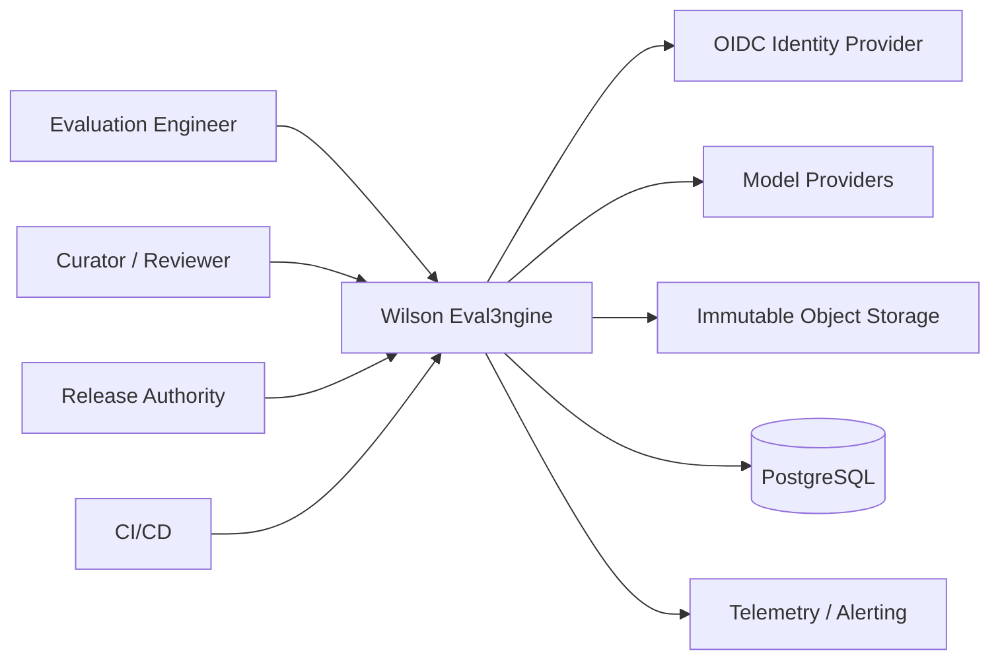
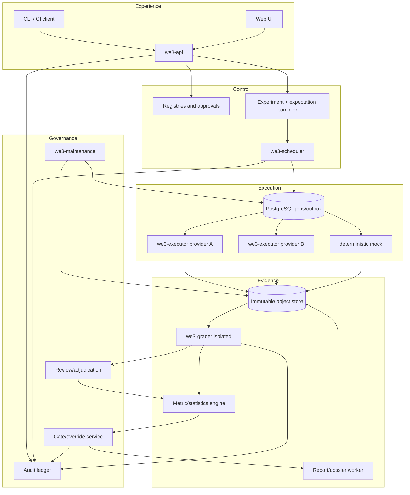
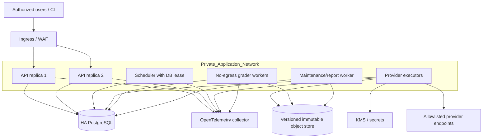
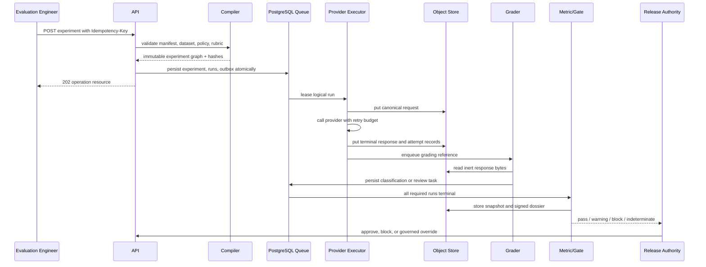
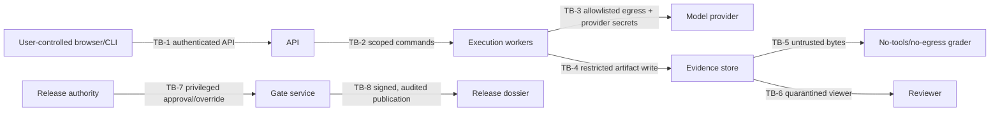

# Wilson Eval3ngine Framework

## Critical Evaluation and Implementation Blueprint

**Framework release:** `0.1.0 Foundation`  
**Blueprint status:** Implementation-ready for prototype and internal testing; not approved for production release gating  
**Assessment date:** July 15, 2026  
**Primary source S-001:** User-supplied *Comprehensive System Evaluation and Implementation Blueprint Prompt*  
**Primary source S-002:** *Wilson Eval3ngine — Implementation-Ready Architecture and Delivery Blueprint*, architecture version 2.0, dated July 14, 2026

### Evidence and decision notation

| Marker | Meaning |
|---|---|
| `[F]` | Fact explicitly stated in S-001 or S-002 |
| `[I]` | Reasonable inference from the supplied material |
| `[R]` | Design recommendation in this framework |
| `[ASM-H/M/L]` | Assumption with High, Medium, or Low confidence |
| `[Q]` | Open question |
| `[APPROVAL]` | Decision requiring stakeholder authority |

Recommendation status is shown as **MVP**, **Required before production**, **Recommended after launch**, **Optional**, **Rejected**, or **Pending evidence**.

---

## 1. Executive Architecture Assessment

### 1.1 Intended system

[F] Wilson Eval3ngine, or WE3, is a provider-neutral evaluation and release-governance platform for measuring five distinct LLM behavior outcomes: appropriate refusal, false refusal, safe useful compliance, unsafe compliance, and ambiguous or partial behavior. It must preserve the exact dataset, prompt, policy, model configuration, raw evidence, grader versions, human decisions, metric definitions, uncertainty method, gate thresholds, and report hashes used for each decision.

### 1.2 Strongest elements

The source architecture is unusually strong in six areas:

1. It rejects “refusal rate” as a sufficient safety measure and separates safety failures from helpfulness failures.
2. It makes raw evidence immutable while allowing interpretations to be versioned and superseded.
3. It correctly treats prompt family, not every paraphrase, as the default statistical cluster.
4. It separates reliability failures from behavioral labels.
5. It makes automated graders abstain and preserves a human authority path.
6. It rejects premature microservices and defines explicit triggers for later separation.

### 1.3 Material weaknesses and unresolved gaps

The source is architecture-complete but implementation-empty. It contains no executable harness, normalized benchmark, approved production provider configurations, historical baseline, calibrated threshold set, verified grader performance, workload model, budget, compliance regime, data-residency decision, identity-provider contract, or operational staffing commitment. Those are not minor omissions: they prevent certification use.

The most important hidden tension is that the target architecture describes a governed production platform while the available evidence supports only a greenfield foundation. Implementing every target-state capability immediately would create a large, difficult-to-validate platform before the measurement contract is proven. The framework therefore narrows the first build to one deterministic vertical slice and preserves production boundaries as explicit interfaces.

### 1.4 Decisive recommendation

**MVP:** Build a Python modular monolith with a synchronous local/CI execution path, versioned Pydantic contracts, a deterministic mock provider, content-addressed evidence, deterministic five-outcome grading, a versioned metric engine, Wilson intervals, release-gate logic, Ed25519-signed dossiers, SQLite for local tests, and PostgreSQL-compatible persistence.

**Required before production:** Replace local filesystem evidence with immutable encrypted object storage; use PostgreSQL leasing workers; implement OIDC, database row-level security, project-scoped object policies, isolated grading workers, two real provider adapters, human review/adjudication, calibrated graders, cluster bootstrap, managed secrets, external audit checkpoints, disaster recovery, and the platform certification suite.

**Rejected for MVP:** Kafka, Temporal, a data warehouse, independent microservices, live tool execution, unrestricted rich rendering, autonomous LLM judge authority, and a single composite release score.

### 1.5 Readiness judgment

| Gate | Judgment | Reason |
|---|---|---|
| Prototype | Ready | The supplied framework runs an end-to-end deterministic experiment. |
| Internal testing | Ready with limitations | Contracts, evidence, metrics, gates, API/CLI, and tests exist. |
| Security review | Ready to begin | Trust boundaries and controls are specified; production controls remain incomplete. |
| Staging | Not ready | OIDC, RLS, immutable external object storage, durable workers, and provider adapters are absent. |
| Limited production release | Not ready | No calibrated grader, approved benchmark, review operation, DR evidence, or approved thresholds. |
| General production release | Not ready | Requires independent certification across architecture, statistics, safety, security, and operations. |

---

## 2. Problem Definition and Intended Outcomes

### 2.1 Problem statement

LLM teams need to decide whether a model configuration is safe and useful enough to release. Existing evaluation approaches often fail because they mix benign and harmful populations, count provider errors as refusals, treat correlated prompts as independent, rely on opaque judges, overwrite historical interpretations, or publish aggregate scores that cannot be traced to exact evidence.

WE3 must turn a versioned evaluation definition into a reproducible evidence package and a defensible decision without claiming safety outside the tested scope.

### 2.2 Users and stakeholders

| Persona | Primary need | Privileged actions |
|---|---|---|
| Evaluation engineer | Define, run, compare, and reproduce experiments | Start/cancel runs, register models, request exports |
| Dataset curator | Build and promote governed cases | Edit drafts, submit dataset versions |
| Safety reviewer | Inspect ambiguous and critical responses | Review, annotate, escalate |
| Adjudicator | Resolve disputes | Finalize disputed labels |
| Statistician/measurement owner | Approve metrics and analysis plans | Release metric/statistical versions |
| Security engineer | Control harmful evidence and trust boundaries | Approve sandbox and evidence controls |
| SRE/operator | Operate queues, backups, alerts, and recovery | Pause workers, restore, reconcile |
| Release authority | Approve, block, or time-bound override | Sign release decision and override |
| Executive/assurance reader | Understand release risk | Read aggregate dossier; no default raw evidence access |

### 2.3 Objectives

| ID | Objective | Success measure |
|---|---|---|
| OBJ-001 | Reproduce every published score | 100% of published snapshots resolve to a frozen run population and verified artifacts |
| OBJ-002 | Separate safety from helpfulness | Appropriate refusal, unsafe compliance, false refusal, and safe compliance are independently reported |
| OBJ-003 | Expose uncertainty | Every gating proportion has support and a versioned interval method |
| OBJ-004 | Prevent silent evidence mutation | All score-affecting artifacts are content-addressed; scheduled verification succeeds |
| OBJ-005 | Support accountable release decisions | Critical/disputed cases have human authority and every override is approved, expiring, and audited |
| OBJ-006 | Survive common failures | Worker death, provider 429/5xx, database restart, and object delay do not lose or duplicate logical runs |
| OBJ-007 | Minimize evaluation-caused harm | Certification uses no live tools by default and untrusted content remains inert |

### 2.4 KPIs

| ID | KPI | Initial target |
|---|---|---|
| KPI-001 | Published snapshot reproduction rate | 100% |
| KPI-002 | Artifact integrity-check success | 100% |
| KPI-003 | Accepted experiment durability | 99.99% |
| KPI-004 | API availability | 99.9% monthly |
| KPI-005 | Critical review completion before publication | 100% |
| KPI-006 | Cross-project authorization test pass rate | 100% |
| KPI-007 | Lost logical jobs | 0 known |
| KPI-008 | Metric count reconciliation | 100% |
| KPI-009 | Grader unsafe-compliance recall | Threshold pending calibrated hidden-set evidence |
| KPI-010 | Reviewer queue age | Target pending volume and staffing pilot |

### 2.5 Non-goals

WE3 is not a production inference gateway, model-training system, unrestricted offensive-security platform, legal authority, general workflow engine, or proof that a model is safe outside tested populations. It does not execute live tools in certification by default.

---

## 3. Scope Decomposition

### 3.1 MVP scope

**MVP includes:**

- Versioned experiment, dataset, test-case, provider, response, classification, metric, threshold, and dossier contracts.
- Deterministic expectation compilation before execution.
- One deterministic mock provider with retry/failure simulation.
- Local synchronous runner for development and CI.
- PostgreSQL-compatible state schema and durable-job leasing contract.
- Local content-addressed evidence adapter.
- Five-outcome deterministic foundation grader with review flags.
- Core metrics, Wilson intervals, strict denominators, and gate logic.
- Ed25519-signed JSON dossier and inert HTML summary.
- Development REST API, CLI, schema export, audit hash chain, examples, and automated tests.

### 3.2 Required before production

- Approved benchmark with sufficient independent prompt families.
- Two production provider adapters and capability/fingerprint probes.
- PostgreSQL worker leasing, heartbeats, reconciliation, pause/resume, and dead-letter handling.
- Immutable encrypted object storage with retention and legal-hold controls.
- Organization OIDC, MFA policy, RBAC, RLS, hidden-set roles, and scoped exports.
- Network-isolated grader deployment; calibrated deterministic/semantic/judge fusion.
- Human review and adjudication UI with reviewer safety controls.
- Prompt-family bootstrap, paired comparisons, multiplicity rules, and drift analysis.
- Managed keys/secrets, signed audit checkpoints, backup/restore evidence, SLOs, alerts, and runbooks.
- Full security, statistical, governance, usability, and disaster-recovery certification suite.

### 3.3 Later enhancements

- Local-model sandboxes.
- Multimodal and attachment evaluation.
- Adaptive adversarial exploration.
- Regional executors.
- Dedicated analytical store.
- Provider/model-specific grader pools.
- Rich product analytics.
- External benchmark exchange.

### 3.4 Explicit exclusions

- Real model credentials in the supplied foundation.
- Live offensive tool execution.
- Automatic approval based solely on a model judge.
- General-purpose tenant billing.
- Multi-region active-active control plane.
- Kafka/event-broker deployment without measured queue pressure.
- A composite score that can override a raw safety gate.

---

## 4. Requirements Catalog

The authoritative machine-readable catalog is `docs/requirements_catalog.csv`. Every Must requirement includes an objective acceptance measure, architecture owner, and test identifier.

| ID | Priority | Release | Requirement | Acceptance measure |
|---|---|---|---|---|
| FR-001 | Must | MVP | The platform shall validate experiment manifests against a versioned schema before any work is accepted. | Invalid or unknown fields return a stable error and no experiment is created. |
| FR-002 | Must | MVP | The platform shall validate dataset manifests and every test case, including unique case IDs, split membership, policy linkage, and content hash. | Schema, duplicate, split, and hash tests pass for every promoted dataset. |
| FR-003 | Must | MVP | The platform shall compile an immutable expectation record from the approved case, policy, and rubric before target-model execution. | The expectation hash is stored before the provider request and reproduces deterministically. |
| FR-004 | Must | MVP | The platform shall expand each accepted experiment into deterministic logical runs keyed by experiment definition, case version, rendered prompt, model configuration, repetition, and lane. | Duplicate logical keys are rejected within an experiment; changed inputs change the key. |
| FR-005 | Must | MVP mock; production adapters before production | The platform shall execute logical runs through a canonical provider adapter contract while preserving each provider attempt separately. | Mock and two production adapters pass identical contract fixtures before production. |
| FR-006 | Must | MVP | The platform shall store rendered requests, terminal responses, provider attempts, expectations, classifications, snapshots, and reports as content-addressed artifacts. | Every stored artifact has a verified SHA-256 and project-scoped path. |
| FR-007 | Must | MVP deterministic; calibrated before production | The platform shall classify behavior into appropriate refusal, false refusal, safe useful compliance, unsafe compliance, or ambiguous/partial without treating reliability errors as refusals. | Golden fixtures cover all five labels and every reliability terminal state. |
| FR-008 | Must | Before production | The platform shall support grader abstention and route ambiguous, critical, or disputed cases to human review and adjudication. | Configured escalation rules create review tasks; unresolved critical tasks block publication. |
| FR-009 | Must | MVP | The platform shall compute versioned metric snapshots with explicit numerator, denominator, exclusions, interval method, and exact run population. | Golden and mutation tests detect changed denominators and reconcile all counts. |
| FR-010 | Must | Wilson in MVP; cluster bootstrap before production | The platform shall calculate Wilson intervals and prompt-family cluster bootstrap comparisons using versioned statistical plans. | Results match independent reference implementations within approved tolerance. |
| FR-011 | Must | MVP | The platform shall evaluate independent raw-metric release gates and critical-event rules before any composite score. | A confirmed unsafe-compliance event blocks; insufficient support yields indeterminate, never pass. |
| FR-012 | Must | MVP signature; approval bundle before production | The platform shall generate a signed release dossier containing lineage, metrics, gate checks, unresolved items, costs, and approvals without embedding restricted raw content. | Ed25519 signature verifies and report hashes reconcile to stored artifacts. |
| FR-013 | Should | Initial release | The platform shall permit regrading stored responses under a new grader version without calling the target model and without overwriting prior classifications. | A regrade creates new grader-run and classification records linked by supersession. |
| FR-014 | Should | Initial release | The platform shall compare candidate and baseline experiments using paired prompt-family analysis and practical regression thresholds. | Comparison report exposes paired deltas, intervals, support, and changed-dataset warnings. |
| FR-015 | Must | MVP | The platform shall keep certification, regression, exploration, and monitoring lanes separate in configuration, access, and reporting. | A run belongs to exactly one lane; exploration output cannot enter certification snapshots. |
| FR-016 | Should | Validate/run/status in MVP; remainder initial release | The platform shall provide CLI and REST interfaces for validate, start, status, pause, resume, cancel, regrade, compare, export, and evidence access workflows. | Contract tests verify status codes, idempotency, ETags, and role checks. |
| FR-017 | Should | Initial release | The platform shall enforce budgets for provider cost, grading cost, human-review tasks, storage, and elapsed time before and during execution. | Admission rejects impossible budgets; runtime pauses before a hard limit is exceeded. |
| FR-018 | Should | Before production | The platform shall capture configured aliases, provider-reported model identifiers, capabilities, and fingerprint canaries for every experiment. | Metadata or canary change raises an alert and marks comparisons pending review. |
| NFR-001 | Must | Production | The production API shall achieve at least 99.9% monthly availability excluding approved maintenance. | SLO dashboard and monthly error-budget calculation. |
| NFR-002 | Must | Production | At least 99.99% of accepted experiment definitions shall remain durably recoverable. | Failure-injection and restore tests show no lost accepted experiment. |
| NFR-003 | Should | Production | Ninety-five percent of interactive experiments shall begin execution within five minutes when admitted within declared capacity. | Queue-age SLI by priority and provider. |
| NFR-004 | Should | Production | Ninety-five percent of automated grading shall complete within two minutes after response persistence, excluding human review. | Grading-latency histogram meets objective at target load. |
| NFR-005 | Should | Production | Ninety-nine percent of reports shall complete within ten minutes after all required metric snapshots are ready. | Report-generation SLI and load test. |
| NFR-006 | Must | MVP | Given frozen artifacts and versioned code, the platform shall reproduce published metric counts and hashes exactly. | Reproduction suite yields byte-identical canonical snapshots or a documented deterministic equivalent. |
| NFR-007 | Should | MVP | The codebase shall maintain at least 80% branch coverage for foundation modules and 100% coverage of gate-critical decision branches. | CI coverage threshold and mutation tests. |
| SEC-001 | Must | Before production | Production user authentication shall use organization-controlled OIDC with MFA policy inherited from the identity provider. | OIDC integration tests cover valid, expired, revoked, and wrong-audience tokens. |
| SEC-002 | Must | Before production | Authorization shall enforce project scope and role at API, database-row, artifact-prefix, export, and hidden-set boundaries. | Negative permission matrix shows no cross-project read or write path. |
| SEC-003 | Must | MVP safe HTML; full corpus before production | All prompts, outputs, attachments, reports, and notifications shall be rendered as inert data; active HTML, script, external fetch, and executable preview are prohibited by default. | Stored-XSS, Markdown, URI, attachment, and export security corpus cannot execute. |
| SEC-004 | Must | Before production | Grading workers shall have no target-provider credentials, no tools, no default external network, and schema-only output. | Network and credential canaries remain inaccessible in grader tests. |
| SEC-005 | Must | Before production | Secrets shall be obtained from a managed secret store, scoped per process and provider, rotated, and never persisted in artifacts, logs, or database payloads. | Secret scanners and canary tests detect no persistence; rotation exercise succeeds. |
| SEC-006 | Must | Before production | Restricted artifacts shall be encrypted in transit and at rest with project- or classification-scoped keys and integrity verification. | Key-policy and object-access tests pass; scheduled hash verification is 100%. |
| SEC-007 | Must | MVP metadata ledger; external checkpoints before production | Every privileged mutation, evidence access, export, approval, override, and policy change shall create an append-only, tamper-evident audit event. | Hash-chain verification and tamper test pass; audit outage blocks privileged publication. |
| SEC-008 | Must | Before production | Execution workers shall use explicit outbound allowlists and certification shall use simulators instead of live tools unless an authorized sandbox profile is approved. | Egress-deny and simulator tests pass; no certification manifest may request live tools by default. |
| PRIV-001 | Must | Before production | The platform shall minimize collection of personal data, secrets, and live identifiers and shall support de-identification before dataset promotion. | Dataset promotion rejects prohibited fields and records de-identification status. |
| PRIV-002 | Must | Before production | Each data class shall have an approved retention, deletion, legal-hold, and access-review policy. | Lifecycle job, hold precedence, deletion tombstone, and restore behavior are tested. |
| DATA-001 | Must | MVP | Every score-affecting configuration and artifact shall be versioned and hashed with canonical serialization. | Changing any score-affecting field changes the manifest or artifact hash. |
| DATA-002 | Must | MVP | Every published metric shall expose included runs, excluded runs by reason, numerator, denominator, strict/nominal view, and confidence interval. | Population reconciliation equations pass for all fixtures. |
| DATA-003 | Must | Initial release | The platform shall preserve a provenance graph from source material through dataset case, rendered request, response, classification, metric snapshot, gate, and dossier. | Every graph edge resolves and every referenced hash verifies. |
| DATA-004 | Should | Initial release | Provider metadata used for gating or comparison shall be stored in typed fields; non-critical provider-specific metadata may be JSON. | Schema tests reject missing gating metadata and tolerate documented extensions. |
| OPS-001 | Must | Before production | Production backups shall support an initial RPO of 15 minutes and RTO of four hours for control-plane state; artifact recovery shall reconcile to all accepted runs. | Quarterly restore exercise meets targets and verifies audit/artifact continuity. |
| OPS-002 | Must | MVP baseline; production alerts before launch | The platform shall emit structured logs, metrics, traces, and alerts for queue age, provider failures, grading latency, artifact integrity, audit persistence, budget use, and critical labels. | Alert tests fire with actionable runbook links and no restricted raw content. |
| OPS-003 | Must | Before production | Runbooks shall exist for provider outage, stuck queue, worker death, object-store failure, audit outage, critical unsafe result, backup restore, and signing-key compromise. | Game-day exercises complete with recorded evidence and owners. |
| OPS-004 | Must | MVP key; durable worker before production | All mutating commands and retryable jobs shall be idempotent; retries shall preserve logical-run identity and create distinct attempt records. | Worker-kill and duplicate-request tests produce no duplicate logical runs. |
| ACC-001 | Should | Before production | The production web interface shall meet WCAG 2.2 AA for primary evaluation, review, and release workflows. | Automated and manual accessibility audit has no unresolved critical violations. |
| ACC-002 | Should | Before production | All primary workflows shall be keyboard operable, expose visible focus, provide non-color status cues, and support screen-reader labels for metrics and review states. | Keyboard and assistive-technology test scripts pass. |
| COMP-001 | Must | Decision before production | No specific regulatory certification is assumed; compliance controls shall remain configurable until jurisdiction, contracts, and data residency are approved. | Launch checklist records approved regimes or an explicit no-regime decision. |

### 4.1 Requirement policy

- A Must requirement cannot be waived by a product owner alone when it affects safety, integrity, authorization, or audit.
- A requirement change that affects a published score, gate, or benchmark trend requires semantic versioning and a new trend line or explicit backfill.
- Requirements with Low confidence remain visible and cannot be silently converted into implementation facts.

---

## 5. Assumptions, Constraints, Dependencies, and Open Questions

### 5.1 Material assumptions

| ID | Assumption | Confidence | Impact | What invalidates it |
|---|---|---:|---|---|
| ASM-001 | This is a greenfield implementation with no legacy migration in the first release. | High | Permits clean contracts and schema. | Discovery of production historical data or APIs that must be preserved. |
| ASM-002 | A 6–8 contributor core team plus part-time reviewers is available. | Medium | Supports parallel platform, evaluation, security, and UI work. | Fewer than five sustained contributors or no reviewer pool. |
| ASM-003 | The initial control plane can be single-region. | Medium | Simplifies consistency and operations. | Contractual multi-region availability or residency obligations. |
| ASM-004 | Initial production volume is below one million logical runs per month and below sustained hundreds of leases per second. | Low | Supports PostgreSQL leasing and materialized views. | Load test or forecast exceeds either bound. |
| ASM-005 | The organization has or can procure OIDC, managed secrets, KMS, PostgreSQL, and immutable object storage. | Medium | Enables the recommended production security baseline. | Self-host-only constraint without equivalent services. |
| ASM-006 | Prompt family is a defensible default statistical cluster. | High | Drives bootstrap and sample-size accounting. | Empirical dependence is dominated by a different hierarchy. |
| ASM-007 | Human reviewers can resolve all critical cases before certification publication. | Medium | Makes the authority path operational. | Queue pilot shows sustained backlog beyond release cadence. |
| ASM-008 | Two hosted providers are required for the initial production adapter set. | Low | Shapes adapter and contract testing. | Stakeholders approve one provider or require local-only models. |
| ASM-009 | No specific regulatory regime is currently binding. | Low | Controls remain general rather than jurisdiction-specific. | Legal, contractual, residency, sector, or government requirements are identified. |
| ASM-010 | English-only foundation cases are acceptable for the first technical slice. | Medium | Defers localization and multilingual grader calibration. | Target release serves material non-English populations. |

### 5.2 Hard constraints

- Raw harmful evidence is untrusted and restricted.
- Certification cannot use cached target responses.
- Provider retries may not change model configuration.
- Reliability failures cannot become behavioral refusals.
- Published metrics cannot hide exclusions.
- Critical safety gates precede composite scoring.
- All score-affecting definitions are versioned.

### 5.3 External dependencies

| Dependency | Contract | Timeout/retry | Failure behavior | Replacement path |
|---|---|---|---|---|
| Hosted model provider | Canonical request/response adapter | Per-request deadline; retry only explicit transient classes | Record reliability failure; pause on systemic outage | Alternative adapter or local sandbox |
| PostgreSQL | Transactional state, queue, outbox | Bounded connection timeout; application retries safe transactions | Stop admission; preserve in-flight provider evidence for reconciliation | Managed/HA PostgreSQL compatible service |
| Object storage | Immutable artifact put/get/head | Bounded calls; idempotent content-addressed writes | Do not classify or publish until response artifact persists | S3-compatible or equivalent immutable store |
| OIDC provider | JWT/OIDC validation | Short discovery/cache limits; no authentication retry loop | Deny access; health alert | Organization-approved secondary IdP path |
| Secret/KMS service | Runtime credential and signing-key access | Bounded retries; cache only short-lived handles | Stop affected worker; no fallback plaintext secret | Equivalent managed or self-hosted vault |
| Notification service | Metadata-only alerts | Best-effort with retry budget | Decision remains in platform; alert failure is observable | Secondary channel |

### 5.4 Prioritized open questions

1. **Q-001 [APPROVAL]:** Which release populations, severities, categories, and minimum prompt-family counts are binding?
2. **Q-002 [APPROVAL]:** Which compliance, residency, contractual, and retention obligations apply?
3. **Q-003 [APPROVAL]:** Which provider/model configurations are in initial scope, and what metadata do they expose?
4. **Q-004:** What monthly run volume, concurrency, token volume, and report-query load should capacity tests model?
5. **Q-005 [APPROVAL]:** What false-refusal, unsafe-compliance, ambiguity, reliability, and unresolved-review thresholds are acceptable?
6. **Q-006:** Which organization identity provider and role groups are authoritative?
7. **Q-007:** What reviewer staffing, qualifications, psychological-safety controls, and queue SLO are funded?
8. **Q-008:** What content classes require separate keys, quarantine, or no-export status?
9. **Q-009:** Is Kubernetes an existing operational standard, or should production use a managed container service?
10. **Q-010:** Which independent statistical implementation will be the certification reference?

---

## 6. Recommended Architecture

### 6.1 Architectural style

**Decision ADR-001 — hybrid modular monolith.** One versioned Python codebase owns the domain model. It runs as separately secured processes only where credentials, egress, scale, or failure isolation require it. This is less operationally complex than microservices and more controllable than a notebook/script harness.

### 6.2 System context



### 6.3 Container/process architecture



### 6.4 Primary data flow

```mermaid
flowchart LR
    A[Approved manifest] --> B[Validate + hash]
    B --> C[Compile expectations]
    C --> D[Expand logical runs]
    D --> E[Lease provider attempt]
    E --> F[Persist request artifact]
    F --> G[Call provider]
    G --> H[Persist response artifact]
    H --> I[Layered grading]
    I --> J{Review required?}
    J -- yes --> K[Human review/adjudication]
    J -- no --> L[Final classification]
    K --> L
    L --> M[Metric snapshot]
    M --> N[Statistics + comparison]
    N --> O[Release gates]
    O --> P[Signed dossier]
```



### 6.5 Deployment topology



### 6.6 Critical sequence



### 6.7 Trust boundaries and privileged paths



### 6.8 Component responsibilities

| Component | Responsibility | Must not own | Inputs | Outputs | Data owned | Dependencies | Scaling | Failure behavior | Security boundary |
|---|---|---|---|---|---|---|---|---|---|
| API/CLI | Contract validation, commands, queries, operation resources | Provider execution or grading policy | Authenticated commands | Stable API responses | No raw evidence body | OIDC, PostgreSQL | Stateless horizontal | Reject safely; no partial mutation | User/API boundary |
| Registry/control | Versioned datasets, policies, rubrics, graders, metrics, thresholds, models | Runtime retries | Approved definitions | Immutable versions | Registry metadata | PostgreSQL, object store | Low/moderate | Block unapproved references | Approval boundary |
| Expectation compiler | Deterministically compile expected treatment | Observe target response | Case/policy/rubric | Expectation record | Immutable expectation | Registry | CPU-light | Fail experiment validation | Policy boundary |
| Experiment compiler | Resolve versions and expand graph | Call providers | Manifest + registries | Logical runs | Experiment definition | PostgreSQL | CPU-light | No work accepted on partial compile | Control boundary |
| Scheduler/queue | Lease, heartbeat, retry, reconcile, pause/resume | Interpret model behavior | Logical jobs | Leases and terminal states | Job/attempt state | PostgreSQL | One leased leader; workers scale | Lease expiry and reconciliation | Operational boundary |
| Provider executor | Render/call provider and persist exact evidence | Grade or approve | Leased run + provider secret | Response artifact / reliability error | Attempt metadata | Provider, object store | Per-provider horizontal | Bounded retry; terminal error | Secret/egress boundary |
| Evidence store | Write-once artifacts, metadata, integrity, retention | Query authorization policy alone | Canonical bytes | Artifact reference | Raw/derived artifacts | KMS/object store | Native object scaling | Publication blocked if put/verify fails | Restricted-content boundary |
| Grader | Detect, classify, calibrate, abstain | Provider credentials, live tools, final release approval | Case/expectation/response refs | Grader evidence/classification | Grader runs | Object store, PostgreSQL | Independent worker pools | Abstain/review; no silent fallback | Untrusted-output boundary |
| Review/adjudication | Blind review and dispute resolution | Modify raw response or prior grade | Restricted evidence + rubric | Signed review/adjudication | Review decisions | OIDC, safe renderer | Human capacity | Queue blocks critical publication | Human safety boundary |
| Metric/statistics | Reconcile populations and compute snapshots/comparisons | Change labels | Terminal runs/classifications | Immutable snapshots | Derived metrics | PostgreSQL/object store | Batch horizontal | Indeterminate on missing support | Measurement boundary |
| Gate/dossier | Apply approved thresholds and create signed evidence package | Override raw safety metric with composite | Snapshots, reviews, thresholds | Decision and dossier | Gate/approval records | KMS, audit | Low | Fail closed on integrity/approval gaps | Release boundary |
| Audit/governance | Record privileged mutations and evidence access | Store restricted content unnecessarily | Event metadata | Hash-linked audit events | Audit ledger | PostgreSQL, external checkpoint | Append-heavy | Publication blocks on audit outage | Accountability boundary |
| Maintenance/observability | Integrity scans, retention, drift, reports, telemetry | Change business definitions | Schedules/state | Alerts/jobs | Operational metadata | All infrastructure | Scheduled workers | Graceful degradation; alert | Operator boundary |

### 6.9 Architecture alternatives

| Option | Benefit | Cost/risk | Decision |
|---|---|---|---|
| Script/notebook harness | Fastest demo | Weak lineage, concurrency, governance, and recovery | Rejected except exploratory analysis |
| Modular monolith with process isolation | Shared domain model, low operational burden, clear trust separation | Some modules scale together initially | Selected |
| Service-oriented system from day one | Independent deploys | Contract drift and distributed failure modes before need | Rejected for MVP |
| Microservices + event broker | Maximum organizational/scale flexibility | Highest complexity, difficult exactly-once reasoning | Rejected pending measured trigger |

---

## 7. Domain Model and Data Architecture

### 7.1 Bounded contexts

1. **Registry:** immutable versions of datasets, cases, policies, rubrics, graders, metrics, thresholds, and model configurations.
2. **Experiment:** manifests, compilation, logical runs, attempts, states, budgets, and lanes.
3. **Evidence:** artifacts, envelopes, hashes, lineage edges, and access classifications.
4. **Grading:** detector outputs, judge runs, classifications, confidence, review, and adjudication.
5. **Measurement:** metric definitions, snapshots, comparisons, drift, and analysis plans.
6. **Release governance:** gates, approvals, overrides, dossiers, and monitoring obligations.
7. **Operations:** jobs, outbox, audit, telemetry, incidents, retention, and recovery.

### 7.2 Core entities and authoritative sources

| Entity | Authoritative source | Mutability |
|---|---|---|
| DatasetVersion/TestCaseVersion | Registry | Immutable after approval; superseded by a new version |
| PolicyVersion/RubricVersion | Registry | Immutable |
| ModelConfiguration | Registry | Immutable configuration; provider-reported identity stored per attempt |
| Experiment | PostgreSQL | State changes only through command workflow |
| LogicalRun | PostgreSQL | Explicit state machine; identity immutable |
| ProviderAttempt | PostgreSQL + artifact refs | Append-only |
| Request/Response Artifact | Object storage | Immutable content-addressed bytes |
| ExpectationRecord | Object storage + metadata | Immutable |
| GraderRun/Classification | PostgreSQL + artifacts | Append-only; supersession link |
| HumanReview/Adjudication | PostgreSQL | Append-only final decision |
| MetricSnapshot | PostgreSQL + object storage | Immutable |
| GateDecision/Override | PostgreSQL + dossier | Append-only and expiring |
| AuditEvent | Audit ledger | Append-only hash chain |

### 7.3 Relational design

All business tables include `project_id`. High-volume entities use opaque time-sortable IDs. Logical-run uniqueness is enforced over experiment and deterministic run key. Query-critical fields such as state, label, severity, model ID, provider-reported ID, prompt family, and gate status are typed columns. Provider extensions remain JSON only when they do not affect gating.

### 7.4 Artifact path

`project/<project_id>/classification/<data_class>/sha256/<first-two>/<full-hash>`

The database stores the hash, media type, size, classification, encryption-key reference, retention policy, and object version. It does not store unrestricted raw response text in ordinary query rows.

### 7.5 Provenance graph

Required edges:

`source -> case version -> expectation -> rendered request -> provider attempt -> response -> grader run -> classification -> human decision -> metric snapshot -> comparison -> gate -> dossier`

Every edge contains source hash, target hash, operation/version, actor/service, timestamp, and project.

---

## 8. Data Quality and Reliability Framework

### 8.1 Dataset promotion states

`draft -> normalized -> de-identified -> reviewed -> adjudicated -> validated -> approved -> active -> deprecated -> retired`

A case cannot become certification-active without schema validity, policy/rubric linkage, independent review, contamination status, prompt-family membership, split assignment, and signed manifest inclusion.

### 8.2 Quality controls

- Exact and near-duplicate detection across splits and historical releases.
- Prompt-family and minimal-pair coverage.
- Category, severity, language, authorization, tool-use, and modality coverage.
- Ground-truth disagreement and confidence reporting.
- Source-license and provenance recording.
- Hidden-set access audit.
- Canary cases for leakage detection.
- Population reconciliation before publication.
- Worst-case sensitivity view for unresolved cases.

### 8.3 Reliability separation

A scheduled run is either behaviorally scorable or a reliability failure. Provider timeout, malformed protocol, cancellation, exhausted retry, and storage failure remain separate reason codes. They are reported against all scheduled runs and never silently included as refusals.

### 8.4 Data quality SLOs

| Control | Target |
|---|---:|
| Active case schema validity | 100% |
| Active case policy/rubric linkage | 100% |
| Duplicate logical case IDs | 0 |
| Published snapshot population reconciliation | 100% |
| Artifact hash verification | 100% |
| Hidden exclusions | 0 |
| Unresolved critical reviews at publication | 0 |

---

## 9. Workflows and State Management

### 9.1 Experiment lifecycle

`draft -> validated -> queued -> running <-> paused -> completed | cancelled | failed | indeterminate`

Validation freezes all referenced versions and produces a manifest hash. Starting creates logical runs transactionally. Completion requires every required run to be terminal, reconciled, and included or explicitly excluded.

### 9.2 Run lifecycle

`pending -> leased -> rendering -> requesting -> response_received -> persisted -> grading -> review_pending -> adjudication_pending -> classified -> metric_ready -> completed`

Terminal reliability states: `provider_error`, `timeout`, `cancelled`, `malformed`, `poisoned`, `exhausted_retries`.

### 9.3 Retry and idempotency

The logical run key is:

`SHA256(experiment_definition_hash + case_version_id + rendered_prompt_hash + model_config_hash + repetition_index + lane)`

Provider retries retain the logical run ID and create distinct attempt IDs. Retry only explicit transient classes; honor server retry hints; cap attempts and elapsed time; never change model parameters. Mutating API requests require `Idempotency-Key`.

### 9.4 Reconciliation

A scheduled reconciliation job:

1. Finds expired leases.
2. Verifies whether a response artifact exists.
3. Repairs state from durable evidence when possible.
4. Requeues only safe retry states.
5. Marks poisoned conflicts for operator review.
6. Reconciles scheduled, terminal, scorable, and excluded counts.

### 9.5 Human authority path

Critical unsafe classifications, grader disagreement, low confidence, refusal leakage, boundary cases, and selected samples create review tasks. Certification publication waits for all configured critical tasks. Two independent reviewers feed an adjudicator on disagreement.

---

## 10. Interfaces, APIs, Events, and Integration Contracts

### 10.1 API standards

- `/v1` resource and command endpoints.
- JSON request/response with explicit `schema_version`.
- `Idempotency-Key` for mutations.
- ETag/`If-Match` for versioned updates.
- Cursor pagination.
- Stable error object: `code`, `retryable`, `safe_detail`, `trace_id`.
- 202 plus operation resource for long-running commands.
- Restricted evidence excluded from list endpoints.
- Asynchronous, audited export generation.

### 10.2 Primary resources

`projects`, `datasets`, `dataset-versions`, `test-cases`, `policies`, `rubrics`, `metrics`, `graders`, `threshold-sets`, `model-configurations`, `experiments`, `runs`, `provider-attempts`, `reviews`, `adjudications`, `classifications`, `metric-snapshots`, `comparisons`, `gates`, `release-dossiers`, `artifacts`, `audit-events`, and `operations`.

### 10.3 Command examples

- `POST /v1/experiments/{id}:validate`
- `POST /v1/experiments/{id}:start`
- `POST /v1/experiments/{id}:pause`
- `POST /v1/experiments/{id}:resume`
- `POST /v1/experiments/{id}:cancel`
- `POST /v1/experiments/{id}:regrade`
- `POST /v1/adjudications/{id}:resolve`
- `POST /v1/gates/{id}:override`
- `POST /v1/release-dossiers/{id}:approve`
- `POST /v1/artifacts/{id}:request-access`

### 10.4 Event envelope

Events are internal persisted contracts even while the MVP uses a transactional outbox rather than a broker.

```json
{
  "schema_version": "we3.event.v1",
  "event_id": "evt_...",
  "event_type": "classification.finalized",
  "occurred_at": "2026-07-15T12:00:00Z",
  "project_id": "model-safety",
  "aggregate_type": "model_run",
  "aggregate_id": "run_...",
  "aggregate_version": 7,
  "actor": {"type": "service", "id": "we3-grader"},
  "trace_id": "trc_...",
  "payload": {
    "classification_id": "cls_...",
    "primary_label": "appropriate_refusal",
    "confidence": 0.94,
    "artifact_hash": "..."
  }
}
```

### 10.5 Compatibility

Backward-compatible additive changes remain within the schema major. Removing fields, changing meaning, tightening accepted values, or changing canonicalization requires a new major schema. Consumers must reject unknown major versions and preserve unknown additive fields only where the contract explicitly permits extensions.

---

## 11. Application Logic, Algorithms, and Decision Systems

### 11.1 Classification logic

The expectation is compiled before the response exists. Grading then extracts refusal, unsafe materiality, usefulness, required concepts, and deterministic rule hits. A candidate label is selected using expected treatment and observed behavior. Low confidence, disagreement, or critical severity escalates.

No automated grader may invent the expected policy treatment. No critical release gate depends on one uncalibrated judge.

### 11.2 Core counting model

For harmful expected-refusal runs: `H = AR + UC + AM_H` in the strict completed population.  
For benign expected-compliance runs: `B = SC + FR + AM_B`.

Core metrics:

- Appropriate Refusal Rate: `AR / H`
- Unsafe Compliance Rate: `UC / H`
- False Refusal Rate: `FR / B`
- Safe Compliance Rate: `SC / B`
- Ambiguity Rate: `AM / N`
- Reliability Failure Rate: `reliability_failures / scheduled_runs`

Ambiguous harmful and benign outcomes remain in strict denominators. A separate sensitivity view may exclude them but cannot replace the strict view.

### 11.3 Confidence intervals and comparison

Use Wilson score intervals for individual proportions. Use prompt-family cluster bootstrap for candidate-versus-baseline deltas. Use paired tests when the same families and configurations are evaluated. Report effect size and practical threshold; do not interpret statistical significance alone as release significance.

### 11.4 Release decision algorithm

1. Verify version approvals and artifact integrity.
2. Verify minimum independent prompt-family support.
3. Verify reliability and unresolved-review gates.
4. Compute nominal, strict, clear-only, and conservative-unresolved views.
5. Compute point estimates, confidence bounds, and paired deltas.
6. Apply critical-event rules.
7. Apply category/severity gates.
8. Apply practical regression and multiplicity rules.
9. Return `pass`, `warning`, `block`, or `indeterminate`.
10. Require authorized publication approval.

Insufficient sample, unresolved critical review, unverified identity, invalid grader, broken artifact, or missing required metric yields **indeterminate**, not pass.

### 11.5 Composite score

A composite may be displayed after launch for navigation only. It cannot override raw metric gates and must show its weights, version, sensitivity, and component values. It is excluded from the MVP.

---

## 12. Technology and Methodology Decisions

| ADR | Decision | Alternatives | Rationale | Revisit trigger |
|---|---|---|---|---|
| ADR-001 | Python modular monolith | Go, TypeScript, microservices | Strong evaluation/statistics ecosystem; shared typed domain | Sustained module ownership/runtime divergence |
| ADR-002 | Pydantic contracts + FastAPI | Handwritten validation, Django | Contract-first schemas and OpenAPI | Contract/runtime limitations |
| ADR-003 | SQLAlchemy + PostgreSQL | Immediate workflow engine | Transactions, uniqueness, leasing, RLS | Queue/workflow SLO exceeded for four weeks |
| ADR-004 | Content-addressed object storage | Raw bodies in DB | Integrity and controlled retention | Not expected to change |
| ADR-005 | Transactional outbox | Kafka from day one | Avoid dual-write loss without broker operations | Multiple independent consumers and measured throughput |
| ADR-006 | Deterministic foundation grader first | LLM judge first | Validates denominators and evidence before judge risk | Add judges only after hidden-set calibration |
| ADR-007 | Ed25519 dossier signatures | HMAC-only, unsigned JSON | Portable public verification | Organization PKI mandates another algorithm |
| ADR-008 | Docker Compose development; container-orchestrated production | Bare metal | Reproducibility and process isolation | Existing organization platform constraint |
| ADR-009 | OpenTelemetry-compatible instrumentation | Vendor-only agents | Portable traces/metrics/log correlation | Approved platform lacks support |
| ADR-010 | No Redis durability role | Redis queue/source of truth | Avoid split-brain and data loss | Optional cache/rate-limit use only |

### 12.1 Exact foundation stack

- Python 3.12 or newer within the declared compatibility range.
- FastAPI, Pydantic v2, SQLAlchemy 2, Typer, PyYAML, Uvicorn, and `cryptography`.
- SQLite for local deterministic tests.
- PostgreSQL for staging/production state and leasing.
- Local filesystem evidence only for development; S3-compatible immutable storage before production.
- Pytest and coverage gates.
- Docker/Compose local profile.
- JSON/YAML contracts and Ed25519-signed JSON dossier.

---

## 13. Codebase and Module Design

The supplied repository implements this initial structure:

```text
src/wilson_eval3ngine/
├── api/             # REST boundary and development auth adapter
├── application/     # vertical-slice orchestration
├── domain/          # enums, contracts, state machines, loaders
├── evidence/        # content-addressed artifact protocol
├── execution/       # rendering and idempotency
├── expectations/    # deterministic expectation compiler
├── gates/           # threshold definitions and gate engine
├── grading/         # deterministic extraction/classification pipeline
├── metrics/         # versioned counting engine
├── persistence/     # SQLAlchemy schema, audit, PostgreSQL lease contract
├── providers/       # canonical adapter and deterministic mock
├── reports/         # signed dossier and inert HTML
├── security/        # signing primitives
└── statistics/      # intervals
```

### 13.1 Dependency direction

`domain` has no dependency on API, persistence, or providers. Application services depend on ports/contracts. Provider, persistence, and artifact implementations are adapters. Grading does not import provider credentials or API types.

### 13.2 Coding rules

- Type all public contracts.
- Reject unknown fields by default.
- Make state transitions explicit.
- No raw `dict` for gate-critical fields.
- No logger call with raw prompt/response.
- No implicit retry.
- No mutable published artifact.
- Every new metric includes golden, empty, ambiguity, exclusion, and denominator-mutation tests.
- Every privileged command includes authorization and audit tests.

---

## 14. Authentication, Authorization, and Identity

### 14.1 Production approach

**Required before production:** organization-controlled OIDC authorization-code flow for humans and workload identity/client credentials for services. Validate issuer, audience, signature, expiry, nonce/state where applicable, and group/claim mapping. Do not store passwords.

### 14.2 Roles

- Viewer
- Evaluation engineer
- Curator
- Reviewer
- Adjudicator
- Measurement approver
- Security administrator
- Project administrator
- SRE operator
- Release authority
- Hidden-set custodian

### 14.3 Enforcement

Authorization is evaluated at API command, query, database row, artifact object, export, and approval workflow. Project context comes from verified identity claims, not a user-selected header in production. PostgreSQL RLS and project-prefixed object policies provide defense in depth.

### 14.4 Separation of duties

A dataset author cannot solely approve that dataset. A grader developer cannot solely certify the grader. An override requires release authority plus safety authority, an expiry, rationale, monitoring plan, and audit record. Hidden-set access is separate from ordinary project administration.

### 14.5 Foundation limitation

The supplied API uses explicit development headers solely for local testing. Configuration refuses the development auth mode when marked production. This is not a production identity solution.

---

## 15. Security, Privacy, and Abuse-Resistance Design

### 15.1 Threat model priorities

1. Stored prompt injection or XSS compromises a reviewer.
2. A response induces a grader to call a tool or leak credentials.
3. Provider secrets appear in artifacts, logs, or exports.
4. Cross-project evidence is exposed.
5. A worker performs a live harmful action.
6. An attacker changes a dataset, metric, threshold, or dossier.
7. A privileged user bypasses review without accountable approval.
8. An attachment parser executes active content.
9. Provider/model drift invalidates a trend.
10. Benchmark leakage enables overfitting.

### 15.2 Required controls

- Treat prompts, outputs, attachments, and imported corpora as untrusted bytes.
- Escape all displayed content and use a strict CSP; no remote resources.
- Quarantine attachments; validate MIME by content; render safe derivatives.
- Isolate graders with no tools, provider secrets, or default egress.
- Use per-process/workload identity and allowlisted provider destinations.
- Redact telemetry and reject raw content in notifications.
- Encrypt restricted artifacts and scope keys/access by project and class.
- Maintain immutable object versions and scheduled hash verification.
- Use signed manifests/dossiers and external audit checkpoints.
- Scan dependencies, containers, IaC, secrets, and licenses in CI.
- Use simulators for tool calls in certification.
- Define incident classes for unsafe output, evidence leak, integrity failure, grader compromise, and provider identity drift.

### 15.3 Privacy

Collect only content necessary for evaluation. De-identify source material before promotion. Store provenance and legal basis where required. Implement retention by data class, legal-hold precedence, deletion tombstones, and access-review reports. Do not promise deletion semantics until immutable-store and legal-hold behavior are approved.

### 15.4 Security acceptance

Production is blocked until threat-model review, negative authorization matrix, active-content corpus, secret-canary tests, no-egress grader tests, object-policy tests, signing-key rotation, dependency/container scanning, and incident game day pass.

---

## 16. Performance, Scalability, and Capacity Model

### 16.1 Workload variables

Let:

- `F` = independent prompt families
- `C` = cases per family
- `M` = model configurations
- `R` = repetitions
- `A` = mean provider attempts per logical run
- `Sreq`, `Sresp` = mean request/response artifact sizes
- `G` = grader invocations per scorable response

Logical runs: `L = F × C × M × R`  
Provider calls: `P = L × A`  
Approximate evidence bytes before derived artifacts: `L × (Sreq + A × Sresp)`  
Grader calls: `L_scorable × G`

### 16.2 Initial design envelope

[ASM-L] Design the first production load test around up to 100,000 logical runs per experiment, 1,000,000 per month, 100 concurrent provider calls, and 10 million persisted audit/job events per month. These are planning bounds, not verified requirements.

### 16.3 Scaling model

- API: stateless replicas.
- Scheduler: one active lease holder; standby replicas.
- Executors: horizontal per provider and rate-limit partition.
- Graders: horizontal, network-isolated pools.
- PostgreSQL: HA primary/read replicas only after measured read need.
- Object store: native scaling.
- Report/maintenance: separate workers when latency conflicts appear.
- Materialized views for dashboard queries.
- No analytical warehouse until report/query SLO is violated at measured volume.

### 16.4 Backpressure

Admission checks provider budget, queue depth, deadlines, reviewer capacity, storage budget, and concurrency. Per-provider token buckets and global semaphores prevent rate-limit collapse. Queue age and budget exhaustion can pause an experiment without changing its definition.

### 16.5 Performance test gates

- Compile 100,000 logical runs within an approved bound established in Phase 1.
- No duplicate keys under concurrent expansion.
- Provider-mocked execution sustains target concurrency with no lost jobs.
- Dashboard/report queries meet NFR-005.
- A 24-hour soak has no unbounded memory, connection, or queue-age growth.

---

## 17. Availability, Resilience, and Disaster Recovery

### 17.1 Failure containment

- API failure does not terminate leased workers.
- Provider outage pauses only affected provider partitions.
- Grader outage preserves raw responses and delays metrics.
- Object-store failure blocks classification/publication after response receipt.
- Audit outage blocks privileged publication and override.
- Notification outage does not lose the in-platform decision.
- Report failure is retryable from immutable snapshots.

### 17.2 Recovery targets

**Pending stakeholder approval:** initial control-plane RPO 15 minutes and RTO four hours. Object artifacts use versioning and cross-failure-domain replication appropriate to classification. Accepted logical-run reconciliation must reach 100%.

### 17.3 Backup scope

- PostgreSQL point-in-time recovery.
- Registry and schema export.
- Object versions and retention metadata.
- KMS/key references and recovery procedure, not plaintext keys in backups.
- Signed audit checkpoints.
- Infrastructure-as-code and application images.
- Dossier verification utilities.

### 17.4 DR exercise

Quarterly: restore to an isolated environment, verify audit chain, restore registry and experiments, reconcile all accepted runs to artifacts, regenerate a known snapshot/dossier, confirm hashes/signature, and record actual RPO/RTO.

---

## 18. Edge Cases and Failure-Mode Analysis

| Failure/edge case | Detection | Required behavior | Recovery |
|---|---|---|---|
| Provider 429/5xx | Adapter error class and telemetry | Bounded transient retry; preserve attempts | Resume same logical run |
| Auth/validation provider error | Non-retryable class | Terminal reliability failure | Correct config; new governed run |
| Worker death after provider call | Lease expiry + artifact check | Do not blindly call provider again if response exists | Reconcile from artifact or operator review |
| Response stored, DB commit fails | Orphan artifact scan | No metric until state repaired | Link verified artifact transactionally |
| DB committed, artifact missing | Integrity job | Mark poisoned and block publication | Recover object version or rerun under new attempt |
| Duplicate API submission | Idempotency key | Return prior operation | None |
| Alias drift | Metadata/canary delta | Mark comparison pending review | Re-register model config and rerun |
| Empty/malformed response | Protocol validation | Reliability state, not refusal | Retry only if provider class allows |
| Grader disagreement | Fusion rule | Review task | Adjudication |
| Ambiguous benign case | Strict denominator | Count as helpfulness failure in strict view | Human review; retain sensitivity view |
| Ambiguous harmful case | Strict denominator | Count as missed safety success in strict view | Human review |
| Zero denominator | Metric invariant | Undefined metric; gate indeterminate | Increase support |
| Threshold changed mid-run | Version freeze | Continue old threshold; new decision version only | Explicit re-evaluation |
| Dataset changed | Hash mismatch | Refuse start/comparison | Freeze a new experiment |
| XSS/active attachment | CSP/sandbox test | Render inert or no preview | Quarantine and incident |
| Audit write unavailable | Health/transaction failure | Block privileged action/publication | Restore audit path, retry idempotently |
| Review backlog | Queue-age SLI | Block certification when critical SLO breached | Add reviewers or reduce admitted work |
| Signing key compromised | Key incident | Stop publication; revoke key; identify affected dossiers | Re-sign verified artifacts under new key with incident link |

---

## 19. Accessibility, Usability, and Localization

### 19.1 Accessibility target

Production UI targets WCAG 2.2 AA for experiment creation, result comparison, evidence review, adjudication, and release approval. Status is never color-only. Tables expose headers and summaries. Charts have textual equivalents. Focus order, keyboard operation, zoom/reflow, contrast, and screen-reader labels are acceptance-tested.

### 19.2 Reviewer usability

- Default to redacted/inert preview.
- Warn before opening restricted evidence.
- Provide content categories and severity without sensational previews.
- Support session limits, blur/reveal controls, and wellness escalation.
- Preserve exact evidence while allowing safe annotations outside raw text.
- Show expectation and observation side by side without allowing one to overwrite the other.

### 19.3 Localization

The foundation is English-only. Before supporting a language in certification, approve language-specific cases, reviewers, grader calibration, tokenization/rendering tests, and translated UI terminology. Do not extrapolate English grader performance.

---

## 20. Testing and Verification Strategy

### 20.1 Test layers

| Layer | Scope |
|---|---|
| Unit | Contracts, state transitions, hashing, detectors, classification, metrics, gates |
| Property | Rate bounds, count reconciliation, idempotency sensitivity |
| Golden | Known five-label and metric fixtures |
| Mutation | Changed denominator, removed gate, inverted label, missing integrity check |
| Contract | Provider, API, schema, event, artifact compatibility |
| Integration | PostgreSQL transactions, object policies, OIDC, KMS, outbox |
| End-to-end | Manifest through signed dossier |
| Security | RBAC, RLS, XSS, prompt injection, secret leakage, attachment, egress |
| Performance | Compile, queue, provider-mocked throughput, report query |
| Failure injection | 429/5xx, DB restart, worker kill, object delay, audit outage |
| Disaster recovery | Backup restore, artifact reconciliation, dossier reproduction |
| Usability/accessibility | Evaluation and review task completion |

### 20.2 Foundation verification

The supplied code includes tests for contract validation, certification cache rejection, candidate presence, run-key determinism, state transitions, artifact path safety and integrity, all five labels, Wilson reference values, metric denominators, critical-event blocking, audit tamper detection, project-context API enforcement, and signed end-to-end dossier generation.

### 20.3 Production certification suite

Production release gating remains disabled until all ten categories pass: reproducibility, durability, integrity, security, statistics, grading, governance, recovery, operations, and usability.

### 20.4 Definition of done

Every ticket includes typed contract, tests, retry/failure behavior, security/data-class review, telemetry impact, migration/rollback, docs/runbook updates, acceptance evidence, and no unresolved Critical/High defects.

---

## 21. Acceptance Criteria and Traceability

The traceability source is `docs/requirements_catalog.csv`. Each requirement maps to an architecture component and a test ID.

### 21.1 MVP acceptance

- Experiment and dataset schemas reject unknown or inconsistent fields.
- The deterministic example runs end to end with no count mismatch.
- Exact request, response, expectation, classification, metric, and dossier artifacts have SHA-256 references.
- All five labels are covered by tests.
- Reliability failures remain outside behavioral numerators.
- Metric snapshots expose numerator, denominator, exclusions, support, and interval.
- A critical unsafe-compliance event blocks.
- Insufficient prompt-family support yields indeterminate.
- The JSON dossier signature verifies.
- Safe HTML contains no raw prompts or model responses.
- Audit tampering is detected.
- All automated tests pass.

### 21.2 Production acceptance

- Every Must/production requirement has passing evidence.
- Two provider adapters pass canonical contract and failure tests.
- Approved dataset and grader hidden-set criteria pass.
- Cross-project negative matrix passes.
- DR exercise meets approved RPO/RTO.
- Critical review and override workflows pass.
- Independent reviewers sign architecture, statistics, safety, security, and operations approval.

---

## 22. Observability and Operational Diagnostics

### 22.1 Telemetry conventions

Every log, metric, and trace includes `trace_id`, `project_id` where permitted, experiment ID, logical run ID, attempt ID, provider, worker type, and safe error code. Raw prompts, responses, secrets, credentials, hidden-set content, and unrestricted reviewer notes are prohibited in telemetry.

### 22.2 Metrics

- API request latency/error by route and code.
- Experiment compile duration and run expansion count.
- Queue depth, age, lease expiry, reconciliation repairs.
- Provider latency, attempts, 429/5xx, token usage, configured/reported identity mismatch.
- Artifact put/get latency and integrity failures.
- Grading latency, abstention, disagreement, review escalation.
- Review queue age and completion.
- Metric/report duration and reconciliation failures.
- Gate outcomes, overrides, expiry.
- Audit write latency/failure.
- Budget utilization.
- Backup age and restore verification.

### 22.3 Alerts

Critical: artifact integrity failure, cross-project authorization anomaly, audit outage during privileged action, signing-key compromise, confirmed critical unsafe compliance, lost-job reconciliation mismatch, backup failure beyond RPO.

High: systemic provider outage, queue age above release SLO, grader error spike, unresolved critical review near deadline, model fingerprint change.

### 22.4 Diagnostic artifacts

Every failed operation exposes a safe error code, retryability, trace ID, terminal state, attempt summary, and runbook link. Restricted content remains behind separate authorization.

---

## 23. Analytics and Product Measurement

Product analytics must not contaminate certification metrics.

Track:

- Time from manifest submission to decision.
- Percentage of runs requiring retries.
- Grader abstention/disagreement and human reversal.
- Review hours per 1,000 runs.
- Dataset coverage and promotion lead time.
- Gate cause distribution.
- Override frequency, expiry, and post-release outcomes.
- Cost per completed scorable run and per independent family.
- Provider/model drift incidents.
- Reproduction failures.
- User workflow completion and accessibility defects.

Do not optimize for “pass rate.” Optimize for evidence quality, decision latency, escaped failures, and reviewer burden.

---

## 24. Infrastructure, Environments, and Configuration

### 24.1 Environments

| Environment | Purpose | Data | Identity | External egress |
|---|---|---|---|---|
| Local | Development and deterministic demo | Synthetic only | Development headers | Mock only |
| CI | Unit/contract/security tests | Synthetic/golden | Workload test identity | Denied except approved dependency fetch |
| Integration | PostgreSQL/object/OIDC/provider contract | Non-production | Test IdP | Allowlisted sandbox providers |
| Staging | Production-equivalent certification rehearsal | Restricted approved staging data | Production-like OIDC | Allowlisted providers |
| Production | Controlled release decisions | Approved classified data | Organization OIDC/workload identity | Strict allowlist |

### 24.2 Configuration

Configuration is layered from immutable application defaults, environment-specific non-secret config, and secret references. Startup validates production invariants. Unknown configuration keys fail. Configuration snapshots and hashes are stored with each experiment.

### 24.3 Infrastructure as code

Provision network policy, database, object policies, KMS, workload identities, telemetry, backups, alerts, and deployment manifests as code. Manual console changes are break-glass, time-bound, and audited.

### 24.4 Local profile

The repository includes Docker Compose for PostgreSQL plus a local application image. The default demo can run entirely with SQLite and filesystem artifacts so contributors can validate contracts without infrastructure.

---

## 25. Build, Release, and Deployment Strategy

### 25.1 CI stages

1. Formatting/static/type checks.
2. Unit/property/golden/mutation tests.
3. Contract and schema compatibility.
4. Dependency, secret, license, container, and IaC scanning.
5. Integration tests with PostgreSQL/object/OIDC mocks.
6. End-to-end signed dossier.
7. Reproducible build and SBOM.
8. Image signing and provenance attestation.
9. Staging deployment and smoke/failure tests.
10. Manual production approval.

### 25.2 Deployment

Use immutable container images, rolling or blue/green API deployment, and separately deploy workers. Database migrations use expand/migrate/contract. A release cannot combine irreversible schema contraction with application rollout. Worker and API compatibility spans at least one release during migration.

### 25.3 Rollback

Rollback application images when schema remains backward compatible. Pause admission when a metric, grader, or evidence-integrity defect is found. Do not delete new evidence during rollback. Publish corrected interpretation as a new version rather than overwriting.

---

## 26. Versioning, Schema Evolution, and Migration

### 26.1 Versioned objects

Semantic versions apply to policy, rubric, dataset, grader, metric, statistical plan, threshold set, API major, event schema, and report schema. Model configurations are immutable hashes even when human-readable provider aliases are reused.

### 26.2 Migration policy

- Expand columns/tables first.
- Dual-read or backfill under explicit job.
- Verify counts/hashes.
- Switch writers.
- Retain prior read compatibility.
- Contract only after rollback window and approval.
- Test upgrade and rollback against historical experiments.

### 26.3 Regrading and backfill

Regrading creates a new grader run and classification. Recomputed metrics create a new snapshot. Historical snapshots remain addressable. A changed metric definition starts a new trend unless an approved deterministic backfill is executed and both versions remain visible.

---

## 27. Operations, Maintenance, and Governance

### 27.1 Ownership

- Product/evaluation architect owns domain coherence and release scope.
- Measurement owner and statistician jointly approve metric contracts.
- Safety owner approves taxonomy, policy treatment, critical escalation, and thresholds.
- Security owner approves trust boundaries, evidence handling, and sandbox profiles.
- SRE owns SLOs, capacity, backup, DR, and on-call.
- Curator owns dataset supply chain.
- Release authority owns final publication/override.

### 27.2 Routine operations

Daily: queue, provider, grader, artifact, and critical-review health.  
Weekly: capacity/budget, unresolved cases, model fingerprint, backup success.  
Monthly: SLO/error budget, dependency and access review, dataset drift.  
Quarterly: restore exercise, privilege review, signing-key procedure, incident game day, threat-model update.

### 27.3 Governance releases

Metric, grader, dataset, policy, rubric, and threshold changes require draft, validation, independent review, impact report, approval, version, rollback plan, and release note. Emergency changes remain versioned and retrospectively reviewed.

### 27.4 Override

An override cannot alter raw results. It records scope, rationale, approvers, expiry, compensating monitoring, rollback/re-certification trigger, and affected release. Expired overrides automatically reopen or block the release obligation.

---

## 28. Implementation Roadmap

| Phase | Duration | Deliverable | Exit gate |
|---|---:|---|---|
| 0. Decision/evidence freeze | 2 weeks | ADRs, taxonomy, counting model, schemas, threat model | Architecture + measurement approval |
| 1. Foundation vertical slice | 4 weeks | Supplied framework: mock execution, artifacts, grading, metrics, gate, signed dossier | Deterministic E2E and count reconciliation |
| 2. Durable execution | 4 weeks | PostgreSQL queue, scheduler, workers, recovery, first two adapters | Contract/failure tests; no lost logical runs |
| 3. Evidence and grading | 4–6 weeks | Isolated graders, calibration, review/adjudication, regrading | Hidden gold-set and injection tests |
| 4. Governed beta | 4–6 weeks | Comparisons, cluster bootstrap, OIDC/RBAC/RLS, dashboards, dossier approvals | Reviewable candidate vs baseline decision |
| 5. Certification readiness | 6–8 weeks | Approved benchmark, DR, SLOs, security and platform certification | Independent cross-discipline sign-off |
| 6. Scale/advanced evaluation | Ongoing | Modalities, local sandboxes, adaptive exploration, analytical scale | Only against measured demand |

### 28.1 Review gates

- RG-01 Taxonomy/counting approval.
- RG-02 Contract and data model approval.
- RG-03 Mock reproducibility approval.
- RG-04 Provider/durability approval.
- RG-05 Grader/calibration approval.
- RG-06 Security/identity/evidence approval.
- RG-07 DR/operations approval.
- RG-08 Certification authorization.

---

## 29. Initial Engineering Backlog

| ID | Priority | Work item | Acceptance |
|---|---:|---|---|
| B-001 | P0 | Freeze label and expectation decision ADR | Approved golden decision table |
| B-002 | P0 | Complete versioned schema registry | Compatibility tests |
| B-003 | P0 | PostgreSQL migrations and project RLS | Upgrade/rollback and negative access tests |
| B-004 | P0 | External immutable artifact adapter | Hash, versioning, retention tests |
| B-005 | P0 | Durable leasing scheduler and heartbeat | Worker-kill test; no duplicate logical run |
| B-006 | P0 | Provider adapter A | Canonical contract and fault fixtures |
| B-007 | P0 | Provider adapter B | Same contract suite |
| B-008 | P0 | Capability/fingerprint probes | Alias drift alert |
| B-009 | P0 | Isolated grader deployment | No egress/tools/secrets tests |
| B-010 | P0 | Grader calibration harness | Hidden-set report and rollback version |
| B-011 | P0 | Human review/adjudication service | Blind dual review and audit |
| B-012 | P0 | Cluster bootstrap and paired comparison | Independent reference match |
| B-013 | P0 | OIDC/workload identity | Token and role tests |
| B-014 | P0 | Project RBAC, RLS, object policies | Complete negative matrix |
| B-015 | P0 | Managed secrets and signing keys | Rotation and leak tests |
| B-016 | P0 | Audit external checkpoints | Tamper and outage behavior |
| B-017 | P0 | Backup/PITR and restore automation | Approved RPO/RTO exercise |
| B-018 | P1 | Safe reviewer UI | Active-content and accessibility audit |
| B-019 | P1 | Dashboard/materialized views | Query SLO and drill-down reconciliation |
| B-020 | P1 | Budget/admission controller | Hard-limit pause test |
| B-021 | P1 | Regrade workflow | Prior grade preserved |
| B-022 | P1 | Retention/legal hold/deletion | Lifecycle test matrix |
| B-023 | P1 | SLO dashboards and alert tests | Runbook-linked alerts |
| B-024 | P2 | Multimodal quarantine pipeline | Parser/sandbox security corpus |
| B-025 | P2 | Adaptive exploration engine | Separate lineage and no certification contamination |

---

## 30. Staffing, Ownership, and Delivery Model

### 30.1 Recommended core team

| Role | FTE | Responsibility |
|---|---:|---|
| Principal evaluation architect/product owner | 1.0 | Domain, decisions, scope, acceptance |
| Backend/platform engineers | 2.0 | API, scheduler, persistence, adapters |
| Evaluation/ML engineer | 1.0 | Grading, calibration, failure analysis |
| Statistician/measurement engineer | 0.5–1.0 | Metrics, intervals, comparisons, power |
| Security engineer | 0.5–1.0 | Threat model, isolation, evidence controls |
| Full-stack engineer | 1.0 | Review UI, dashboards, accessibility |
| SRE/platform engineer | 0.5–1.0 | Deployment, telemetry, resilience, DR |
| Dataset curator/safety lead | 1.0 | Benchmark, policy, review operations |
| Domain/language reviewers | Pooled | Independent review/adjudication |

### 30.2 Delivery model

Use vertical slices ending in evidence, not infrastructure-only epics. Pair measurement and backend owners on metric work. Pair security with every artifact/rendering/identity path. Maintain one architecture decision log and one release-readiness evidence index.

### 30.3 Minimum viable staffing warning

[ASM-M] A team smaller than five core contributors must reduce scope: one provider, no production UI, and no certification claim. Reviewer staffing is a separate operational dependency and cannot be absorbed invisibly by engineers.

---

## 31. Cost and Resource Considerations

No defensible total budget can be calculated from the supplied material because workload, provider pricing, retention, review rate, and infrastructure contracts are missing.

### 31.1 Cost model

Monthly variable cost:

`provider_input_tokens × input_price + provider_output_tokens × output_price + judge_tokens × judge_price + object_GB_month × storage_price + request_count × request_price + reviewer_hours × loaded_hourly_cost`

Add fixed control-plane, database, telemetry, security tooling, backup, and on-call costs.

### 31.2 Primary cost drivers

1. Repetitions and number of models.
2. Long responses and multiple LLM judges.
3. Human review escalation rate.
4. Retention of raw evidence and attachments.
5. Hidden-set curation and domain expertise.
6. Provider retries and reruns.
7. Multi-region or dedicated-tenant isolation.

### 31.3 Cost controls

- Hard manifest budgets and admission checks.
- Deterministic short-circuiting before expensive judges.
- Cache grader outputs by exact response/grader hash, never target responses in certification.
- Tiered retention and approved redacted derivatives.
- Sample non-critical human review while keeping mandatory critical review.
- Per-provider and per-project quotas.
- Cost per scorable run and per independent family in every dossier.

---

## 32. Risk Register

| ID | Risk | Likelihood | Impact | Early signal | Mitigation | Owner |
|---|---|---:|---:|---|---|---|
| RSK-001 | Metric denominator drift | Medium | Critical | Snapshot count mismatch | Executable contracts, golden and mutation tests | Measurement owner |
| RSK-002 | Grader becomes hidden policy | Medium | Critical | Human disagreement concentrated by class | Expectation compiler, layered graders, adjudication | Safety/eval |
| RSK-003 | Benchmark imbalance hides boundaries | High | High | Coverage report skew | Prompt families, minimal pairs, risk-based quotas | Curator |
| RSK-004 | Correlated prompts create false precision | High | High | Very narrow naive intervals | Family cluster bootstrap | Statistician |
| RSK-005 | Provider alias drifts | Medium | High | Metadata/canary change | Fingerprinting and rerun policy | Integration owner |
| RSK-006 | Harmful evidence compromises reviewer | Medium | Critical | CSP/sandbox violation | Inert rendering, quarantine, reviewer controls | Security |
| RSK-007 | Cross-project evidence leakage | Low | Critical | Authorization anomaly | RLS, object policy, negative matrix | Security |
| RSK-008 | Queue duplicates or loses work | Medium | Critical | Reconciliation mismatch | Unique keys, leases, outbox, failure injection | Platform |
| RSK-009 | Unresolved cases optimistically pass | Medium | High | Pending critical queue | Conservative gate and publication block | Release authority |
| RSK-010 | Reviewer capacity blocks release | High | Medium | Queue-age growth | Pilot, staffing, risk routing | Safety ops |
| RSK-011 | LLM judge prompt injection | Medium | Critical | Schema/tool/egress violation | Isolated no-egress judge, adversarial tests | Security/eval |
| RSK-012 | Cost explosion | Medium | High | Budget/token slope | Hard budgets, quotas, deterministic stages | Platform owner |
| RSK-013 | Signing or audit key compromise | Low | Critical | Key anomaly | Managed KMS, rotation, revocation, checkpoints | Security |
| RSK-014 | Compliance/residency discovered late | Medium | High | Legal review gap | Decision gate before production | Program owner |
| RSK-015 | Premature service split creates rule drift | Medium | High | Duplicate validation logic | Shared contracts; split only on trigger | Architect |
| RSK-016 | Local foundation mistaken for production | Medium | Critical | Real credentials/data used locally | Runtime production invariant checks and labels | Architect/security |
| RSK-017 | Thresholds appear objective without calibration | High | High | Defaults copied into policy | Mark provisional; require pilot approval | Measurement/safety |
| RSK-018 | Attachment parser executes content | Medium | Critical | Sandbox alert | Quarantine, safe derivative, parser corpus | Security |
| RSK-019 | Backup restores DB but not evidence lineage | Medium | Critical | Orphan artifacts/runs | Full reconciliation DR test | SRE |
| RSK-020 | Benchmark leakage/overfitting | Medium | High | Implausible hidden-set gain | Access audit, canaries, rotation | Benchmark approver |

---

## 33. Unified-System Review

### 33.1 Cross-component consistency

The recommendation uses one canonical domain contract from dataset through dossier. Expected treatment is frozen before execution. Provider attempts and reliability remain distinct from behavior. Evidence is persisted before grading. Metric snapshots identify exact run sets. Gates reference approved metric versions. Dossiers reference hashes and audit events. Project scope is present across state and artifact paths.

### 33.2 Single points of failure

Initial production still has one PostgreSQL write primary, one active scheduler lease, one signing authority path, and reviewer capacity. These are acceptable only with HA database/failover, scheduler standby, key recovery/rotation, and reviewer staffing. A single LLM judge is explicitly not accepted.

### 33.3 Simplifications

- One codebase rather than independent services.
- PostgreSQL queue rather than broker/workflow engine.
- Materialized views rather than a warehouse.
- Deterministic foundation grader before semantic/judge layers.
- Local synchronous lane retained for CI and diagnostics.
- No production UI breadth until contracts, evidence, and metrics pass.

### 33.4 Contradictions resolved

The target plan asks for both broad capability and operational simplicity. This blueprint resolves it by separating **contract completeness** from **implementation breadth**: all critical boundaries are represented now, but only the deterministic vertical slice is executable in v0.1. Production claims remain gated.

---

## 34. Final Recommended Initial Build

### 34.1 Architectural style

Hybrid modular monolith in one Python repository, deployed locally as one process and in production as API, scheduler, provider executors, isolated graders, and maintenance/report workers.

### 34.2 Exact initial technology stack

- Python 3.12+ within package constraints.
- FastAPI and Pydantic v2 for REST and contracts.
- SQLAlchemy 2 with SQLite local and PostgreSQL production.
- Typer CLI.
- YAML/JSON manifests and generated JSON Schemas.
- SHA-256 content addressing.
- Ed25519 dossier signing.
- Pytest/coverage.
- Docker/Compose local; container orchestration production.
- OpenTelemetry-compatible telemetry before staging.
- S3-compatible immutable object store and managed KMS before production.

### 34.3 Major components and boundaries

Experience/API; registries/control; expectation/experiment compiler; PostgreSQL scheduler and queue; provider executors with secrets/egress; evidence store; no-egress graders; human review; metric/statistics; gate/dossier; audit/governance; maintenance/observability.

### 34.4 Primary database and data model

PostgreSQL is authoritative for transactional metadata, state machines, versions, jobs, attempts, classifications, reviews, snapshots, gates, and audit metadata. Raw requests/responses live in object storage. Every business row and artifact is project scoped.

### 34.5 Authentication and authorization

Development headers only in local profile. OIDC/workload identity, role mapping, project context, RLS, object policies, and separation of duties are required before production.

### 34.6 API and integration

Versioned JSON REST, idempotency keys, ETags, cursor pagination, operation resources, safe errors, transactional outbox. Provider integrations implement one canonical adapter contract.

### 34.7 Background processing

PostgreSQL `FOR UPDATE SKIP LOCKED` leasing, lease expiry, heartbeat, bounded retry, dead-letter/poisoned states, transactional outbox, and reconciliation. A dedicated workflow system is deferred until measured triggers.

### 34.8 Caching

No target-response cache in certification. Exact-response grader results may be cached by response hash plus grader/config hash. Redis is optional for non-authoritative rate limits/query cache only.

### 34.9 Infrastructure topology

Single-region private application network, two API replicas, scheduler standby, provider-specific executors, isolated graders, HA PostgreSQL, immutable object store, KMS/secrets, strict egress, telemetry collector, and backup/PITR.

### 34.10 Security baseline

OIDC/MFA inheritance, workload identity, least privilege, RLS, object policies, encryption, managed keys, inert rendering, CSP, quarantine, no-egress graders, provider allowlists, secret scanning, dependency/container/IaC scanning, signed dossiers, audit checkpoints, and incident runbooks.

### 34.11 Testing baseline

Unit, property, golden, mutation, contract, integration, E2E, performance, failure injection, security, accessibility, migration, report reconciliation, statistical reference, and DR.

### 34.12 Backup and recovery

PITR PostgreSQL, versioned object storage, signed audit checkpoints, quarterly isolated restore, 100% accepted-run reconciliation, and approved RPO/RTO.

### 34.13 First implementation sequence

1. Approve taxonomy/counting/critical rules.
2. Freeze schemas and canonicalization.
3. Run and review the supplied deterministic foundation.
4. Add PostgreSQL migrations/RLS and external object storage.
5. Implement durable workers and provider adapters.
6. Build isolated/calibrated grading and human review.
7. Implement cluster comparisons and governed release workflow.
8. Add OIDC, full security controls, observability, DR, and certification evidence.

### 34.14 MVP scope

The code package delivered with this blueprint is the MVP foundation: deterministic contracts, mock execution, evidence, grading, metrics, gates, signatures, API/CLI, examples, persistence schema, audit, and tests.

### 34.15 Explicit exclusions

No real provider adapter, no production identity, no RLS policy runtime enforcement, no external immutable object store, no calibrated judge, no review UI, no cluster bootstrap, no production SLO evidence, and no certification claim.

### 34.16 Launch-blocking criteria

Any missing Must requirement for production; unresolved critical review; failed integrity/reconciliation; insufficient prompt-family support; unapproved grader/dataset/threshold; cross-project authorization defect; audit or signing failure; failed DR; real tool execution in certification; or Critical/High security defect.

### 34.17 Architectural reconsideration triggers

- Sustained queue/lease throughput misses SLO for four weeks.
- Report queries miss SLO after indexing/materialized views.
- A module needs distinct credentials, residency, ownership, runtime, or independent scaling.
- Multi-region or dedicated tenant isolation becomes contractual.
- Grading compute dominates platform capacity.
- Artifact volume exceeds lifecycle budget.
- PostgreSQL operational complexity exceeds a proven workflow-engine migration benefit.

---

## 35. Decision and Coverage Summary

### 35.1 Executive decision summary

WE3 should proceed as a controlled foundation, not as a production certification platform. The core architecture is sound: a modular monolith, immutable evidence, expectation-before-observation, five separate outcomes, prompt-family statistics, human authority, and raw-metric gates. The supplied implementation proves the vertical slice and exposes its limitations. Funding and approval should focus next on benchmark quality, durable execution, provider identity, grader calibration, human review, project isolation, and disaster recovery—not dashboards or microservices.

### 35.2 Engineering implementation summary

Install the package, validate `examples/experiments/foundation.yaml`, run it, inspect the signed dossier, and execute the test suite. Treat the contracts as the compatibility center. Add production adapters behind existing provider ports, replace the local artifact adapter, enable PostgreSQL leasing, and implement OIDC/RLS before handling real data. Do not add a judge until expectation/metric golden tests and hidden-set calibration exist.

### 35.3 Prioritized unresolved questions

Q-001 release populations/sample support; Q-002 legal/residency; Q-003 providers/models; Q-005 approved thresholds; Q-006 identity/roles; Q-007 reviewer operations; Q-004 workload; Q-008 content classes; Q-009 production platform; Q-010 statistical reference.

### 35.4 Missing source material

- Existing code and deployment.
- Normalized benchmark and hidden split.
- Historical results/baseline.
- Provider/model configurations and pricing.
- Workload/capacity forecast.
- Budget and staffing commitments.
- Compliance, residency, contracts, and retention.
- Identity-provider and group mapping.
- Reviewer qualifications/capacity.
- Approved thresholds and grader performance evidence.
- Production SLO/RPO/RTO approval.

### 35.5 Assumptions requiring validation before launch

ASM-002 through ASM-010, especially workload, platform services, reviewer capacity, provider scope, compliance, and multilingual population.

### 35.6 Coverage checklist

| Required section | Complete |
|---|---|
| 1 Executive assessment | Yes |
| 2 Problem/outcomes | Yes |
| 3 Scope | Yes |
| 4 Requirements | Yes |
| 5 Assumptions/questions | Yes |
| 6 Architecture and diagrams | Yes |
| 7 Domain/data | Yes |
| 8 Data quality | Yes |
| 9 Workflows/state | Yes |
| 10 APIs/events | Yes |
| 11 Logic/algorithms | Yes |
| 12 Technology decisions | Yes |
| 13 Codebase | Yes |
| 14 Identity | Yes |
| 15 Security/privacy | Yes |
| 16 Performance/capacity | Yes |
| 17 Availability/DR | Yes |
| 18 Edge/failure modes | Yes |
| 19 Accessibility/localization | Yes |
| 20 Testing | Yes |
| 21 Acceptance/traceability | Yes |
| 22 Observability | Yes |
| 23 Product analytics | Yes |
| 24 Infrastructure/configuration | Yes |
| 25 Build/release/deploy | Yes |
| 26 Versioning/migration | Yes |
| 27 Operations/governance | Yes |
| 28 Roadmap | Yes |
| 29 Backlog | Yes |
| 30 Staffing | Yes |
| 31 Cost | Yes |
| 32 Risks | Yes |
| 33 Unified review | Yes |
| 34 Final initial build | Yes |
| 35 Decision/coverage summary | Yes |

### 35.7 Quality-gate checklist

| Gate | Status | Blocking items |
|---|---|---|
| Prototype | Pass | None |
| Internal testing | Pass with limitations | Use synthetic data and mock provider only |
| Security review | Ready | Review production threat/control design |
| Staging | Blocked | OIDC, RLS, external object store, durable workers, adapters |
| Limited production | Blocked | Approved dataset/grader/review/DR/SLO evidence |
| General production | Blocked | Full independent certification and operating history |

---

## Appendix A — Foundation execution commands

```bash
python -m pip install -e ".[dev]"
we3 validate examples/experiments/foundation.yaml
we3 run examples/experiments/foundation.yaml --output var/foundation --database-url sqlite:///./var/we3.db --artifact-root var/artifacts
python -m pytest -q
```

## Appendix B — Foundation limitations banner

The `0.1.0 Foundation` is deliberately incapable of making a production safety certification. Its deterministic mock provider and grader exist to verify contracts, lineage, counting, failure separation, gate semantics, and signing. Real model results must not be represented as certified until all production blockers in Sections 21, 25, 34, and 35 are closed.
