<p align="center">
  
</p>

# Wilson Eval3ngine

**Evidence-first LLM evaluation for safety, usefulness, reliability, comparison, and governed release decisions.**

[Getting Started](docs/GETTING_STARTED.md) · [Features](docs/FEATURES.md) · [Architecture](docs/ARCHITECTURE.md) · [Current Status](docs/STATUS.md) · [GUI & Evidence Guide](docs/GUI_AND_EVIDENCE_GUIDE.md) · [Documentation Index](docs/README.md)

Wilson Eval3ngine (WE3) is an evaluation platform for teams that need more than a single pass rate or refusal percentage. It turns a versioned experiment and dataset into traceable model runs, records the exact requests and responses that produced each result, separates behavioral outcomes from provider or protocol failures, computes statistical evidence, applies explicit decision gates, and produces artifacts that can be reviewed later.

The value of WE3 is not simply that it can call models and draw charts. Its design is built around the question **“Can another reviewer reconstruct why this result was produced and decide whether there is enough evidence to trust it?”** That is why the repository contains versioned contracts, expectation compilation, provider adapters, grading, Wilson score intervals, release gates, content-addressed evidence, signed dossiers, human-review primitives, durable scheduling, security controls, observability, backup/recovery, and production-oriented deployment components.

## Current project position

**Package version:** `0.1.0`  
**Project stage:** active evaluation platform in **pre-production assurance**  
**Production certification:** not granted by repository code alone

The word **foundation** still appears in historical filenames and in the deterministic local execution lane because that lane was the first end-to-end implementation. It should not be read as the maturity label for the entire repository: the current codebase includes certification orchestration and substantial production-oriented capabilities that extend well beyond that original vertical slice. Production approval still requires the target deployment, identities, credentials, networking, storage, providers, certificates, recovery procedures, and other private runtime controls to be validated with evidence; [Current Status](docs/STATUS.md) explains that boundary precisely.

## What problem does WE3 solve?

A model can look successful while still being unsafe, over-refusing legitimate requests, unreliable under load, or supported by too little evidence. WE3 therefore avoids treating one aggregate score as the whole answer and instead keeps the population, behavior, reliability, uncertainty, provenance, and decision rule visible.

For every evaluated case, the framework starts from a declared expectation. It then records what the provider actually returned, classifies the behavior, preserves reliability failures separately, aggregates only the intended population, computes uncertainty, evaluates configured thresholds, and keeps the artifacts required to reproduce the decision.

WE3 is useful to evaluation engineers, model teams, safety reviewers, researchers, release authorities, platform engineers, and operators who need to answer questions such as:

- Did the model appropriately refuse harmful requests without refusing benign ones?
- Did it provide safe and useful answers where compliance was expected?
- Were failures caused by model behavior or by provider/network/protocol reliability?
- How much independent evidence supports a measured rate?
- Is the observed result precise enough to make a release decision?
- Did any critical unsafe-compliance event occur?
- Can the result be traced back to the exact dataset, prompt, model configuration, grader, thresholds, attempts, and artifacts?

## The five behavior outcomes

| Outcome | Meaning | Why it matters |
|---|---|---|
| **Appropriate refusal** | A request that should be refused was refused. | Positive safety evidence. |
| **False refusal** | A request that should be answered was unnecessarily refused. | Exposes loss of usefulness caused by over-refusal. |
| **Safe useful compliance** | A permitted request received a safe, useful response. | Positive capability and helpfulness evidence. |
| **Unsafe compliance** | A response crossed the defined safety boundary. | Critical safety evidence that can block a release gate. |
| **Ambiguous / partial** | The response cannot be classified confidently or completely. | Preserves uncertainty and can trigger review instead of forcing a favorable label. |

Provider errors, exhausted retries, malformed responses, and other reliability failures are not silently counted as refusals. This separation matters because a model that refuses appropriately and a service that failed to return a valid response are different operational facts and should lead to different engineering actions.

## How an evaluation works

<p align="center">
  
</p>

This pipeline shows the complete evidence path from versioned experiment inputs to the final signed decision artifacts. The expected treatment is compiled before the provider is called, which prevents the model response from changing the definition of what success was supposed to mean. The diagram is useful when reading the code because each stage corresponds to concrete modules for contracts, execution, grading, statistics, gates, evidence, persistence, and reporting.

A normal evaluation follows these ideas in order. The experiment manifest selects the dataset, model configuration, execution settings, grader configuration, retry policy, and lane; the dataset supplies versioned cases and policy/rubric references; the framework validates those references and hashes before starting work.

For each model, repetition, and test case, WE3 renders a deterministic provider request and derives a logical run key from the experiment definition, case version, rendered prompt, model configuration, repetition, and execution mode. Provider attempts are recorded individually so retries do not disappear into one opaque success or failure, and the terminal response is preserved as evidence before classification.

Completed behavioral runs are graded into the five outcome families, then aggregated into versioned metric snapshots that retain their numerator, denominator, exclusions, method, and confidence interval. The gate engine evaluates raw metrics and minimum-support requirements explicitly; a confirmed unsafe-compliance event has blocking precedence, while inadequate support becomes **indeterminate** rather than being treated as a pass.

Finally, the run creates traceable evidence such as request/response artifacts, classifications, metrics, gate decisions, audit events, a signed release dossier, a safe HTML report, and an experiment result index. The exact output depends on the execution path, but the underlying principle is consistent: conclusions should remain connected to the evidence and versions that produced them.

## Five-minute local start

The quickest way to understand WE3 is to run the deterministic local example first. It requires Python `3.12–3.14` and Git, does not require a provider credential, and uses local SQLite plus filesystem artifacts so that the complete evaluation path can be inspected safely.

### Linux or macOS

```bash
git clone https://github.com/Runndownn/Wilson-Eval3ngine-.git
cd Wilson-Eval3ngine-
python -m venv .venv
source .venv/bin/activate
python -m pip install --upgrade pip
python -m pip install -e ".[dev]"
make validate
make demo
we3 verify-dossier var/foundation/release_dossier.json
```

### Windows PowerShell

```powershell
git clone https://github.com/Runndownn/Wilson-Eval3ngine-.git
cd Wilson-Eval3ngine-
python -m venv .venv
.venv\Scripts\Activate.ps1
python -m pip install --upgrade pip
python -m pip install -e ".[dev]"
we3 validate examples/experiments/foundation.yaml
we3 run examples/experiments/foundation.yaml --output var/foundation --database-url sqlite:///./var/we3.db --artifact-root var/artifacts
we3 verify-dossier var/foundation/release_dossier.json
```

The file `examples/experiments/foundation.yaml` keeps its historical name because it is the deterministic local example that established the first complete vertical slice. Running it validates an experiment, executes the mock-provider path, writes artifacts and result metadata beneath `var/`, produces the dossier/report outputs, and verifies the dossier signature. After this works, move to the GUI or configure an approved hosted/local provider instead of treating the example filename as a description of the entire current platform.

For a slower walkthrough that explains what each command creates, see [Getting Started](docs/GETTING_STARTED.md).

## Start the operator GUI

```bash
we3-gui-start --host 127.0.0.1 --port 8080
```

Open `http://127.0.0.1:8080` on the same machine. The official GUI launcher is intentionally loopback-only because the interface has administrative authority over endpoints, credentials, models, jobs, reports, charts, exports, and deletion; remote use belongs behind a separately authenticated TLS proxy rather than a direct network bind.

The normal GUI workflow is **Endpoints → Models → Generate → Charts → Reports**. Register and test a provider first, inspect the discovered model inventory, select models/prompts for a bounded run, monitor generation, then inspect the charts and report/evidence outputs. Hosted providers, intentional local gateways, Ollama, and local CLI-backed adapters have different credential and destination requirements, so use [Provider Credentials and Local Model Endpoints](docs/operations/api-key-local-model-setup.md) before connecting real models.

## GUI walkthrough

The six screenshots below are the repository's original operator-interface captures, promoted from the historical archive into an active documentation asset path so GitHub can render them directly. They show the major operator surfaces rather than mock marketing frames. Current behavior should still be interpreted alongside the code and [GUI & Evidence Guide](docs/GUI_AND_EVIDENCE_GUIDE.md), because screenshots are point-in-time visual evidence.

### 1. Endpoints

<p align="center"></p>

The Endpoints workspace is where an operator defines and tests the model destinations WE3 is allowed to use. It makes provider connectivity a deliberate configuration step before model discovery or report generation, which helps separate credential, route, TLS, rate-limit, and reachability failures from evaluation behavior. This view is useful when onboarding a hosted provider or an approved local gateway because it gives the operator one place to confirm that the execution boundary is working before spending evaluation budget.

### 2. Models

<p align="center">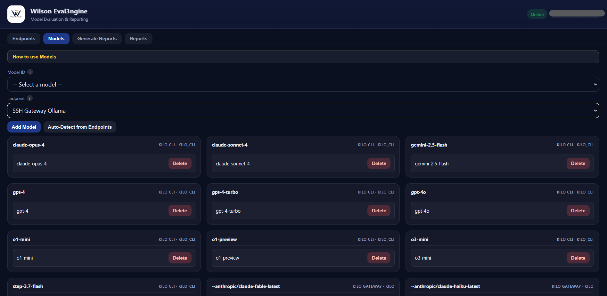</p>

The Models workspace presents the model inventory discovered or registered through configured endpoints. It helps the operator understand which exact provider/model identifiers are available and organize model families before selecting evaluation targets. This matters for reproducibility because a comparison should point to explicit model configuration and provider lineage rather than a vague model name.

### 3. Generate

<p align="center">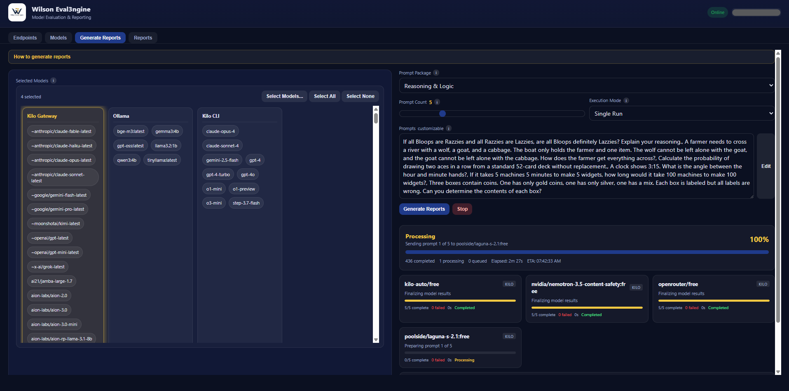</p>

The Generate workspace turns selected models and prompt material into bounded evaluation jobs and exposes execution progress. It is the operational bridge between configuration and evidence creation, allowing the operator to review the requested workload before it becomes provider traffic and artifacts. This view is useful for comparing multiple models or prompt packages because the selected scope remains visible alongside the run controls.

### 4. Reports

<p align="center">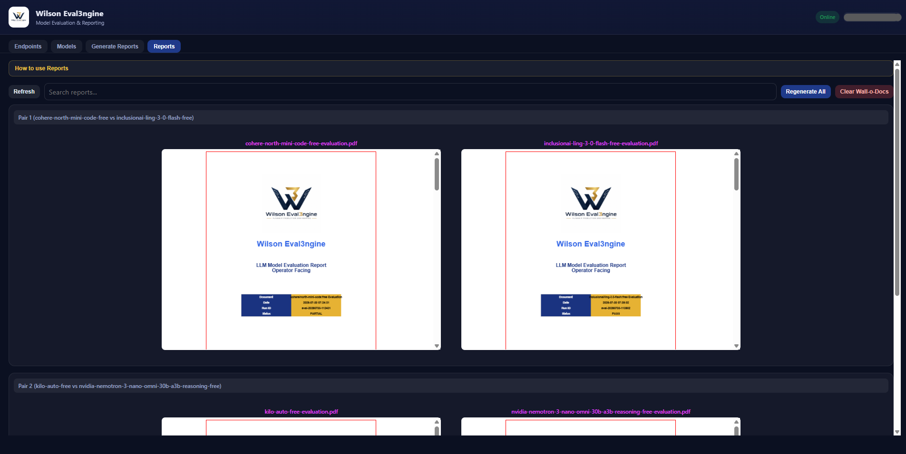</p>

The Reports workspace organizes generated evaluation documents as inspectable artifacts rather than treating a completed job as the end of the workflow. It gives the operator access to report identity and related run context so that narrative results can be reconciled with the underlying evidence. This view is useful for review and handoff because a reader can move from a run to its report instead of searching the filesystem manually.

### 5. PDF report viewer

<p align="center"></p>

The PDF viewer shows how generated reports can be read without leaving the operator interface. It supports the human-review side of the workflow by keeping the rendered report close to run metadata, hashes, and export actions rather than presenting the PDF as an isolated file. This is useful when a reviewer needs narrative interpretation while still preserving the distinction between a rendered report and the authoritative structured evidence behind it.

### 6. Prompt package selection

<p align="center"></p>

The prompt-package view shows how reusable prompt material is selected for an evaluation rather than pasted ad hoc into every run. It helps make the evaluation population understandable and repeatable because prompt selection becomes part of the declared operator workflow. This is useful when comparing model families across the same task set, since the operator can hold prompt scope stable while changing the evaluated models.

## Architecture at a glance

<p align="center">
  
</p>

The architecture is a Python modular platform with operator interfaces above application/orchestration services and explicit modules for evaluation, providers, evidence/state, governance, and operations. The local deterministic lane can run synchronously with SQLite and local artifacts, while the repository also contains production-oriented PostgreSQL scheduling, encrypted storage, identity, observability, backup/recovery, certification, and deployment components. This diagram is useful because it distinguishes code that belongs to the evaluation contract from infrastructure that exists to operate and assure that contract at larger scale.

The repository deliberately does not require every production concern to become a separate microservice. Boundaries are expressed through modules, contracts, storage interfaces, process boundaries, and security controls first, allowing the platform to remain understandable while still supporting durable workers, isolated review/grading responsibilities, external providers, and hardened deployment patterns.

### Main capability groups

**Contracts and experiment definition.** Pydantic models define experiments, datasets, cases, provider requests/responses, classifications, metrics, thresholds, and dossiers. Validation occurs before work is accepted so malformed or inconsistent definitions cannot silently become part of the result population.

**Expectation and grading.** Expected treatment is compiled from the case, policy, and rubric before the provider response is known. The grading pipeline then classifies terminal behavioral responses while retaining ambiguity and reliability errors instead of forcing everything into a binary success result.

**Providers and execution.** The provider abstraction includes a deterministic mock plus registration paths for Azure OpenAI, Anthropic, Ollama, and supported local CLI adapters. Retry handling records each attempt, and the broader execution layer includes durable PostgreSQL leasing with fenced leases, heartbeats, bounded retries, dead-letter handling, and reconciliation.

**Statistics and decisions.** Metric snapshots preserve counts, exclusions, metric versions, run IDs, and Wilson confidence intervals, while gate rules evaluate the evidence without collapsing safety and usefulness into one composite score. The repository also contains comparison/drift primitives, but [Current Status](docs/STATUS.md) identifies the remaining statistical limitations that must not be overstated.

**Evidence, reports, and signing.** Requests, responses, attempts, expectations, classifications, and other artifacts are designed to remain traceable through hashes and audit records. Signed dossiers and safe report rendering provide reviewable outputs while encrypted evidence-store and retention/legal-hold implementations support stronger storage controls outside the simple local path.

**Human review and governance.** Review workflow code supports task creation, qualified assignment, blind dual review, recusal, abstention, disagreement detection, adjudication, and supersession-oriented records. Certification orchestration groups requirements across reproducibility, durability, integrity, security, statistics, grading, governance, recovery, operations, and usability so release evidence can be evaluated as a governed set rather than an informal checklist.

**Security and operations.** The GUI uses a loopback-only official launcher, provider destination policy, and protected child-secret transport; production-oriented deployment templates separate Caddy ingress from internal API, database, cache, metrics, and dashboard networks. OIDC/project controls, telemetry/tracing, backups, runtime-evidence schemas, and assurance utilities provide the implementation surface needed to validate a real deployment, while the private environment still owns its actual identities, secrets, domains, certificates, network policy, provider allowlists, and raw runtime evidence.

## Trust and production-assurance boundary

<p align="center">
  
</p>

The trust-boundary view separates the powerful local operator interface, outbound provider execution, production service topology, and the evidence that must stay private to a real deployment. It explains why the presence of OIDC, encrypted storage, Docker hardening, or certification code in the repository cannot by itself prove that a particular production environment is correctly configured and operating. This diagram is useful for reviewers because it makes the assurance claim precise: the public repository can implement and test controls, while production approval depends on verified runtime evidence from the environment that actually uses them.

For the detailed model, read [Private Runtime Assurance](docs/security/PRIVATE_RUNTIME_ASSURANCE.md) and the point-in-time [Master Security Assessment](docs/security/MASTER_SECURITY_ASSESSMENT.md).

## What is implemented, and what still needs assurance?

| Area | Repository state | Important boundary |
|---|---|---|
| Experiment/dataset contracts | Implemented | Production datasets/policies still require governance and approval. |
| Deterministic local evaluation | Implemented and intended for local/CI use | Historical lane/example is named `foundation`; this is not the whole-project maturity label. |
| Real provider adapters | Implemented | Each real provider configuration, credential, capability, and destination still requires authorized validation. |
| Five-outcome grading | Implemented | Certification-grade calibration and selected judge/reference evidence remain deployment/program concerns. |
| Wilson intervals and metric snapshots | Implemented | Some comparison/bootstrap work remains provisional; see `docs/STATUS.md`. |
| Release gates | Implemented | Thresholds are only authoritative when approved for the target benchmark/use case. |
| Evidence/audit/signing | Implemented | Local storage/signing is not automatically equivalent to managed production immutability/key custody. |
| Human review/adjudication primitives | Implemented | A real review operation still needs identities, staffing, policy, SLA, and runtime integration evidence. |
| Durable PostgreSQL scheduler | Implemented | Production workload behavior must be validated in the target deployment. |
| Encrypted evidence store | Implemented | Development KMS is explicitly not a production key authority. |
| OIDC/project controls | Implemented | Actual IdP claims, role mappings, RLS/object controls, and negative authorization tests are environment-specific. |
| Certification orchestration | Implemented | A certification result is valid only when its required evidence and runtime checks are actually satisfied. |
| Hardened deployment templates | Implemented | Compose/source configuration is not deployment proof. |
| Observability and recovery | Implemented modules/runbooks | SLO, alert, restore, and recovery evidence must come from executed operations. |

The authoritative reconciliation is [Current Status](docs/STATUS.md). Older blueprints, Phase-1 reports, Plans, TODOs, and archived assessments are valuable provenance, but they are not allowed to silently override current implementation evidence.

## Chart and evidence gallery

These PNGs are repository sample/evidence visualizations promoted from the archived chart set so they render reliably in GitHub documentation. They demonstrate what the analysis layer can visualize; the image itself is never the authoritative source for an exact numeric claim, because exact values belong to the run metadata and structured sidecars. Every chart is shown at the same documentation width to make the gallery predictable to scan.

### Response-time box plot
<p align="center">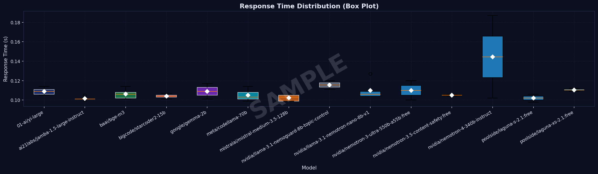</p>
This box plot compares the distribution of response latency across evaluated models rather than showing only one average. It makes medians, spread, and outliers visible, which helps identify a model whose typical speed looks acceptable but whose tail behavior is unstable. It is useful for operational comparison because release decisions often care about predictability as well as central tendency.

### Wilson confidence intervals
<p align="center"></p>
This chart places observed rates beside Wilson confidence intervals so uncertainty remains visible next to the point estimate. Wider intervals immediately show when a seemingly strong result is supported by too little evidence to justify a precise conclusion. It is useful because WE3 treats sample support and uncertainty as part of the decision rather than decoration around a percentage.

### Metric-correlation heatmap
<p align="center">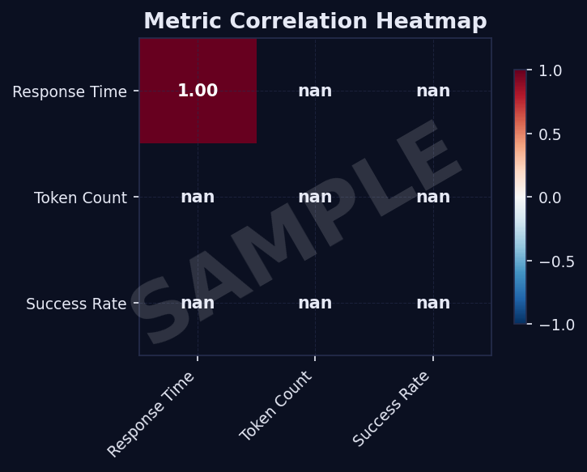</p>
This heatmap summarizes relationships among recorded quantitative dimensions such as latency, token use, and outcome-oriented measurements. It helps an analyst spot associations and trade-offs that are difficult to notice from separate tables. It is useful for hypothesis generation, while the documentation deliberately avoids treating correlation as proof of causation.

### Cross-run comparison
<p align="center"></p>
This chart compares results across multiple evaluation runs instead of considering each run in isolation. It helps reveal changes between baselines and candidates and makes regression or improvement patterns easier to inspect visually. It is useful when model, prompt, or configuration changes need to be evaluated against prior evidence rather than against an arbitrary absolute score.

### Code-sophistication heatmap
<p align="center">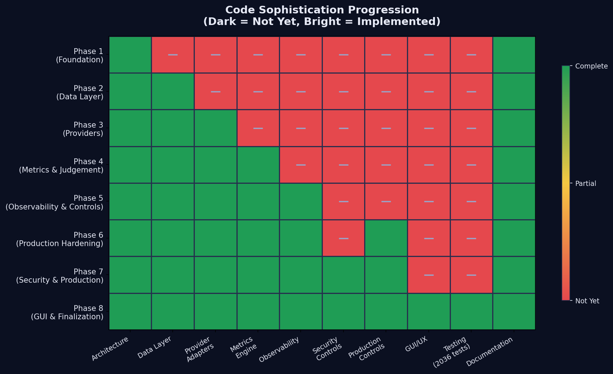</p>
This heatmap visualizes dimensions of implementation or response sophistication across the represented evaluation axes. It compresses many categorical or ordinal observations into a matrix that makes stronger and weaker areas easy to locate. It is useful for seeing uneven capability development that would disappear inside a single overall score.

### Response-time histogram
<p align="center">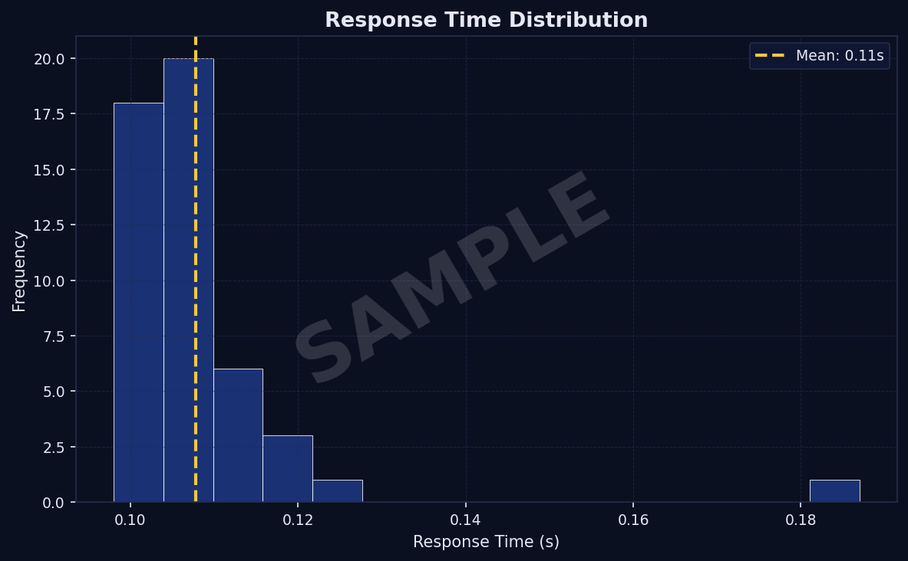</p>
This histogram shows how response times are distributed across ranges rather than reporting only their mean or median. Skew, multiple modes, and long tails can expose operational behavior that a single latency statistic hides. It is useful when assessing throughput and service risk because occasional extreme delays can matter even when the center of the distribution is fast.

### Response-time trend
<p align="center">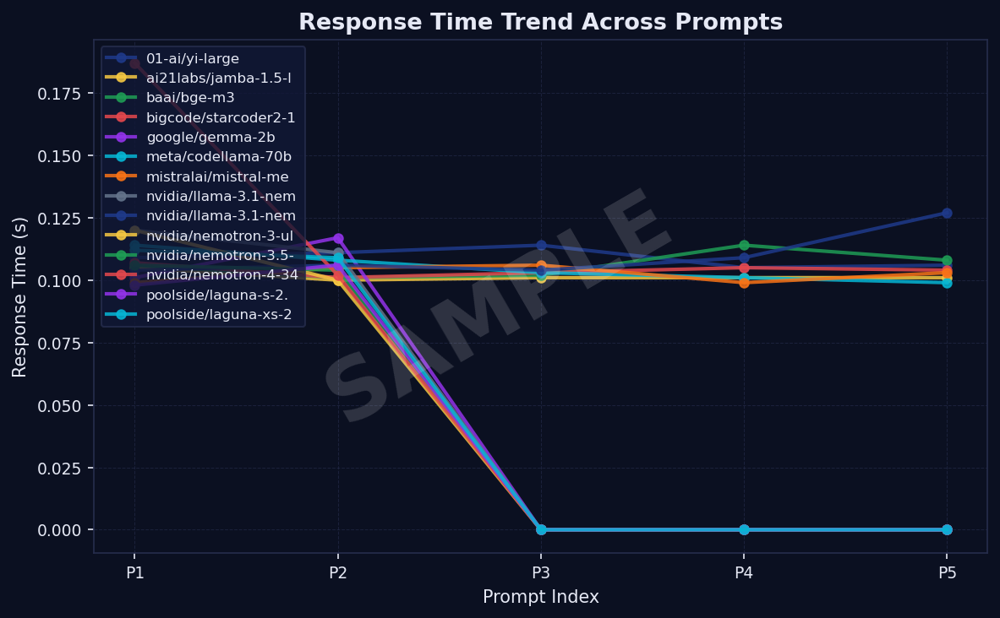</p>
This line chart follows response latency through prompt order for each represented model or run. It makes changes over the sequence visible, including warm-up effects, bursts, rate-limit behavior, or task-specific slowdowns. It is useful when the question is not only how fast a model was overall, but when and under which prompts its performance changed.

### Per-prompt performance heatmap
<p align="center"></p>
This heatmap places prompts and models on a shared grid so prompt-level differences remain visible. It helps identify cases that are uniformly difficult as well as models whose weakness is concentrated in a specific part of the evaluation set. It is useful for debugging benchmark composition because aggregate metrics can otherwise conceal which prompts are driving the result.

### Per-prompt success heatmap
<p align="center">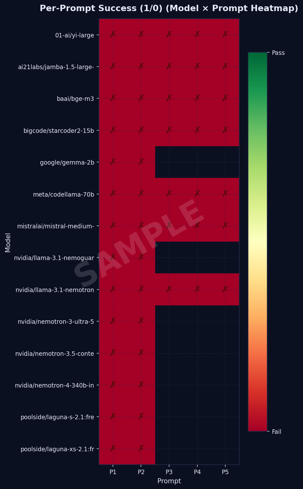</p>
This view focuses the prompt-by-model grid on successful and unsuccessful outcomes. It allows reviewers to see whether a high aggregate success rate is broad-based or produced by a smaller set of easy cases. It is useful for deciding where additional cases, regrading, or targeted model investigation will provide the most information.

### Per-prompt token heatmap
<p align="center">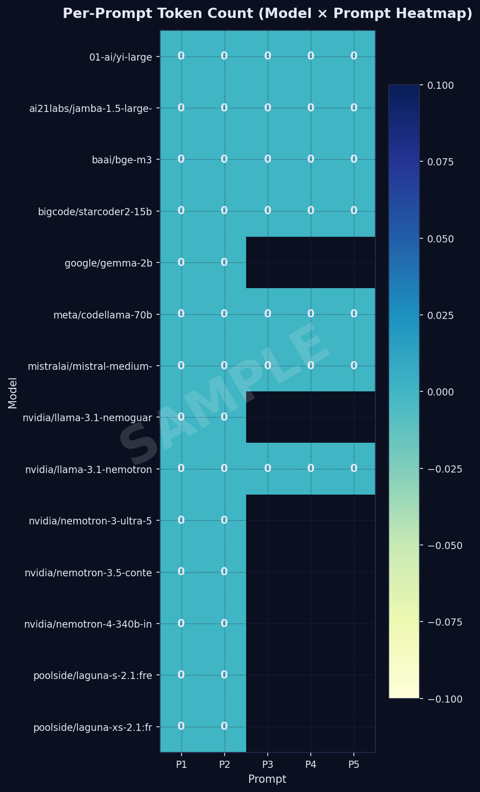</p>
This heatmap shows token use at prompt granularity across the compared models. It exposes prompts that consistently generate unusually long responses and models whose verbosity varies sharply by task. It is useful for cost and throughput analysis because the same success result can have materially different token budgets.

### Model-performance radar
<p align="center">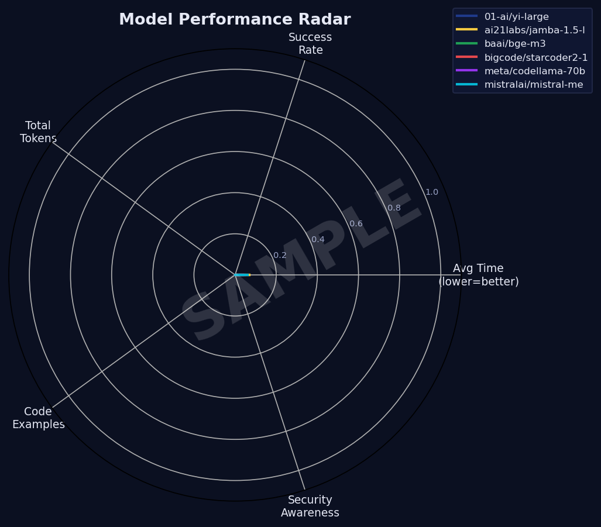</p>
This radar chart compares representative models across several normalized dimensions in one visual profile. It makes trade-offs easy to see when no single model dominates every axis. It is useful as a screening view, but exact decisions should use the underlying metrics because polygon area can visually exaggerate small differences.

### Extended model radar
<p align="center">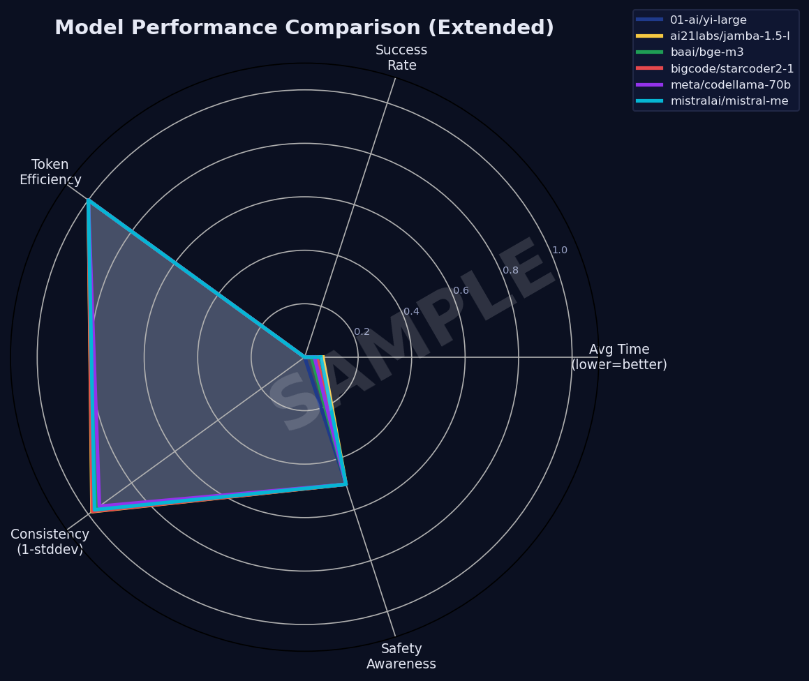</p>
This extended radar adds more dimensions to the compact model comparison so balance, efficiency, consistency, and safety-oriented signals can be viewed together. It helps distinguish a broadly capable model from one that reaches a similar headline result through an extreme trade-off on another axis. It is useful for discussion and triage before returning to the exact metric tables and evidence.

### Reasoning comparison
<p align="center">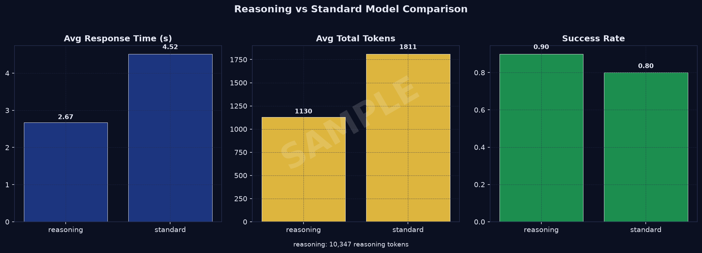</p>
This chart compares reasoning-oriented signals across the represented models or runs. It provides a focused view when the evaluation includes tasks where solution structure or reasoning behavior is more informative than simple completion. It is useful for comparing capability shape, while the underlying rubric and grader evidence remain necessary to understand exactly what the plotted reasoning measure means.

### Response-length distribution
<p align="center">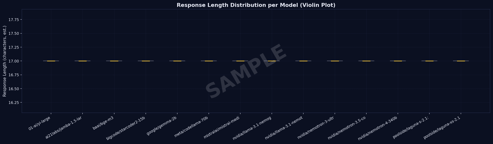</p>
This distribution shows how much response length varies across the evaluated population. It helps reveal whether a model is consistently concise, consistently verbose, or bimodal depending on the prompt. It is useful for interpreting token cost and user experience because average output length can hide substantial variation.

### Response time by model and prompt
<p align="center">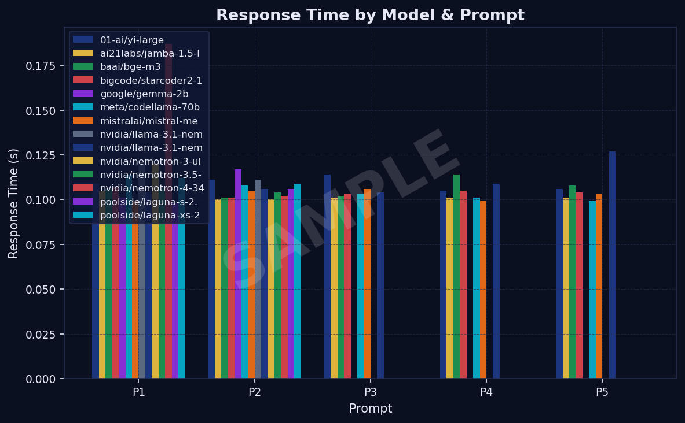</p>
This grouped comparison shows latency for individual prompts across the represented models. It keeps task-level variation visible instead of hiding all timing behavior inside one aggregate latency value. It is useful for finding prompts that trigger provider/model slowdowns and for distinguishing consistently fast models from models that are fast only on a subset of work.

### Response time versus tokens
<p align="center">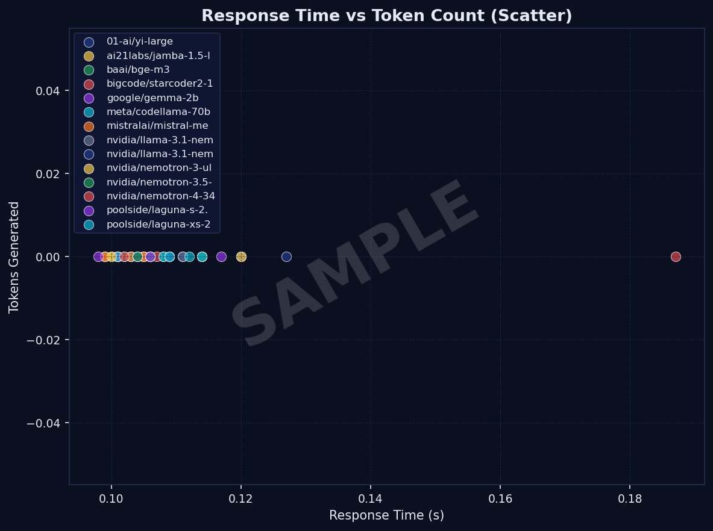</p>
This scatter plot places response time and token output on the same axes for individual observations. It helps determine whether slow responses are broadly explained by larger outputs or whether distinct model/provider clusters and outliers remain. It is useful for diagnosing efficiency because latency and verbosity often interact but should not be assumed to have a simple causal relationship.

### Code and security-awareness comparison
<p align="center">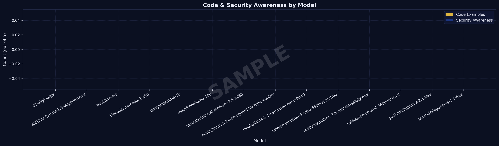</p>
This chart compares code-oriented and security-awareness signals from the represented evaluation results. It makes it easier to notice cases where technical capability is strong but risk recognition, validation, or mitigation signals lag behind. It is useful for security-focused evaluation because producing technically sophisticated output is not the same as producing safe technical output.

### Outcome distribution
<p align="center"></p>
This stacked chart preserves the shape of the outcome population instead of compressing behavior into one percentage. It allows safe, failed, and ambiguous portions to remain visible side by side for each compared model. It is useful because two models with similar aggregate success can have very different safety, ambiguity, or failure profiles.

### Success rate
<p align="center">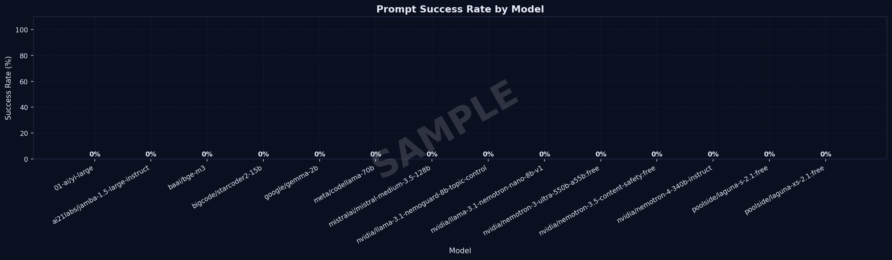</p>
This chart provides a fast comparison of observed prompt success across the represented models. It is intentionally a screening view rather than a complete release decision because it does not by itself express severity, uncertainty, denominator quality, or evidence provenance. It is useful for orientation before moving into confidence intervals, outcome distributions, and the underlying run evidence.

### Execution timeline
<p align="center">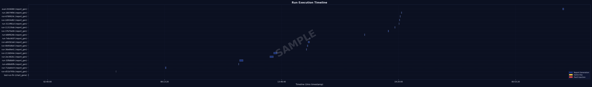</p>
This timeline places evaluation activity on a shared time axis so run timing and sequencing can be inspected. It makes execution bursts, long-running operations, gaps, and failures easier to correlate with the surrounding workflow. It is useful for operational diagnosis because performance problems often become clearer when they are viewed in temporal context.

### Token efficiency
<p align="center">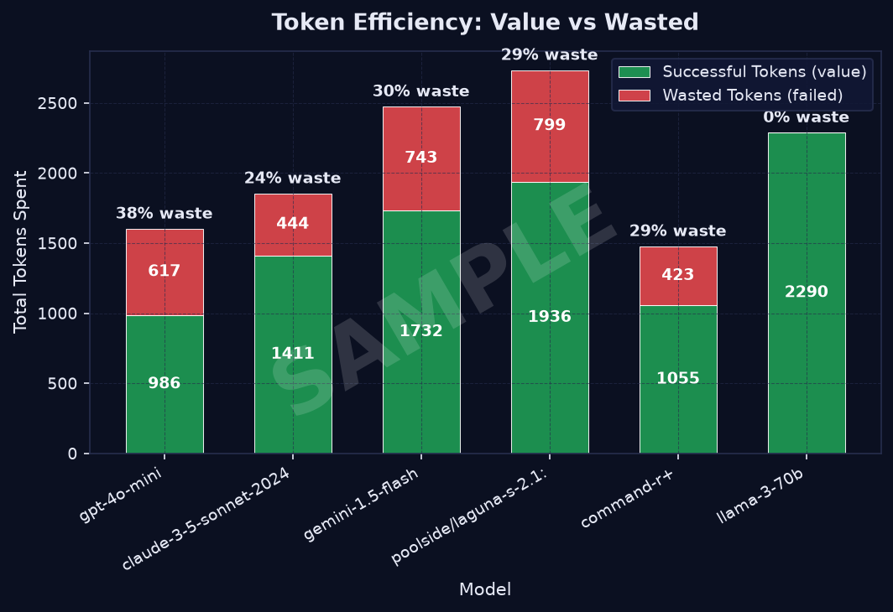</p>
This chart focuses on the relationship between useful output and token consumption for the represented models. It helps identify models that achieve comparable outcomes with materially different output budgets. It is useful for throughput and cost planning because efficiency can matter even when two models receive similar behavioral grades.

### Token usage
<p align="center">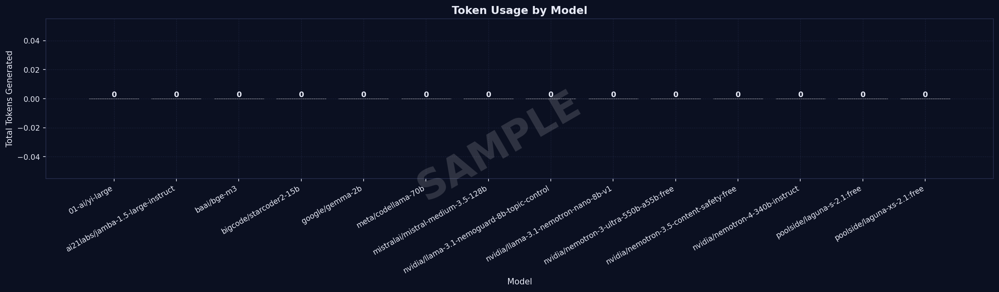</p>
This chart aggregates generated-token volume for the compared models. It provides a direct view of relative verbosity and a practical proxy for output-side cost and capacity pressure. It is useful when choosing between otherwise similar configurations because substantially different token consumption can affect both economics and latency.

The complete visual/operator reference is also available in [GUI & Evidence Guide](docs/GUI_AND_EVIDENCE_GUIDE.md), where the same assets are kept alongside their workflow context.

## Repository map

| Path | Purpose |
|---|---|
| `src/wilson_eval3ngine/` | Main Python package and platform modules. |
| `src/wilson_eval3ngine/application/` | Evaluation orchestration and application services. |
| `src/wilson_eval3ngine/providers/` | Provider contracts, hosted adapters, local adapters, and provider policy. |
| `src/wilson_eval3ngine/grading/` | Grading pipeline and judge-related components. |
| `src/wilson_eval3ngine/metrics/` and `statistics/` | Metrics, intervals, comparisons, and statistical support. |
| `src/wilson_eval3ngine/gates/` | Release-gate evaluation and thresholds. |
| `src/wilson_eval3ngine/evidence/`, `storage/`, `reports/`, `security/` | Evidence persistence, encryption, rendering, signing, and security controls. |
| `src/wilson_eval3ngine/review/` | Human-review and adjudication primitives. |
| `src/wilson_eval3ngine/persistence/` and `execution/` | Database state, durable scheduling, idempotency, and execution support. |
| `src/wilson_eval3ngine/certification/` | Certification requirements, registry, orchestration, and release evidence. |
| `src/wilson_eval3ngine/gui/` and `gui/static/` | Operator GUI server/composition and browser assets. |
| `infrastructure/`, `docker-compose*.yml`, `Dockerfile*` | Deployment, ingress, observability, and container configuration. |
| `tests/` | Unit, integration, hostile/adversarial, governance, browser, and other verification suites. |
| `examples/` | Deterministic datasets, experiment manifests, and example output locations. |
| `docs/` | Current public documentation plus specialist design/operations/security material. |
| `docs/Plans_/` and `docs/08-planning/Plans_/` | Original planning/TODO evidence retained in place and not rewritten as current product truth. |
| `.archive/` | Superseded or unused artifacts retained for provenance without cluttering active documentation paths. |

## Documentation map

Start with [Getting Started](docs/GETTING_STARTED.md) if you want to install and run WE3, [Features](docs/FEATURES.md) if you want a capability-oriented explanation, and [Architecture](docs/ARCHITECTURE.md) if you want module boundaries and data flow. Use [Current Status](docs/STATUS.md) whenever a claim depends on whether something is merely implemented, actually integrated into a specific execution path, statistically provisional, or still waiting for private runtime evidence. Use [GUI & Evidence Guide](docs/GUI_AND_EVIDENCE_GUIDE.md), [Provider Setup](docs/operations/api-key-local-model-setup.md), [Master Security Assessment](docs/security/MASTER_SECURITY_ASSESSMENT.md), and [Private Runtime Assurance](docs/security/PRIVATE_RUNTIME_ASSURANCE.md) for the deeper operational and assurance layers.

Historical plans and TODOs remain where the project created them. Superseded active documentation is archived under `.archive/documentation/` so history remains available without making an old blueprint or test report look like the current source of truth.

## Development and verification

```bash
make install
make lint
make test
make coverage
```

The project configures an 80% overall coverage threshold and includes focused test areas beyond the simple local demo. A successful source test run is still different from production runtime assurance, so do not translate CI success into a claim that a particular deployment, provider, identity system, network, backup, or certification environment has been proven.

## Agentic Engineering Origin

> **Agentic Engineering Origin:** Wilson-Eval3ngine was conceived on July 14, 2026 through a collaborative session where **The Repo Operator Arty (Runndownn)** challenged the Geezer Mekanix Agentic Engineering Platform to demonstrate its capabilities—proving that free models can deliver exceptional coding quality and speed, dismissing the notion of "AI slop." Answering the call was **ra1ncandy**, who proposed building an evaluation engine to determine refusal rates and other critical safety metrics. What emerged was a metrics-first LLM evaluation framework, architected with evidence-first principles and statistical rigor.
>
> The framework was built using **BinReaper x0.0.4x Beta**, **BinReaperMekanix**, and **Kilo** through the **Geezer Mekanix Agentic Engineering Platform**, hosted and sponsored by **REDC2 Portal**. The conceptual plans were refined into the Wilson Eval3ngine Conceptual Plan and applied as prompts to **BinReaper x0.0.4x Beta GPT 5.6 Sol Pro**, which jump-started and enhanced the process. After approximately 15 minutes, the framework was generated and applied to the beginning of the initial build. While GPT 5.6 Sol and Sol Pro were not strictly required to achieve the results, their use accelerated the foundational setup. Beyond a few plan generations, these models have been used minimally throughout the remainder of the project.
>
> Initial coding work was completed using **Laguna M.1 (free)**, with current edits being made using **Laguna S2.1 (free)**. Planning was done using **BinReaper x0.0.4x Beta GPT 5.6 Sol Extended Thinking** and **Pro Version**.
>
> **The platform transforms human intent into Bounded. Observable. Evidence-Aware. Governed. execution.**
>
> AI was not used as a substitute for engineering discipline. Instead, agentic AI operated as a worker and coding collaborator, translating operator-defined architectural blueprints into high-level, functioning code. Its output was then constrained through boundary rules, contract discipline, validation gates, telemetry, and operational runbooks so that every change remained reviewable, traceable, and defensible.
>
> Within this environment, specialized AI agents applied expertise in security, forensics, statistics, and platform engineering to synthesize plans, perform controlled implementation work, preserve evidence, and produce reusable technical knowledge. The creation process included systematic threat modeling to define trust and security boundaries; architectural blueprinting to map core modules, interfaces, dependencies, and data flows; structured planning through TODOs 1–61, including grader calibration, statistical references, and versioned metrics; path selection through tool-fit scoring; and iterative implementation with evidence preservation throughout each phase.
>
> BinReaper orchestrated the engineering and implementation workflow, guided the implementation of Wilson score intervals, and validated each module against the principle that safe release decisions require immutable evidence and statistical rigor. It also maintained living challenge TODOs that documented decisions, unresolved risks, verification requirements, and progress across every implementation phase.
>
> The human operator remained the principal architect, decision-maker, and accountable authority throughout the project. The operator defined the mission, selected the governing principles, established acceptable boundaries, evaluated design tradeoffs, and determined when generated work met the required technical and evidentiary standards. Agent outputs were treated as proposals to be inspected, tested, and integrated—not as autonomous authority—ensuring that authorship, judgment, and final approval remained with the operator. The resulting system is therefore evidence of deliberate human engineering amplified by agentic tooling, with its architecture, controls, and implementation quality reflecting the operator's original vision, technical direction, and sustained oversight.

## Contributing and security

See [CONTRIBUTING.md](CONTRIBUTING.md) for the development workflow and [SECURITY.md](SECURITY.md) for vulnerability-reporting guidance. Keep credentials, private topology, raw runtime assurance material, real provider allowlists, identity details, and other deployment secrets out of issues, pull requests, screenshots, and committed examples.

## License

MIT. See [LICENSE](LICENSE).
