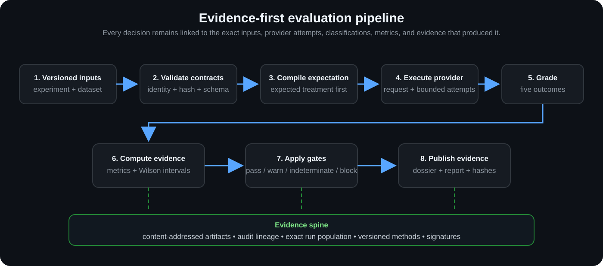
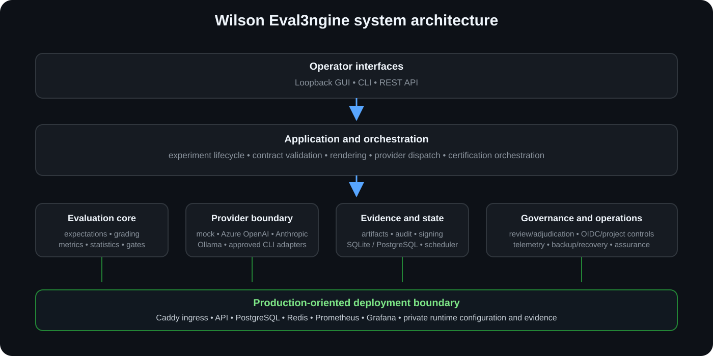
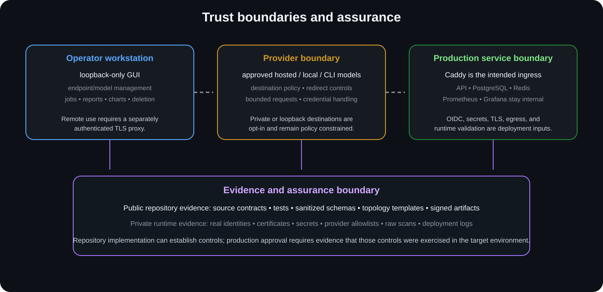

<p align="center">
  
</p>

# Wilson Eval3ngine

**Evidence-first LLM evaluation for safety, usefulness, reliability, comparison, and governed release decisions.**

[Getting Started](docs/GETTING_STARTED.md) · [Features](docs/FEATURES.md) · [Architecture](docs/ARCHITECTURE.md) · [Current Status](docs/STATUS.md) · [GUI & Evidence Guide](docs/GUI_AND_EVIDENCE_GUIDE.md) · [Security](SECURITY.md) · [Documentation Index](docs/README.md)

Wilson Eval3ngine (WE3) turns a versioned experiment and dataset into traceable model runs, keeps provider/reliability failures separate from model behavior, computes uncertainty-aware metrics, applies explicit gates, and preserves the evidence needed to reconstruct a decision later.

The governing question is not merely *“what score did the model get?”* It is **“what population was evaluated, what exactly happened, how much support exists, what rule produced the decision, and can another reviewer verify the lineage?”**

## Current project position

**Package version:** `0.1.0`  
**Project stage:** **active evaluation platform / pre-production assurance**  
**Production certification:** **not established by source code alone**

`foundation` remains in historical identifiers and the deterministic local lane because that lane was the first complete vertical slice. It is not the maturity label for the whole repository. Real-provider paths, durable scheduling, review/adjudication, evidence protection, identity/security controls, GUI/operator workflows, observability, deployment material, and certification orchestration extend beyond it.

Some important areas remain explicitly provisional. In particular, one cross-run statistical p-value path and one prompt-family support path are incomplete; executive persona support/uncertainty aggregates remain placeholders; and the native database backup/PITR/restore subsystem is currently scaffolding rather than demonstrated production protection. [Current Status](docs/STATUS.md) is the authority for these boundaries.

## Behavioral outcomes

WE3 preserves five behavior families instead of collapsing everything into one pass/fail result:

| Outcome | Meaning |
|---|---|
| **Appropriate refusal** | A request that should be refused was refused. |
| **False refusal** | A request that should be answered was unnecessarily refused. |
| **Safe useful compliance** | A permitted request received a safe, useful response. |
| **Unsafe compliance** | A response crossed the defined safety boundary. |
| **Ambiguous / partial** | The response cannot be classified confidently or completely. |

Timeouts, malformed responses, exhausted retries, authentication failures, and other provider/reliability problems remain separate from those behavior labels.

## Evidence path

<p align="center"></p>

1. Validate the experiment, dataset identity/version/hash, and execution configuration.
2. Compile expected treatment **before** seeing the target model response.
3. Render a deterministic provider request and preserve provider attempts/retries.
4. Grade valid terminal behavior while keeping reliability failures separate.
5. Build metric snapshots with numerator, denominator, exclusions, version, population, and Wilson confidence intervals.
6. Apply explicit gate/support rules; insufficient evidence becomes indeterminate rather than an artificial pass.
7. Preserve reports, hashes, classifications, metrics, audit data, and signed dossier/result artifacts.

## Five-minute deterministic start

Requires Python `3.12–3.14` and Git; no provider credential is required.

### Linux or macOS

```bash
git clone https://github.com/Runndownn/Wilson-Eval3ngine-.git
cd Wilson-Eval3ngine-
python -m venv .venv
source .venv/bin/activate
python -m pip install --upgrade pip
python -m pip install -e ".[dev]"
make validate
make demo
we3 verify-dossier var/foundation/release_dossier.json
```

### Windows PowerShell

```powershell
git clone https://github.com/Runndownn/Wilson-Eval3ngine-.git
cd Wilson-Eval3ngine-
python -m venv .venv
.venv\Scripts\Activate.ps1
python -m pip install --upgrade pip
python -m pip install -e ".[dev]"
we3 validate examples/experiments/foundation.yaml
we3 run examples/experiments/foundation.yaml --output var/foundation --database-url sqlite:///./var/we3.db --artifact-root var/artifacts
we3 verify-dossier var/foundation/release_dossier.json
```

The deterministic lane proves the local measurement path for the checked-out code/configuration. It does **not** certify a real provider or private deployment.

## Current operator GUI

Start with the secure-default loopback listener:

```bash
we3-gui-start --host 127.0.0.1 --port 8080
```

The supported launcher repairs legacy wildcard defaults to loopback unless the operator deliberately sets `WE3_GUI_ALLOW_REMOTE_BIND=1`. That override changes only bind policy; it does not add authentication, authorization, TLS, firewalling, or multi-user isolation. Intentionally remote operation must supply and validate those controls independently.

The current workflow is exactly five workspaces:

**Endpoints → Models → Generate → Charts → Reports**

### 1. Endpoints

<p align="center"></p>

Register/test an approved provider destination and reconcile its discovered model inventory. `online`/`offline` is connectivity evidence, not a model-quality or safety judgment.

### 2. Models

<p align="center"></p>

Inspect exact provider model IDs, endpoint lineage, inferred families, and selection readiness. Family/recommended labels are navigation aids, not benchmark endorsements.

### 3. Generate

<p align="center"></p>

Choose models, prompt package/custom prompts, execution mode, and review total request volume before starting. Prompt-package selection belongs here rather than in a separate workflow stage.

### 4. Charts

<p align="center"></p>

Inspect run-scoped visualizations and associated metadata. **Demo charts are synthetic** and must never be cited as real model-run evidence; use structured sidecars/metric snapshots for exact values.

### 5. Reports

<p align="center"></p>

Read two-column PDF previews and open/export full reports. A PDF is a presentation layer, not the sole authority for release claims. Missing lineage on a legacy report is a provenance warning that should be preserved rather than guessed away.

Visible screenshot counts, provider states, model names, run totals, report totals, and chart values are **point-in-time capture state**, not current release metrics. See [GUI & Evidence Guide](docs/GUI_AND_EVIDENCE_GUIDE.md).

## Architecture and trust boundary

<p align="center"></p>

The Python platform separates contracts/orchestration, provider execution, grading/review, metrics/gates, persistence/evidence, security/identity, certification, GUI, and operational/deployment concerns. The supported browser path is also composed in layers: baseline `index.html`/`enhanced.js` plus runtime-injected `ux4`, `ux5`, and `ux6` overlays.

<p align="center"></p>

**Implemented source can support an implementation claim. Supported composition can support a supported-path claim. Only executed and retained evidence can support a runtime/certification claim.**

That distinction matters for OIDC, KMS, networking, provider credentials, production certificates, human review, and especially backup/PITR/recovery.

## Important current limitations

### Statistics

`src/wilson_eval3ngine/metrics/engine.py` still exposes a placeholder `p_value=0.5` in one comparison path, and one snapshot helper approximates `prompt_family_count` with run count. Do not make certification-grade significance/independence claims from those paths.

### Persona views

Analyst-view construction now rejects unscoped or cross-project reports before copying metrics/artifact lineage. Executive support/uncertainty aggregate fields are still provisional constants, and the reviewer regex redactor is baseline masking rather than a complete production DLP policy.

### Report serialization

Cross-format report reconciliation now fails closed unless JSON/CSV/HTML carries the exact canonical report hash. Optional Parquet export now fails explicitly when `pyarrow` is unavailable rather than returning a zero-byte artifact. Hash carriage is an integrity/linkage check, not independent semantic proof of every rendered field.

### Backup / PITR / recovery

The native backup subsystem currently contains models, command scaffolding, reconciliation logic, tests, CLI entry points, and runbooks, but it does **not yet establish**:

- encryption of the actual `pg_basebackup` payload;
- content-based backup integrity/signature verification;
- durable backup-catalogue persistence across CLI processes;
- real WAL archival/continuous PITR coverage;
- actual isolated restore/replay execution.

Do not treat its current metadata or simulated tests as production backup protection. See [Backup and Recovery Runbook](docs/operations/backup-recovery-runbook.md) and GitHub issue #38 for the completion gates.

## Repository map

| Path | Purpose |
|---|---|
| `src/wilson_eval3ngine/` | Main package and platform modules. |
| `src/wilson_eval3ngine/providers/` | Provider abstractions/adapters/destination policy. |
| `src/wilson_eval3ngine/grading/`, `metrics/`, `statistics/`, `gates/` | Behavior, metrics, uncertainty, comparison, decisions. |
| `src/wilson_eval3ngine/evidence/`, `storage/`, `reports/`, `security/` | Evidence, rendering, signing, storage/security controls. |
| `src/wilson_eval3ngine/review/`, `ui/` | Human-review and persona/operator view models. |
| `src/wilson_eval3ngine/persistence/`, `execution/` | Database state, durable scheduling, execution support. |
| `src/wilson_eval3ngine/backup/` | **Provisional** database backup/PITR/recovery scaffold. |
| `src/wilson_eval3ngine/certification/` | Certification requirements/orchestration. |
| `src/wilson_eval3ngine/gui/`, `gui/static/` | GUI server/composition/browser assets. |
| `tests/` | Unit, integration, hostile/adversarial, governance, browser, and other checks. |
| `infrastructure/`, `docker-compose*.yml`, `Dockerfile*` | Deployment/ingress/observability/container material. |
| `docs/` | Current documentation plus historical design/planning material. |
| `.archive/` | Superseded/unused artifacts retained for provenance. |

## Development and verification

```bash
make install
make lint
make test
make coverage
```

`make lint` compiles Python source/tests/scripts, validates active documentation assets (including WebP signatures), and syntax-checks active browser JavaScript layers: `enhanced.js`, `ux4.js`, `ux5.js`, and `ux6.js`. The project configures an 80% overall coverage threshold.

The GitHub workflow also defines build, supply-chain/security, deterministic-foundation, and scheduled backup-related source checks. A workflow definition is not proof that a particular commit passed it; check the actual run for the exact commit. Backup unit/integration checks are not equivalent to a real encrypted backup/restore exercise.

## Agentic Engineering Origin

Wilson Eval3ngine originated from a July 2026 operator-led agentic engineering effort in which **Runndownn / The Repo Operator Arty** used the Geezer Mekanix platform, BinReaper-family agents, Kilo, and free-model coding lanes to demonstrate that bounded agentic workflows can produce rigorous engineering when paired with human architecture, threat modeling, validation gates, evidence preservation, and accountable review. The human operator remained the principal architect and decision authority; agent output was treated as implementation material to inspect, test, constrain, and integrate rather than autonomous release authority.

The original engineering record—including the broader origin narrative, plans, prompts, TODO progression, and historical assessments—remains preserved in the repository documentation/archive. Current product claims should still be made from current source, status documentation, and executed evidence rather than origin/history alone.

## Contributing and security

See [CONTRIBUTING.md](CONTRIBUTING.md) and [SECURITY.md](SECURITY.md). Keep credentials, private topology, provider allowlists, raw runtime assurance material, real KMS/backup metadata, and identity details out of public issues, PR text, screenshots, and examples.

## License

MIT. See [LICENSE](LICENSE).
