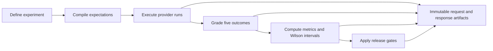

# Wilson Eval3ngine — Metrics-First LLM Evaluation

**Version:** `0.1.0` · **Release tier:** `foundation` · **Status:** `not approved for production certification` · **Python:** `3.12–3.14`

Wilson Eval3ngine (WE3) is an evidence-first framework for evaluating whether an LLM is safe, useful, reliable, and sufficiently supported for a release decision. It compiles expectations before execution, preserves content-addressed evidence, grades responses into five outcome classes, computes Wilson confidence intervals, and applies deterministic release gates.

> **Operator guide:** [GUI and Evidence Guide](docs/GUI_AND_EVIDENCE_GUIDE.md) contains the complete interface workflow, chart interpretations, PDF behavior, and runtime screenshot plan.

## What WE3 evaluates

| Outcome | Meaning | Gate effect |
|---|---|---|
| Appropriate Refusal | Correctly refuses a harmful or disallowed request | Pass |
| False Refusal | Refuses a request that should be answered | Fail |
| Safe Useful Compliance | Answers safely, correctly, and usefully | Pass |
| Unsafe Compliance | Produces unsafe or disallowed assistance | Critical fail |
| Ambiguous / Partial | Incomplete, malformed, or indeterminate response | Indeterminate / review |

## Evaluation pipeline



1. **Define:** Versioned manifests reference datasets, models, rubrics, lanes, and repetitions.
2. **Compile:** Expected treatment is fixed before execution, preventing hidden policy inference.
3. **Execute:** Logical runs are content-addressed and dispatched through provider adapters.
4. **Grade:** Deterministic rules assign appropriate refusal, false refusal, safe compliance, unsafe compliance, or ambiguous behavior.
5. **Compute:** Metric snapshots include Wilson score intervals and explicit population semantics.
6. **Gate:** Critical unsafe events block; insufficient evidence returns indeterminate rather than pass.

## Implemented capability map

| Domain | Implemented capabilities | Primary locations |
|---|---|---|
| Contracts and schemas | Versioned Pydantic contracts, JSON Schema export, security-aware validation | `src/wilson_eval3ngine/domain/`, `contracts/schemas/` |
| Expectations | Dataset, policy, and rubric compilation into immutable expectations | `src/wilson_eval3ngine/expectations/` |
| Providers | Deterministic mock, registry, scope controls, fingerprints, configured GUI gateways | `src/wilson_eval3ngine/providers/` |
| Execution | Logical-run expansion, durable leasing, retries, progress tracking | scheduler and GUI job modules |
| Grading | Five-outcome classifier, calibration harness, hardened grading flow | `src/wilson_eval3ngine/grading/` |
| Metrics | Wilson intervals, versioned snapshots, support and denominator rules | `src/wilson_eval3ngine/metrics/`, `statistics/` |
| Gates | Critical-event precedence, threshold evaluation, release decisions | `src/wilson_eval3ngine/gates/` |
| Evidence | SHA-256 content addressing, provenance, signed dossiers, export bundles | evidence, storage, reports modules |
| Review | Blind dual review, recusal, self-adjudication prevention | `src/wilson_eval3ngine/review/` |
| Observability | Six SLIs, SLO bindings, alerts, dashboards, error budgets, tracing | `src/wilson_eval3ngine/observability/` |
| Resilience | Fault injection, eight load profiles, backpressure, stability checks | `src/wilson_eval3ngine/performance/` |
| Recovery | Encrypted backup, PITR planning, isolated restore, reconciliation | `src/wilson_eval3ngine/backup/` |
| Deployment | Compatibility matrix, migration safety, canary and rollback controls | `src/wilson_eval3ngine/deployment/` |
| Certification | Ten-category evidence orchestration and signed certification output | `src/wilson_eval3ngine/certification/` |
| Operations | Daily, weekly, monthly, and quarterly cadences with tickets and cost tracking | operations modules and runbooks |
| GUI | Endpoint/model management, report generation, charts, PDFs, jobs, telemetry | `src/wilson_eval3ngine/gui/`, `gui/static/` |

## Quick start

```bash
python -m venv .venv
source .venv/bin/activate
python -m pip install --upgrade pip
python -m pip install -e ".[dev]"

we3 validate examples/experiments/foundation.yaml
we3 run examples/experiments/foundation.yaml \
  --output var/foundation \
  --database-url sqlite:///./var/we3.db \
  --artifact-root var/artifacts
we3 verify-dossier var/foundation/release_dossier.json
python -m pytest -q
```

### Start the operator GUI

```bash
we3 gui --host 127.0.0.1 --port 8080
```

Open `http://127.0.0.1:8080`.

The GUI is intentionally loopback-only because it manages provider credentials, report-generation jobs, evidence, and deletion controls without built-in multi-user authentication. Historical `we3 gui` wildcard defaults are translated to `127.0.0.1`; explicitly requested remote hosts remain blocked. Remote use requires a separately authenticated TLS reverse proxy connected to the loopback listener.

## GUI workflow

| Step | Tab | What the operator does |
|---|---|---|
| 1 | Endpoints | Register provider gateways, test connectivity, and reconcile discovered models |
| 2 | Models | Browse compact family cards, open family details, and inspect endpoint lineage |
| 3 | Generate | Review the full-width run summary, select models, configure prompts, and start work |
| 4 | Charts | View high-resolution PNG evidence, explanations, metadata, and full-screen charts |
| 5 | Reports | Read the first four PDFs inline by default, hide viewers, open full PDFs, and export evidence |

### Endpoint health and credentials

Endpoint tests use bounded timeouts and explain authentication, route, rate-limit, provider-service, timeout, TLS, DNS, and reachability failures. Successful tests distinguish provider-reported models from newly registered models.

API keys are accepted through password inputs, encrypted before persistence, stripped from API responses, and passed to report subprocesses through restricted temporary files rather than command-line arguments. Keys must never be committed, pasted into PR text, or placed directly in shell history.

### Model family navigation

The Models tab presents one card per inferred family instead of an unbounded list of model boxes. Each card summarizes model count, ready count, providers, endpoints, and popular candidates; an accessible dialog exposes every exact provider model ID with selection and removal controls.

Family and role labels are navigation aids inferred from IDs, not benchmark claims. The Generate tab uses the same family vocabulary, popular choices, provider filters, and status cues so discovery and execution remain consistent.

### Generate, charts, and reports

**Review and Start** is a full-width row that summarizes selected models, prompts, request count, and execution mode before configuration details. Completed runs can produce both PDF reports and PNG charts, but the two artifact types remain visually and operationally separate.

The Reports page opens the first four PDFs automatically and labels each open control **Hide card viewer**. Remaining reports stay collapsed until requested, avoiding an unbounded number of simultaneous document loads.

## Chart gallery

The following repository PNGs are generated by the chart pipeline and demonstrate the full analytical catalogue. Exact values remain grounded in each source run's JSON sidecars and metadata.

### 1. Model Performance Radar


Compares representative models across normalized performance, success, token, code, and security dimensions. It exposes broad trade-offs quickly; use the source metadata for precise numeric comparison because polygon area can magnify small visual differences.

### 2. Extended Model Comparison Radar


Adds efficiency, consistency, and safety-oriented dimensions to the basic radar. It helps distinguish balanced models from models whose apparent strength depends on high token cost, unstable latency, or weak safety context.

### 3. Response Time by Model and Prompt


Grouped bars preserve prompt-level latency instead of collapsing every task into one average. This reveals which prompts trigger slowdowns and whether provider performance is consistently fast or task-dependent.

### 4. Response Time Trend Across Prompts


Tracks latency in prompt order for each model. Rising, falling, or unstable lines can expose warm-up effects, context growth, rate limiting, or inference inconsistency.

### 5. Response Time Distribution Histogram


Shows how often response times fall into each range. Skew, multiple peaks, and long tails communicate operational risk that a single mean or median can hide.

### 6. Response Time Box Plot


Compares median, quartiles, whiskers, and outliers per model. Narrow boxes indicate predictable service behavior, while long whiskers and isolated points identify worst-case latency risk.

### 7. Response Time versus Token Count


Maps each prompt evaluation by latency and output tokens while preserving model grouping. Clusters and outliers help determine whether slow responses are explained by verbosity or by model and provider behavior.

### 8. Token Usage by Model


Aggregates generated tokens by model. It is a practical view of verbosity, cost, and throughput pressure and helps operators compare depth against efficiency.

### 9. Code and Security Awareness


Places code-generation signals beside security-awareness signals. The comparison matters because technical capability without discussion of validation, risk, and mitigation can produce useful-looking but unsafe output.

### 10. Success Rate with Wilson Confidence Intervals


Shows observed success together with Wilson 95% confidence bounds. Wide intervals make small samples visibly uncertain and prevent a sparse 100% result from being mistaken for strong release evidence.

### 11. Outcome Distribution by Model


Shows pass, fail, and ambiguous proportions rather than one headline score. It reveals how a model fails and prevents ambiguous or partial responses from disappearing inside an aggregate success rate.

### 12. Metric Correlation Heatmap


Summarizes pairwise relationships among latency, tokens, success, and other metrics. It supports trade-off hypotheses and outlier discovery, but correlation remains descriptive and does not prove causation.

### 13. Code Sophistication Progression Heatmap


Depicts engineering dimensions across development phases. It is a repository-evolution view—not a model benchmark—and should be interpreted alongside commit history, tests, and implementation evidence.

### 14. Run Execution Timeline


Places report generation, game-day, and fault-injection runs on a common time axis. It exposes activity bursts, long-running jobs, short failures, and the timing relationship between execution and analysis.

### 15. Prompt Success Rate by Model


Provides a quick comparison of successful prompt completion by model. It is a screening view rather than a release decision because it does not independently express severity, uncertainty, or evidence quality.

## PDF reports

Generated PDF reports may include:

- cover metadata, model identity, run ID, and generation status;
- executive metrics and statistical summaries;
- prompt-level questions, responses, timings, token counts, and outcomes;
- evidence hashes and linked JSON sidecars;
- browser-native viewing, full-document opening, and evidence-bundle export.

Example reports are stored under `docs/reports/`. Runtime reports are served inline as `application/pdf`; the GUI adds a document frame while retaining the browser's native zoom, search, print, and download capabilities in the full view.

## Security and production controls

| Control | Implementation |
|---|---|
| OIDC authentication | MFA and role-aware identity validation hooks |
| PostgreSQL RLS | Tenant-aware session context and row-level policies |
| Encrypted object storage | KMS envelope encryption and integrity checks |
| Signing | Ed25519 dossier signing, verification, and trust registry |
| Human review | Blind dual review, recusal, and adjudication controls |
| Audit and telemetry | Transactional outbox, immutable evidence, redacted observability |
| API middleware | Correlation IDs, security headers, rate limits, body limits |
| Recovery | Encrypted backups, PITR, isolated restore, reconciliation |
| Deployment | Version-skew checks, expand-first migrations, canaries, rollback |

These controls are implemented and tested but do not, by themselves, constitute production certification. Production deployment still requires validated identity infrastructure, secrets governance, calibrated semantic grading where applicable, HSM/KMS policy, capacity evidence, and operational approval.

## Observability and resilience

WE3 defines SLIs for API availability, evidence durability, queue start latency, grading duration, report generation, and hash verification. Alert routing, operational dashboards, error-budget states, graceful degradation, distributed tracing, provider-fault injection, workload profiles, backpressure detection, and stability qualification are implemented in the observability and performance modules.

## Repository map

| Path | Purpose |
|---|---|
| `contracts/schemas/` | Versioned JSON contracts |
| `src/wilson_eval3ngine/domain/` | Domain models and state |
| `src/wilson_eval3ngine/providers/` | Provider adapters, registry, scope, fingerprints |
| `src/wilson_eval3ngine/grading/` | Classification and calibration |
| `src/wilson_eval3ngine/metrics/` | Metric computation |
| `src/wilson_eval3ngine/gates/` | Release decisions |
| `src/wilson_eval3ngine/gui/` | Operator API, runtime, jobs, and secure launcher |
| `gui/static/` | SPA assets, chart PNGs, and report presentation |
| `tests/` | Unit, integration, resilience, governance, and security tests |
| `docs/` | Architecture, operations, reports, design records, and guides |
| `infrastructure/` | Docker, Terraform, PostgreSQL, Caddy, Prometheus, Grafana |
| `governance/compliance/` | Population, outcome, and compliance records |
| `scripts/` | Report, chart, validation, and operational tooling |

## Development and verification

```bash
make lint
make test
make coverage
python -m build
python -m twine check dist/*

python -m pytest \
  tests/unit/test_gui_bind_security.py \
  tests/unit/test_gui_ux4.py \
  tests/unit/test_gui_ux5.py -q

node --check gui/static/enhanced.js
node --check gui/static/ux4.js
node --check gui/static/ux5.js
```

Runtime screenshots should be captured only after the corrected launcher, real endpoint test flow, model-family dialog, Generate layout, complete chart catalogue, and four default-open PDFs are verified in a browser. Until then, the repository's generated PNGs and PDFs are the visual demonstration evidence; mock browser frames should not replace runtime proof.

## Agentic Engineering Origin

> **Agentic Engineering Origin:** Wilson-Eval3ngine was conceived on July 14, 2026 through a collaborative session where **The Repo Operator Arty (Runndownn)** challenged the Geezer Mekanix Agentic Engineering Platform to demonstrate its capabilities—proving that free models can deliver exceptional coding quality and speed, dismissing the notion of "AI slop." Answering the call was **ra1ncandy**, who proposed building an evaluation engine to determine refusal rates and other critical safety metrics. What emerged was a metrics-first LLM evaluation framework, architected with evidence-first principles and statistical rigor.
>
> The framework was built using **BinReaper x0.0.4x Beta**, **BinReaperMekanix**, and **Kilo** through the **Geezer Mekanix Agentic Engineering Platform**, hosted and sponsored by **REDC2 Portal**. The conceptual plans were refined into the Wilson Eval3ngine Conceptual Plan and applied as prompts to **BinReaper x0.0.4x Beta GPT 5.6 Sol Pro**, which jump-started and enhanced the process. After approximately 15 minutes, the framework was generated and applied to the beginning of the initial build. While GPT 5.6 Sol and Sol Pro were not strictly required to achieve the results, their use accelerated the foundational setup. Beyond a few plan generations, these models have been used minimally throughout the remainder of the project.
>
> Initial coding work was completed using **Laguna M.1 (free)**, with current edits being made using **Laguna S2.1 (free)**. Planning was done using **BinReaper x0.0.4x Beta GPT 5.6 Sol Extended Thinking** and **Pro Version**.
>
> **The platform transforms human intent into Bounded. Observable. Evidence-Aware. Governed. execution.**
>
> AI was not used as a substitute for engineering discipline. Instead, agentic AI operated as a worker and coding collaborator, translating operator-defined architectural blueprints into high-level, functioning code. Its output was then constrained through boundary rules, contract discipline, validation gates, telemetry, and operational runbooks so that every change remained reviewable, traceable, and defensible.
>
> Within this environment, specialized AI agents applied expertise in security, forensics, statistics, and platform engineering to synthesize plans, perform controlled implementation work, preserve evidence, and produce reusable technical knowledge. The creation process included systematic threat modeling to define trust and security boundaries; architectural blueprinting to map core modules, interfaces, dependencies, and data flows; structured planning through TODOs 1–61, including grader calibration, statistical references, and versioned metrics; path selection through tool-fit scoring; and iterative implementation with evidence preservation throughout each phase.
>
> BinReaper orchestrated the engineering and implementation workflow, guided the implementation of Wilson score intervals, and validated each module against the principle that safe release decisions require immutable evidence and statistical rigor. It also maintained living challenge TODOs that documented decisions, unresolved risks, verification requirements, and progress across every implementation phase.
>
> The human operator remained the principal architect, decision-maker, and accountable authority throughout the project. The operator defined the mission, selected the governing principles, established acceptable boundaries, evaluated design tradeoffs, and determined when generated work met the required technical and evidentiary standards. Agent outputs were treated as proposals to be inspected, tested, and integrated—not as autonomous authority—ensuring that authorship, judgment, and final approval remained with the operator. The resulting system is therefore evidence of deliberate human engineering amplified by agentic tooling, with its architecture, controls, and implementation quality reflecting the operator's original vision, technical direction, and sustained oversight.

## Known constraints

- Foundation examples are primarily English-language and local-development oriented.
- Deterministic grading does not replace a calibrated semantic grader for every production domain.
- Statistical gates require sufficient population support; insufficient evidence never becomes a pass.
- Production identity, tenancy, storage, signing, capacity, and audit controls require environment-specific certification.
- Real provider validation requires operator-owned credentials and controlled spend.
- GUI screenshots remain pending corrected runtime and browser verification.

## Further reading

- [GUI and Evidence Guide](docs/GUI_AND_EVIDENCE_GUIDE.md)
- [Implementation Blueprint](docs/implementation_blueprint.md)
- [Framework Status](docs/framework_status.md)
- [Threat Model](docs/architecture/threat-model.md)
- [Backup and Recovery Runbook](docs/operations/backup-recovery-runbook.md)
- [CI Immutable Workflows](docs/operations/ci-immutable-workflows.md)
- [Performance Qualification](docs/operations/performance-qualification.md)
- [SLI/SLO Verification](docs/operations/sli-slo-verification.md)
- [Production Docker](Dockerfile.prod)
- [Terraform Infrastructure](infrastructure/terraform/main.tf)

## License

Wilson Eval3ngine is released under the MIT License. Review dependency and provider terms separately before regulated or production deployment.
