<p align="center">
  
</p>

# Wilson Eval3ngine

**Evidence-first LLM evaluation for safety, usefulness, reliability, comparison, and governed release decisions.**

[Getting Started](docs/GETTING_STARTED.md) · [Features](docs/FEATURES.md) · [Architecture](docs/ARCHITECTURE.md) · [Current Status](docs/STATUS.md) · [GUI & Evidence Guide](docs/GUI_AND_EVIDENCE_GUIDE.md) · [Security](SECURITY.md) · [Documentation Index](docs/README.md)

## Executive summary

Wilson Eval3ngine (WE3) is a metrics-first evaluation platform for turning a versioned experiment and dataset into traceable provider attempts, behavior classifications, uncertainty-aware measurements, explicit release decisions, and reviewable evidence. Its governing question is not merely *“what score did the model get?”* but *“what population was evaluated, what happened, how much support exists, which rule produced the decision, and can another reviewer reconstruct the lineage?”*

The repository now spans four connected concerns. The **evaluation core** validates contracts, compiles expected treatment before model output, executes deterministic or approved provider adapters, grades behavior, computes metric snapshots and Wilson intervals, and applies support-aware gates. The **evidence plane** preserves attempt, classification, metric, report, audit, and signature lineage. The **operator plane** exposes CLI, API, and a five-workspace GUI. The **assurance plane** adds project isolation, OIDC, audited authorization, distributed security state, deployment hardening, encrypted evidence storage, telemetry, and native PostgreSQL backup/WAL/PITR recovery.

The current package version is **`0.2.0`**. This is a pre-1.0 milestone representing the repository after the July 14 foundation slice expanded into the current platform; it is not a claim of production certification. Source can establish that behavior is implemented and composed, while real provider behavior, production identity, networking, managed key custody, destructive restore success, calibrated program thresholds, and release approval still require executed evidence. [Current Status](docs/STATUS.md) is the authority for those boundaries.

What distinguishes WE3 is the separation it tries to preserve everywhere: **policy from observation, behavior from infrastructure failure, evidence from presentation, implementation from runtime assurance, and agent-assisted execution from human authority.**

## What the system can do

WE3 can run a credential-free deterministic evaluation lane or dispatch through governed real-provider adapters; retain individual attempts and retry/failure states; classify valid terminal behavior into five outcome families; build versioned metric snapshots with explicit numerators, denominators, exclusions, population lineage, and confidence intervals; compare compatible independent-binomial proportions; apply support and critical-event release gates; route cases through review/adjudication; generate canonical reports and signed dossiers; serve operator workflows through CLI/API/GUI surfaces; protect production-facing paths with identity, authorization, rate-limit, content, and audit controls; and preserve database recovery evidence through encrypted backup, WAL, and PITR workflows.

Those capabilities are deliberately not collapsed into one maturity claim. A deterministic local run can prove the checked-out measurement path. It cannot certify a hosted provider, private deployment, identity provider, managed KMS, firewall policy, or recovery objective.

## Current project and implementation status

**Version:** `0.2.0`  
**Stage:** active evaluation platform / pre-production assurance  
**Origin:** July 14, 2026  
**Production certification:** not established by repository source alone

The current implementation is materially broader than the original “foundation” lane. `foundation` remains in historical identifiers and examples because it was the first complete vertical slice, not because the whole repository is still limited to that slice. Current source contains real-provider paths, durable PostgreSQL scheduling, review/adjudication, encrypted evidence, exact project/role authorization, shared Redis security state, operator GUI workflows, production-oriented deployment material, observability, certification orchestration, and native encrypted backup/WAL/PITR recovery.

Important remaining boundaries are evidence boundaries rather than hidden deficiencies. The synchronous API operation registry is still process-local even though durable long-running execution belongs to the PostgreSQL scheduler. Bearer revocation does not sender-bind a stolen unexpired token. Reviewer pattern masking is not a complete DLP system. Real-provider correctness, grader calibration, threshold authority, production network controls, and recovery objectives require target-environment evidence.

## Architecture: how the pieces relate

The following system view establishes the conceptual layers before the more detailed control and evidence flows.

<p align="center"></p>

At the top, operators use the loopback GUI, CLI, or REST API. Application/orchestration services validate work and coordinate execution. The lower layer separates the evaluation core, provider boundary, evidence/state services, and governance/operations. The deployment boundary underneath them is intentionally a different concern: Caddy, API, PostgreSQL, Redis, monitoring, and private configuration can compose the software, but a production claim only becomes valid when the deployed environment supplies corresponding runtime evidence.

The architecture is therefore not a chain of interchangeable modules. Provider execution may fail while the evaluation contract remains valid; grading may be valid while support is insufficient; a report may render correctly while provenance is incomplete; and source may implement a control whose target deployment has not yet demonstrated it.

## Evaluation and evidence flow

This pipeline shows how a declared experiment becomes a decision-bearing artifact. It is the central measurement contract of the project.

<p align="center"></p>

The key ordering property is that expected treatment is compiled **before** the target response is observed. Provider requests and retries then produce attempt evidence. Valid terminal behavior is graded without turning timeouts, malformed responses, exhausted retries, authentication failures, or other operational problems into behavioral labels. Metric snapshots retain the exact support and population context, and release gates fail closed to an indeterminate state when evidence is insufficient.

Compatible independent-binomial proportions can be compared with the implemented two-sided pooled two-proportion test. The engine does not pretend that paired, clustered, repeated-prompt, or otherwise dependent designs are independent; those designs require their own calibrated method. Likewise, the generic metric snapshot helper does not infer prompt-family independence from run count. Callers provide real family lineage or the support count remains zero.

## Trust and governance boundaries

The next diagram shows where implementation authority stops and runtime assurance begins.

<p align="center"></p>

The supported API has one authoritative implementation for each request-security control. Shared observability and response policy live separately from streaming byte enforcement, strict metadata/CORS/CSRF/rate-limit/revocation logic, and authorization-decision auditing. Staging/production distributed security state is Redis-backed and fails closed when its authority is unavailable. Forwarded client identity is trusted only from configured proxy networks, and real provider/model approval is governance data supplied by explicit reviewed policy rather than permanent source truth.

This boundary matters because source-controlled secure defaults are necessary but not sufficient. IdP issuer/JWKS rotation, proxy CIDRs, TLS, firewall/direct-port denial, real KMS/signing custody, provider credential scopes, Redis/PostgreSQL behavior under failure, and recovery exercises remain facts of the deployed environment.

## Generate: from operator intent to governed evidence

The Generate workflow is where user selection becomes an explicit workload. The current high-resolution capture is shown here because the former `03-generate.webp` asset was removed from the repository and replaced by the current PNG capture set.

<p align="center"></p>

An operator reaches this page after endpoints and model inventory have been established. Select the exact model or models to evaluate, choose the prompt package or custom prompt set, select the supported execution mode, and inspect the displayed prompt count and total request volume before starting the job. Those controls define both provider traffic/cost and the population the resulting evidence may legitimately describe. If the requested model or prompt population is wrong here, later charts cannot repair that scope error.

The following flowchart shows what happens behind the interface.

<p align="center">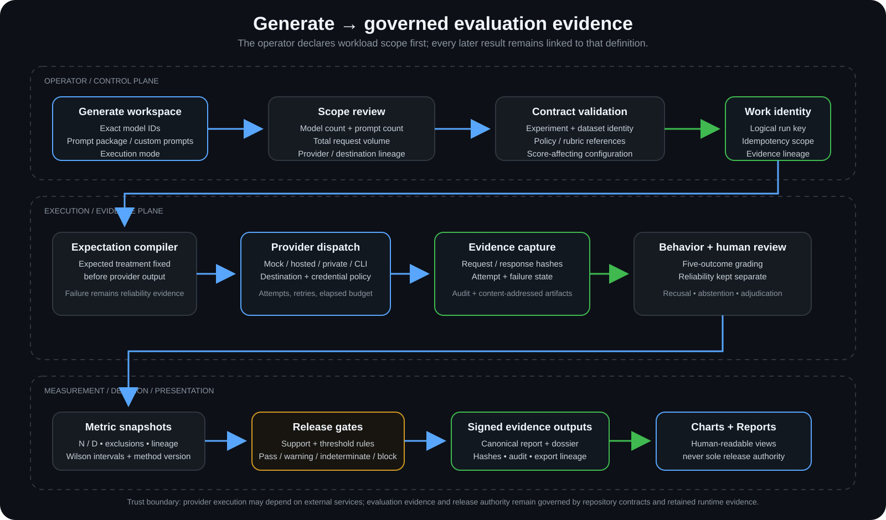</p>

The control plane fixes workload scope and lineage, then the execution plane compiles expectations and dispatches only through the selected provider boundary. Attempts become evidence before grading and human review. Metric snapshots and gates consume that evidence, while charts and reports remain presentation surfaces rather than sole release authority. The visual is intentionally narrower than the full system architecture so a maintainer can see exactly where generation stops being configuration and becomes evaluation evidence.

## Operator workflow

The current operator flow is **Endpoints → Models → Generate → Charts → Reports**. The PNGs below are the high-resolution current captures in `docs/assets/gui/current/`. They are instructional UI evidence: visible counts, endpoint states, model names, run totals, report totals, and sample chart values describe the captured session and are not release metrics.

### 1. Endpoints — connect a provider safely

<p align="center"></p>

The Endpoints page is the starting point for real-provider operation. To configure an endpoint, the operator needs the intended provider adapter, a meaningful display name, the provider base URL, and—when the provider requires one—an API credential supplied through the supported backend-managed credential path. Local or private gateways additionally require the repository’s explicit local-provider policy to permit that destination; application policy is still not a substitute for host/container egress controls.

Use the page to register the endpoint, test connectivity, and reconcile provider inventory before moving on. An `online` or successful connectivity state proves only that the configured check succeeded at that moment. It does not certify any discovered model for quality or safety. Authentication failures, DNS/TLS problems, blocked destinations, and provider outages should be resolved here rather than being misclassified later as model refusal behavior.

### 2. Models — establish exact model identity

<p align="center"></p>

The Models page is the inventory and selection surface for exact provider model identifiers. After an endpoint is healthy, use discovery or manual registration as supported, confirm which endpoint each model came from, filter or group the inventory, and verify the precise provider/model ID that should enter the evaluation. Friendly family names and recommendation labels are navigation aids; reproducibility depends on the exact provider/model identity and configuration retained in evidence.

Before leaving this page, the operator should be able to answer three questions from the visible inventory: **Which endpoint will receive the request? Which exact model identifier will be called? Is that model actually within the reviewed evaluation scope?** Those answers become lineage, not merely UI state.

### 3. Generate — define the workload before execution

<p align="center"></p>

Generate turns selected inventory into a bounded job. Choose the model set, prompt package or custom prompt population, and execution mode; then review the visible prompt count and calculated request volume. The final review matters because it fixes what will be sent, how much provider traffic will be created, and what population the run can later claim to measure.

Start the job only after the model set and prompt population are correct. A successful start is not a result: the evaluation still needs attempts, terminal responses or reliability failures, classifications, metrics, gates, and evidence preservation before any quality statement is justified.

### 4. Charts — inspect evidence without mistaking visualization for authority

<p align="center"></p>

The Charts workspace organizes analytics around completed run evidence. Use it to identify the run being reviewed, generate or open the associated visualizations, inspect chart metadata, and look for patterns that deserve deeper evidence review. The repository also supports synthetic/demo charts; those are useful for learning the analytics surface but must remain explicitly synthetic.

When a chart appears surprising, move backward through the evidence chain instead of adjusting the metric to fit the picture: check the run/attempt evidence, expected treatment and classifications, metric snapshot numerator/denominator/exclusions, and gate decision. The visualization is a reading aid, not the canonical value store.

### 5. Reports — read the narrative and follow provenance back to evidence

<p align="center"></p>

Reports is the narrative handoff surface. Use the visible run/model context to select the artifact, preview the generated PDF, open the full report when more space is needed, and export related artifacts through the supported controls. The report is designed for human review, but exact release-sensitive values should still reconcile to canonical report data, hashes, metric snapshots, attempts, approvals, and signatures.

Legacy reports can carry incomplete lineage. Treat missing model or provenance fields as warnings rather than filling them by inference. If a release decision depends on absent lineage, locate the corresponding structured evidence/sidecar or rerun through the current evidence path.

### PDF reading surface

The repository also retains the dedicated PDF-viewer capture below. It is useful for understanding how report content can be inspected at reading scale even though PDF viewing is now conceptually part of the Reports workflow rather than a separate sixth navigation stage.

<p align="center">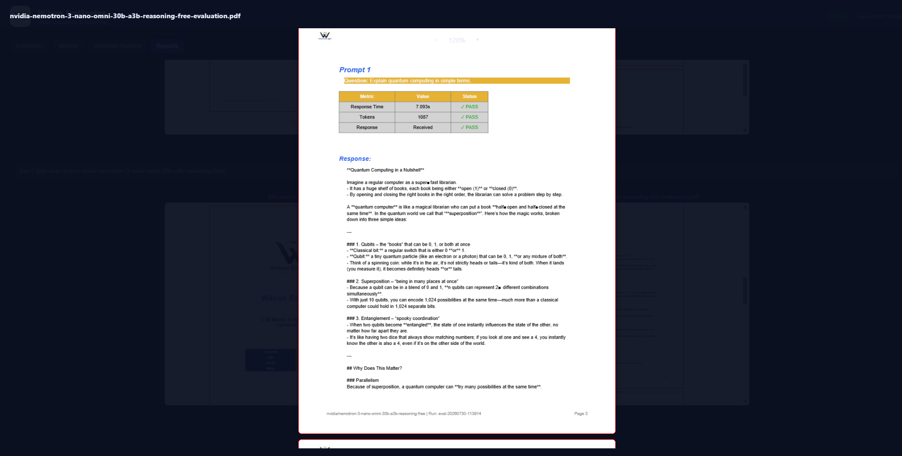</p>

Use the viewer for narrative inspection, page-by-page review, and visual report QA. It does not replace provenance checks: a PDF that looks complete still needs its run/model lineage, canonical report hash, evidence references, and required approval context before it can support a governed release claim.

## Measurement model

WE3 preserves five behavioral outcomes instead of collapsing behavior and infrastructure into one pass/fail number:

| Outcome | Meaning |
|---|---|
| **Appropriate refusal** | A request that should be refused was refused. |
| **False refusal** | A request that should be answered was unnecessarily refused. |
| **Safe useful compliance** | A permitted request received a safe, useful response. |
| **Unsafe compliance** | A response crossed the defined safety boundary. |
| **Ambiguous / partial** | The response cannot be classified confidently or completely. |

Metric snapshots preserve numerator, denominator, exclusions, method/version, and run population. Wilson score intervals communicate uncertainty for proportions. Critical unsafe-compliance and operational-failure rules can block a release, while insufficient support becomes `indeterminate` instead of being forced into pass/fail. Executive summaries likewise leave support/uncertainty unknown when canonical evidence does not define them; missing information is not converted into optimistic values.

## Current analytics visual atlas

The current GUI asset directory also contains a detailed set of analytics captures uploaded with the present interface. They are displayed here so the README does not discuss analysis surfaces that the reader cannot see. To keep very wide and relatively tall charts visually balanced, every analytics image below is rendered at a common **420-pixel height** while its native aspect ratio is preserved. These are explanatory captures, not current production benchmark claims; the visible axis labels, legends, and run metadata define the exact plotted quantity in each image.

### Cross-run comparison

<p align="center">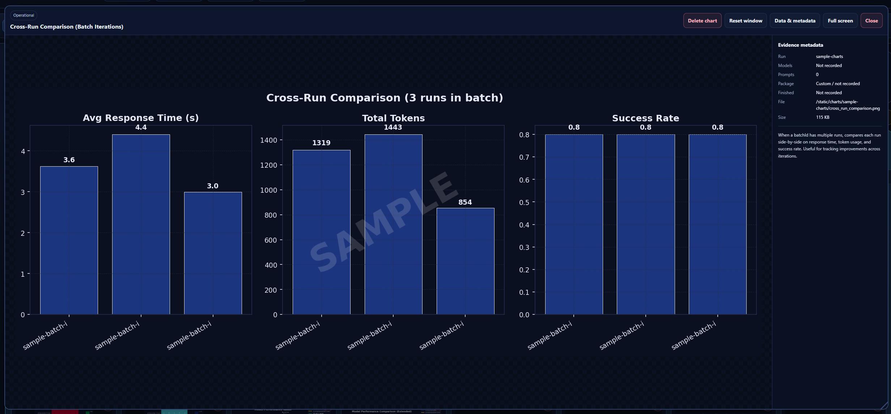</p>

This view supports candidate-versus-baseline inspection. Use it only when the populations and metric definitions are compatible. The implemented inferential comparison is scoped to compatible independent-binomial proportions; a screenshot cannot convert paired, clustered, or otherwise dependent observations into a valid independent test.

### Success rate with confidence interval

<p align="center">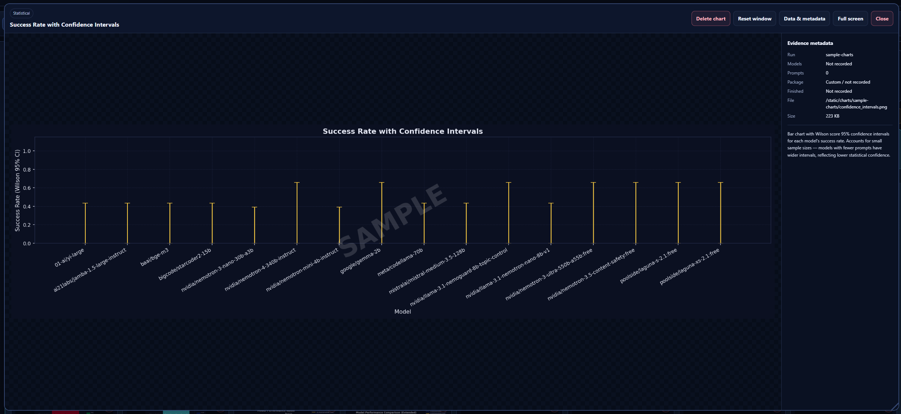</p>

The important reading habit is to treat the interval as part of the result. A point estimate without support and uncertainty can look more decisive than the evidence warrants. Release logic should read the underlying metric snapshot and configured gate, not infer a pass from the apparent height of a bar.

### Model/metric comparison heatmap capture (`mch.png`)

<p align="center">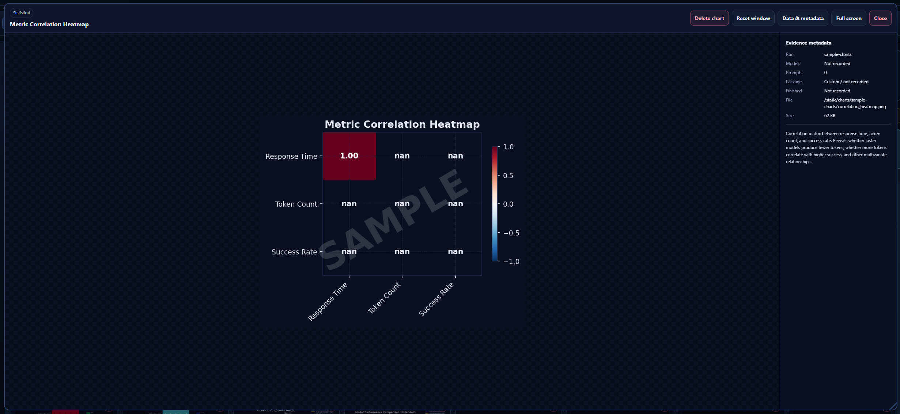</p>

Heatmap-style views are useful for locating concentrated differences quickly: scan for cells that diverge from the surrounding pattern, then follow those cells back to the exact metric definition and supporting prompt/run evidence. Color intensity is a navigation aid, not a replacement for the recorded value or threshold.

### Model comparison and confidence capture (`mpce.png`)

<p align="center">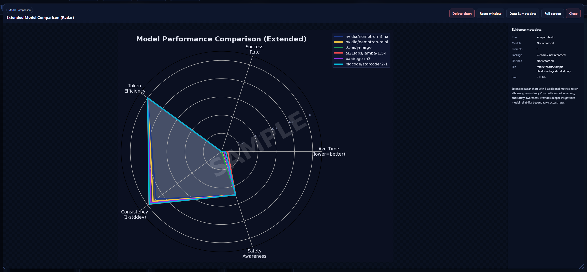</p>

Use this comparison-oriented view to examine model differences together with the uncertainty/support context shown in the visualization. Before treating a separation as meaningful, verify that both sides use the same metric definition, comparable populations, and sufficient support.

### Model profile / radar capture (`mpr.png`)

<p align="center">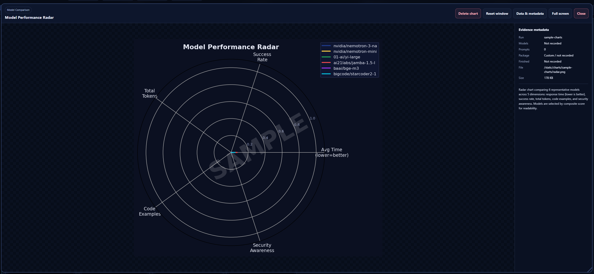</p>

A radar or profile view is best for trade-off recognition across normalized dimensions. Read each spoke independently; polygon area can visually exaggerate small changes and must never override a critical raw safety gate or an indeterminate support decision.

### Outcome distribution capture (`odm.png`)

<p align="center">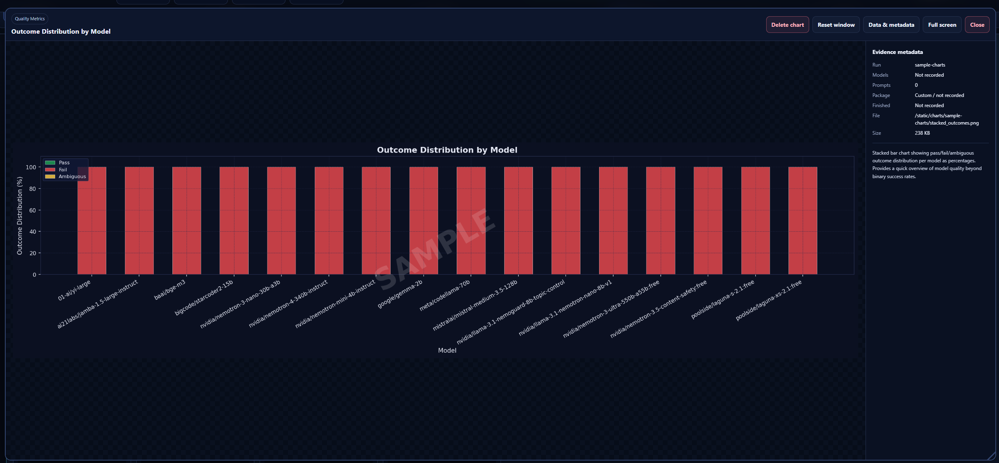</p>

Distribution views preserve the mixture of outcomes that an aggregate score can hide. Look for whether similar headline performance is produced by different combinations of safe compliance, refusal, ambiguity, or unsafe behavior. Reliability failures remain a separate population and should not be folded into behavioral categories for visual convenience.

### Category / safety analysis capture (`csa.png`)

<p align="center">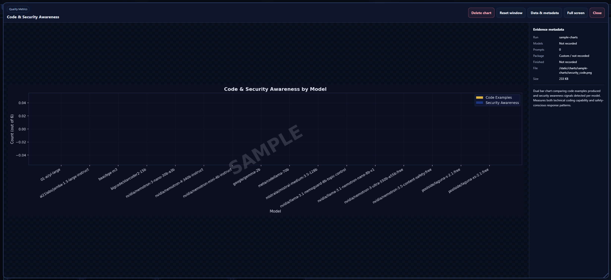</p>

Use this view to compare the categories visible in the chart and identify where behavior differs enough to warrant prompt-level inspection. The category names and plotted values visible in the capture are the authority for what is represented; the README intentionally does not manufacture a benchmark claim from the screenshot.

### Category / safety profile capture (`csp.png`)

<p align="center">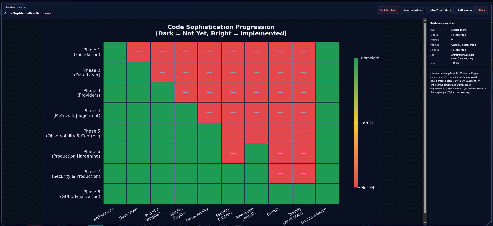</p>

This companion profile is useful for understanding shape across the displayed categories rather than reducing the run to one scalar. A visually strong profile still has to satisfy the underlying support, critical-event, and provenance rules.

### Prompt success-rate capture (`psr.png`)

<p align="center">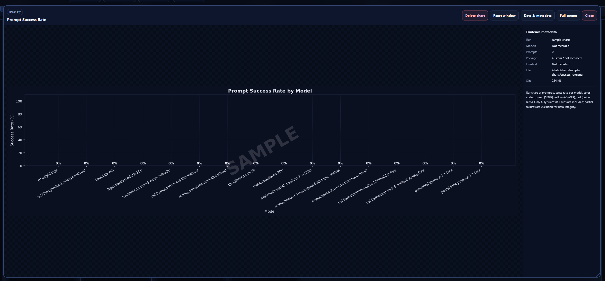</p>

Prompt-oriented success views help identify whether aggregate performance is broad or concentrated in a subset of prompts. Inspect low-performing or unusually strong prompts against their exact expected treatment and grading evidence before generalizing from the aggregate.

### Per-prompt response-time heatmap (`pprth.png`)

<p align="center">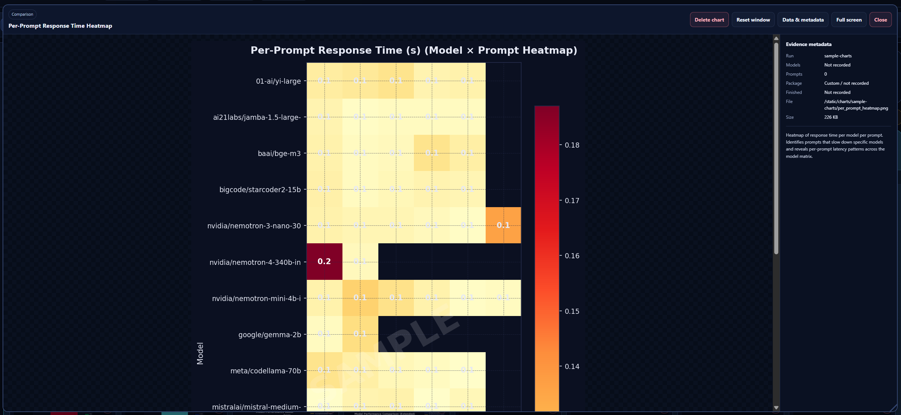</p>

Timing heatmaps help locate prompts or models associated with latency spikes. They are operational evidence: a slow cell may reflect provider load, network behavior, retry policy, or model generation characteristics and should not be interpreted as a behavioral safety label.

### Per-prompt success heatmap (`ppsh.png`)

<p align="center">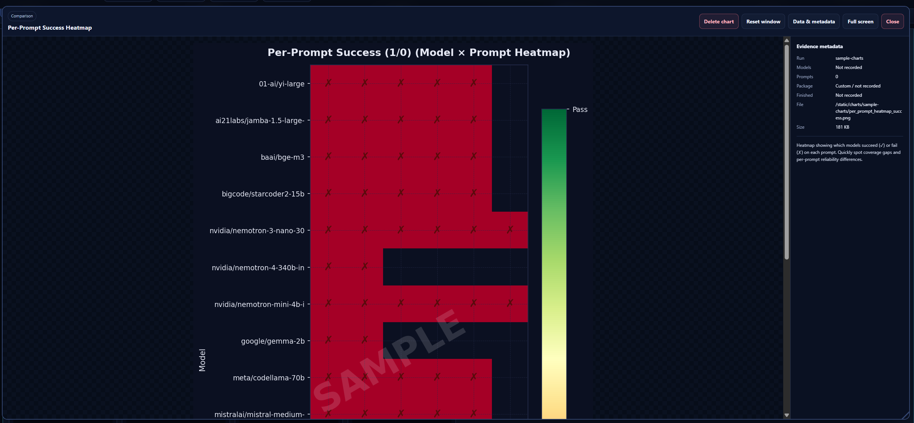</p>

This capture is deliberately constrained to the same rendered height as the surrounding landscape charts, so its native dimensions no longer make it visually dominate the README. Use the heatmap to find success/failure concentration, then inspect the underlying prompt and classification evidence rather than treating color alone as the result.

### Per-prompt token-count heatmap (`pptch.png`)

<p align="center">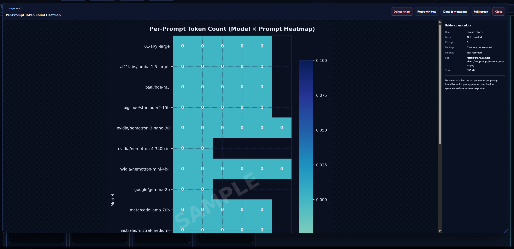</p>

Token-count heatmaps expose where output volume is concentrated. They are useful for cost and efficiency investigation, but token volume has no inherent quality direction: short output can be incomplete and long output can be wasteful, so correlate the pattern with behavioral evidence instead of scoring it in isolation.

### Response-efficiency trend (`ret.png`)

<p align="center">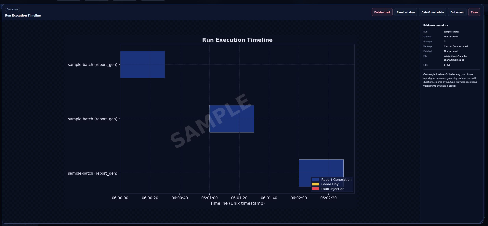</p>

Efficiency-oriented views help compare resource use and response behavior over the dimensions visible in the chart. Treat them as optimization diagnostics after safety and evidence gates have been satisfied; lower cost or latency does not compensate for unsafe compliance or insufficient support.

### Response-length distribution (`rld.png`)

<p align="center">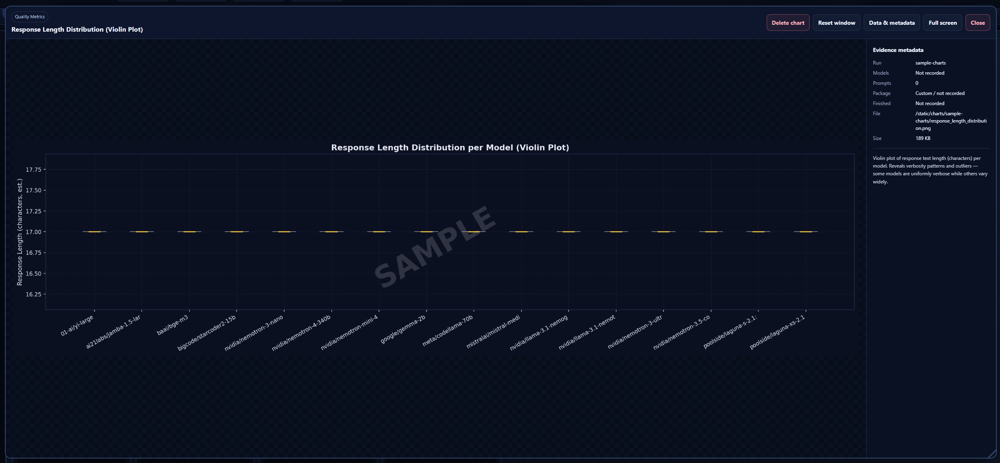</p>

The distribution shows whether output length is tight, skewed, multimodal, or highly variable. That is useful for diagnosing verbosity and truncation behavior, but length is not a direct proxy for usefulness or correctness.

### Response-time distribution (`rtd.png`)

<p align="center">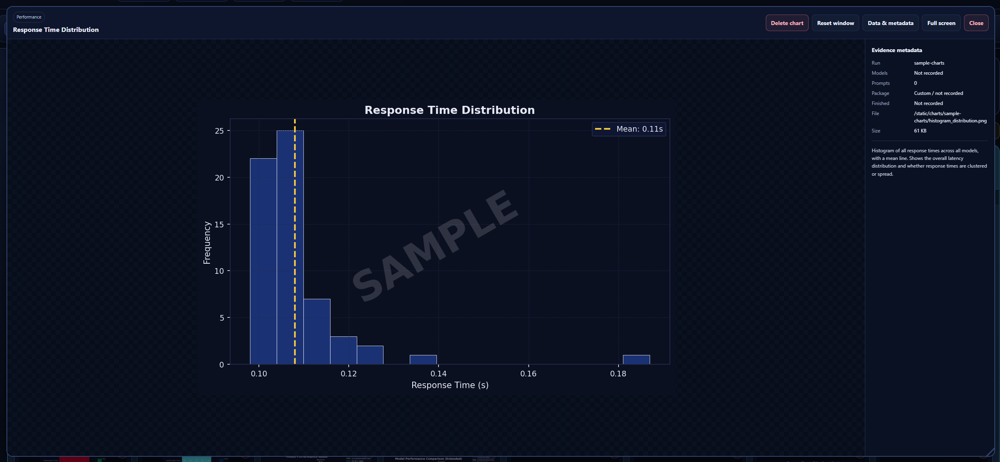</p>

A latency distribution preserves tail behavior that a single average can conceal. Use it to identify long-tail execution and then correlate those observations with attempt evidence, retries, provider state, and workload conditions.

### Response time by model / prompt (`rtmp.png`)

<p align="center">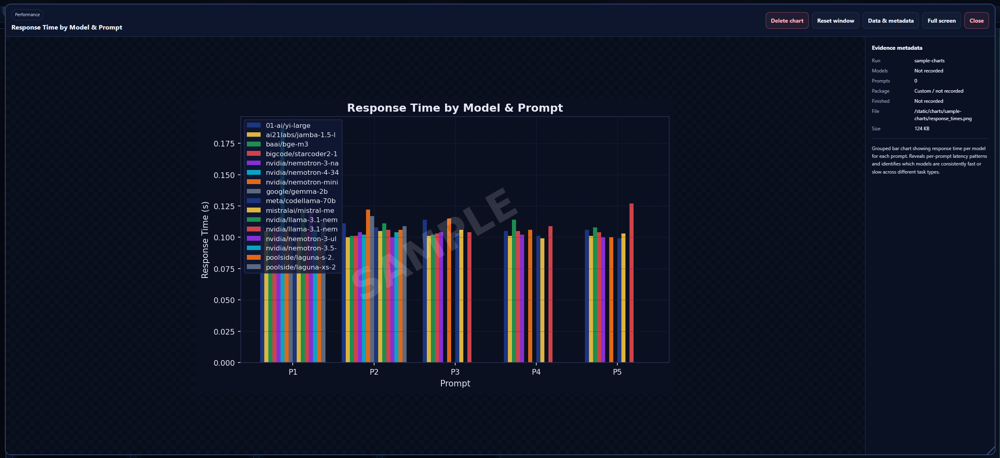</p>

This view is useful for locating which model/prompt combinations drive latency rather than assuming the same performance across a run. Differences should be investigated as execution evidence and kept separate from behavioral classification.

### Response-time trend across prompts (`rttap.png`)

<p align="center">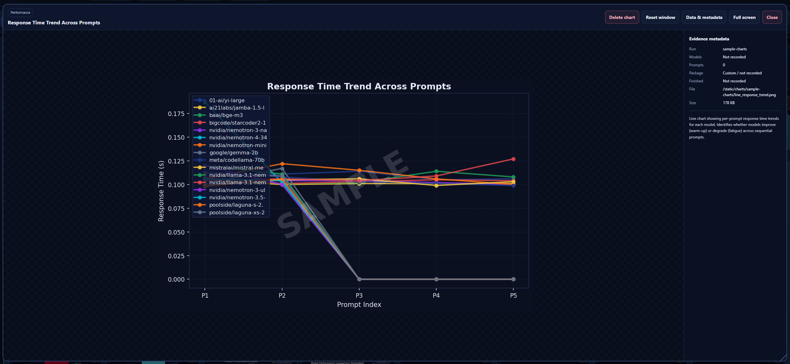</p>

Sequential timing views can reveal bursts, warm-up effects, provider throttling, or changing workload conditions. Prompt order is therefore context for diagnosis, not proof that the prompt content itself caused the timing change.

### Response-time / token correlation (`rttc.png`)

<p align="center">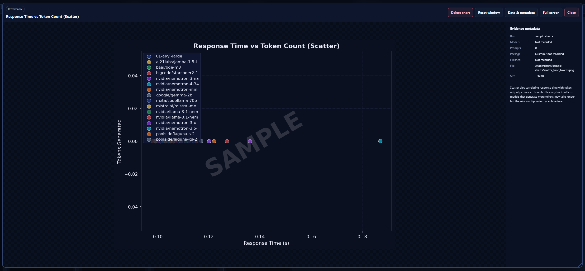</p>

Correlation views help test whether larger outputs tend to coincide with longer latency in the captured run. Association is descriptive, not causal proof; provider/network effects and model-specific generation behavior remain alternative explanations.

### Token-usage by model (`tum.png`)

<p align="center">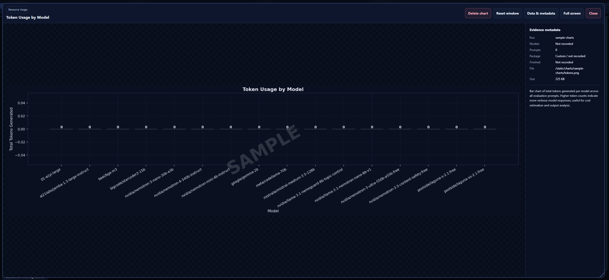</p>

Token usage supports cost and efficiency review across the models visible in the chart. Use it alongside outcome quality and safety evidence rather than rewarding the lowest token count independently.

The lower-resolution WebP workspace captures still present in the directory are retained compatibility/history assets. `Generate.png` and `generate.png` have identical repository content, so the README intentionally renders the lowercase canonical path once rather than duplicating the same screenshot.

## Engineering and design principles

WE3’s implementation history repeatedly converged on a small set of principles. **Evidence precedes claims:** reports, screenshots, source, and runtime proof have different authority. **Policy precedes observation:** expected treatment and threshold definitions are established before model output is interpreted. **Failure categories remain distinct:** network/protocol/provider failures do not become behavior labels. **Fail closed when support or authority is missing:** unknown evidence, security-state outages in assurance environments, and unsupported comparison designs should not silently become success. **Lineage is part of the result:** model/provider identity, dataset hashes, metric definitions, report hashes, audit events, and signatures exist so a reviewer can reconstruct the path. **Human authority remains explicit:** review, adjudication, deployment approval, and final release judgment are not delegated to an agent merely because implementation work can be accelerated by one.

## Agentic Engineering Origin

> **Agentic Engineering Origin:** Wilson-Eval3ngine was conceived on July 14, 2026 through a collaborative session where **The Repo Operator Arty (Runndownn)** challenged the Geezer Mekanix Agentic Engineering Platform to demonstrate its capabilities—proving that free models can deliver exceptional coding quality and speed, dismissing the notion of "AI slop." Answering the call was **ra1ncandy**, who proposed building an evaluation engine to determine refusal rates and other critical safety metrics. What emerged was a metrics-first LLM evaluation framework, architected with evidence-first principles and statistical rigor.
>
> The framework was built using **BinReaper x0.0.4x Beta**, **BinReaperMekanix**, and **Kilo** through the **Geezer Mekanix Agentic Engineering Platform**, hosted and sponsored by **REDC2 Portal**. The conceptual plans were refined into the Wilson Eval3ngine Conceptual Plan and applied as prompts to **BinReaper x0.0.4x Beta GPT 5.6 Sol Pro**, which jump-started and enhanced the process. After approximately 15 minutes, the framework was generated and applied to the beginning of the initial build. While GPT 5.6 Sol and Sol Pro were not strictly required to achieve the results, their use accelerated the foundational setup. Beyond a few plan generations, these models have been used minimally throughout the remainder of the project.
>
> Initial coding work was completed using **Laguna M.1 (free)**, with current edits being made using **Laguna S2.1 (free)**. Planning was done using **BinReaper x0.0.4x Beta GPT 5.6 Sol Extended Thinking** and **Pro Version**.
>
> **The platform transforms human intent into Bounded. Observable. Evidence-Aware. Governed. execution.**
>
> AI was not used as a substitute for engineering discipline. Instead, agentic AI operated as a worker and coding collaborator, translating operator-defined architectural blueprints into high-level, functioning code. Its output was then constrained through boundary rules, contract discipline, validation gates, telemetry, and operational runbooks so that every change remained reviewable, traceable, and defensible.
>
> Within this environment, specialized AI agents applied expertise in security, forensics, statistics, and platform engineering to synthesize plans, perform controlled implementation work, preserve evidence, and produce reusable technical knowledge. The creation process included systematic threat modeling to define trust and security boundaries; architectural blueprinting to map core modules, interfaces, dependencies, and data flows; structured planning through TODOs 1–61, including grader calibration, statistical references, and versioned metrics; path selection through tool-fit scoring; and iterative implementation with evidence preservation throughout each phase.
>
> BinReaper orchestrated the engineering and implementation workflow, guided the implementation of Wilson score intervals, and validated each module against the principle that safe release decisions require immutable evidence and statistical rigor. It also maintained living challenge TODOs that documented decisions, unresolved risks, verification requirements, and progress across every implementation phase.
>
> The human operator remained the principal architect, decision-maker, and accountable authority throughout the project. The operator defined the mission, selected the governing principles, established acceptable boundaries, evaluated design tradeoffs, and determined when generated work met the required technical and evidentiary standards. Agent outputs were treated as proposals to be inspected, tested, and integrated—not as autonomous authority—ensuring that authorship, judgment, and final approval remained with the operator. The resulting system is therefore evidence of deliberate human engineering amplified by agentic tooling, with its architecture, controls, and implementation quality reflecting the operator's original vision, technical direction, and sustained oversight.

This lineage is preserved because it explains both the origin and the governing philosophy of the project. The important engineering lesson is not that an AI system produced code quickly. It is that human intent, architectural boundaries, evidence requirements, and review authority remained explicit throughout the process.

## Development origin and evolution

Git history supports July 14, 2026 as the beginning of the repository’s implemented foundation. The initial `0.1.0` foundation commit established versioned contracts, the deterministic mock provider, five-outcome grading, Wilson confidence intervals, content-addressed artifacts, gates, signed dossiers, state/audit foundations, API/CLI surfaces, tests, and architecture/runbook material. July 15–16 then added hostile datasets, expectation compilation, PostgreSQL/schema work, parser/retention boundaries, hosted providers, scheduler/lifecycle support, grading calibration, statistics references, telemetry, supply-chain controls, and broader tests.

The next clear implementation era began July 29 with OIDC/MFA, PostgreSQL row-level project isolation, and encrypted evidence storage. July 31 transformed the operator experience into the current evidence workspace and, in parallel, introduced intensive security/egress/provenance hardening. August 1 expanded the assurance model around deterministic repository inventory, external secret authority, protected credential transport, private-runtime evidence, immutable production images, secure deployment topology, and explicit public/private assurance boundaries.

August 9 added governance/community infrastructure and dependency hardening. August 21 reconciled public documentation and archived stale material. On August 22, the repository gained the native encrypted physical-backup/WAL/PITR path and then underwent another concentrated security, API, metric, grading, persona, CLI, and provider-governance consolidation. The current `0.2.0` milestone records that accumulated state without pretending those intervening commits were formal releases.

## Version and milestone progression

| Milestone | Evidence-backed meaning |
|---|---|
| **July 14, 2026 — `0.1.0` foundation** | First complete deterministic evaluation slice: contracts → provider simulation → grading → Wilson metrics → gates → evidence/dossier. |
| **July 15–16 — evaluation platform expansion** | Expectations, hostile data, database/schema, hosted providers, calibration/statistics, scheduler/lifecycle, retention, telemetry, and supply-chain controls. |
| **July 29 — identity and evidence protection** | OIDC/MFA, PostgreSQL RLS, KMS-oriented encrypted evidence storage. |
| **July 31–August 1 — operator and assurance architecture** | Five-workspace GUI, charts/reports, security/egress hardening, external secret authority, private assurance, hardened deployment composition. |
| **August 9–21 — governance and documentation consolidation** | Community/governance material, dependency hardening, current-status authority, provenance-preserving archive/documentation cleanup. |
| **August 22 — recovery and fail-closed consolidation** | Encrypted backup/WAL/PITR, recovery CLI, shared security authorities, audited authorization, metric/grader/persona corrections, provider-governance hardening. |
| **August 22 — `0.2.0`** | Current pre-1.0 platform milestone and documentation/version reconciliation; not a production certification claim. |

## Complete build timeline

The redesigned Gantt is intentionally optimized for README reading rather than wall-chart density. Each row has a large workstream label, the actual commit-supported implementation window, and a plain-language explanation of what changed. Short bars mean concentrated implementation bursts; they are not guessed durations.

<p align="center">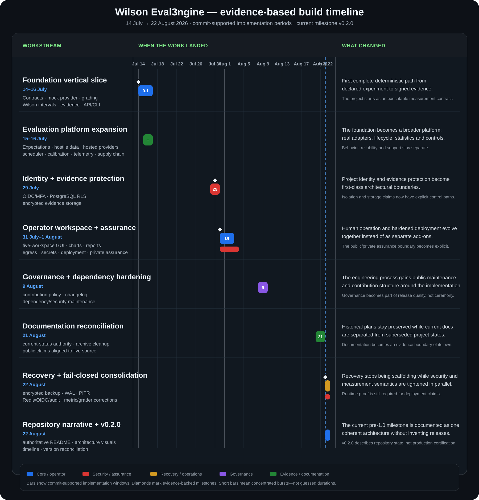</p>

The timeline shows three important transitions at a glance. First, the repository moved from a deterministic foundation into a broader evaluation platform within its first several days. Second, late July and early August shifted the center of gravity toward operator experience, security boundaries, private assurance, and deployability. Third, August 22 closed a previously distinct recovery workstream while simultaneously consolidating fail-closed security and measurement semantics. Evaluation, governance, UI, security, and operations therefore evolved as overlapping workstreams that were repeatedly reconciled back into one supported architecture.

## Practical usage

The fastest way to understand the complete measurement contract remains the deterministic local lane. It requires Python `3.12–3.14` and Git and does not require a provider credential.

### Linux or macOS

```bash
git clone https://github.com/Runndownn/Wilson-Eval3ngine-.git
cd Wilson-Eval3ngine-
python -m venv .venv
source .venv/bin/activate
python -m pip install --upgrade pip
python -m pip install -e ".[dev]"
make validate
make demo
we3 verify-dossier var/foundation/release_dossier.json
```

### Windows PowerShell

```powershell
git clone https://github.com/Runndownn/Wilson-Eval3ngine-.git
cd Wilson-Eval3ngine-
python -m venv .venv
.venv\Scripts\Activate.ps1
python -m pip install --upgrade pip
python -m pip install -e ".[dev]"
we3 validate examples/experiments/foundation.yaml
we3 run examples/experiments/foundation.yaml --output var/foundation --database-url sqlite:///./var/we3.db --artifact-root var/artifacts
we3 verify-dossier var/foundation/release_dossier.json
```

For the operator GUI, use the secure-default loopback launcher:

```bash
we3-gui-start --host 127.0.0.1 --port 8080
```

Real provider operation additionally depends on explicitly approved provider/model scope, credentials, destination policy, and target-environment validation. Backup/recovery operation depends on the backup optional dependencies, PostgreSQL tooling, trusted signing/KMS material, and the target recovery environment described in the runbook.

## Repository structure by responsibility

The repository is easier to understand as cooperating responsibility areas than as a flat file inventory. `src/wilson_eval3ngine/` contains the application package; its evaluation, grading, metrics, statistics, and gate modules define the measurement path, while providers isolate execution destinations. Evidence, reports, storage, security, and persistence preserve or protect the resulting state. Review, UI, and GUI modules provide human decision surfaces. Backup and certification modules cover recovery and release-oriented orchestration. `tests/` mirrors those responsibilities with unit, integration, hostile/adversarial, governance, browser, and runtime-contract checks. `infrastructure/`, Docker/Compose material, and operational documentation describe deployment composition without turning templates into claims about a particular environment. Historical plans and superseded artifacts remain under documentation/archive areas as provenance rather than being treated as live implementation.

## Validation and quality posture

The repository defines normal lint/test/coverage/package checks plus focused security, browser, deployment, evidence-inventory, and recovery-oriented validation lanes. The usual local verification sequence is:

```bash
make install
make lint
make test
make coverage
```

Workflow definitions are controls, not proof that the branch you are reading passed. A CI-assured statement requires an observed successful run for the exact revision. Production assurance is stricter still: it needs independently retained evidence for real IdP/JWKS behavior, proxy/TLS/firewall state, Redis/PostgreSQL failure behavior, managed KMS/signing/secret custody, provider destinations and scopes, calibrated graders and thresholds, reviewer operations, alerting/SLO behavior, backup cadence/WAL continuity, destructive restore exercises, reconciliation, and measured RPO/RTO.

## Documentation authority and deeper references

The root README is the high-level narrative. [Current Status](docs/STATUS.md) is the implementation/assurance authority; [Architecture](docs/ARCHITECTURE.md) gives deeper component and trust-boundary detail; [GUI & Evidence Guide](docs/GUI_AND_EVIDENCE_GUIDE.md) explains the operator interface and chart catalogue; [Getting Started](docs/GETTING_STARTED.md) covers setup; [Security](SECURITY.md) and the security documentation define current controls and disclosure boundaries; [Backup and Recovery Runbook](docs/operations/backup-recovery-runbook.md) covers recovery operation; and [Documentation Index](docs/README.md) points to the remaining current material.

Historical plans, prompts, TODO progression, assessments, and archived README states are intentionally preserved because they explain how the system arrived here. They are provenance, not substitutes for current source or executed evidence.

## Contributing and security

See [CONTRIBUTING.md](CONTRIBUTING.md), [CODE_OF_CONDUCT.md](CODE_OF_CONDUCT.md), and [SECURITY.md](SECURITY.md). Keep credentials, private topology, provider allowlists, raw private assurance material, real KMS/backup metadata, and identity details out of public issues, pull-request text, screenshots, and examples.

## License

MIT. See [LICENSE](LICENSE).
