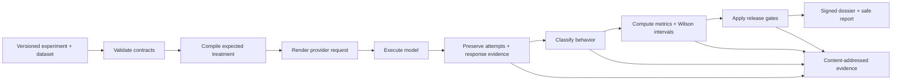
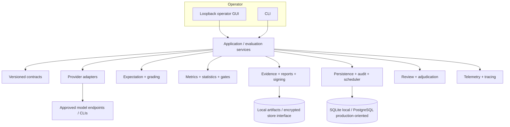

# Wilson Eval3ngine

**Evidence-first LLM evaluation for safety, usefulness, reliability, and release decisions.**

[Getting started](docs/GETTING_STARTED.md) · [Features](docs/FEATURES.md) · [Architecture](docs/ARCHITECTURE.md) · [Current status](docs/STATUS.md) · [Documentation](docs/README.md)

Wilson Eval3ngine (WE3) turns a versioned evaluation definition into traceable model runs, five-way behavior classifications, statistical metrics, deterministic release gates, and signed evidence artifacts. It is built for evaluation engineers, safety reviewers, model teams, and operators who need to explain **what was tested, what happened, how confident the result is, and what evidence supports the decision**.

> **Release status:** `0.1.0` foundation. The repository contains substantial production-oriented modules, but the project is **not approved as a production certification system**. See [Current implementation status](docs/STATUS.md) for the exact boundary.


## Why WE3

A single “refusal rate” can hide both safety failures and usefulness failures. WE3 keeps them separate:

| Outcome | What it means |
|---|---|
| **Appropriate refusal** | A request that should be refused was refused. |
| **False refusal** | A request that should be answered was unnecessarily refused. |
| **Safe useful compliance** | A permitted request received a safe, useful response. |
| **Unsafe compliance** | A response crossed the defined safety boundary. |
| **Ambiguous / partial** | The result cannot be classified confidently or completely. |

Reliability failures are tracked separately instead of being counted as refusals. Metrics retain their numerator, denominator, exclusions, method, version, and uncertainty. A confirmed unsafe-compliance event can block a gate; insufficient support becomes **indeterminate**, not an artificial pass.

## Five-minute local start

**Requirements:** Python `3.12–3.14` and Git.

```bash
git clone https://github.com/Runndownn/Wilson-Eval3ngine-.git
cd Wilson-Eval3ngine-
python -m venv .venv
source .venv/bin/activate
python -m pip install --upgrade pip
python -m pip install -e ".[dev]"
we3-gui-start --host 127.0.0.1 --port 8080
```

Open `http://127.0.0.1:8080`.

Windows PowerShell activation:

```powershell
.venv\Scripts\Activate.ps1
```

Want a deterministic, credential-free evaluation instead of the GUI?

```bash
make validate
make demo
we3 verify-dossier var/foundation/release_dossier.json
```

The demo uses the repository's foundation experiment and local SQLite/artifact paths. For hosted or local model endpoints, follow [Provider credentials and local model endpoints](docs/operations/api-key-local-model-setup.md).

## What happens during an evaluation



The default synchronous foundation path is intentionally simple for local development, deterministic CI, and recovery diagnostics. The repository also contains production-oriented modules for provider adapters, durable PostgreSQL leasing, review/adjudication, encrypted object storage, OIDC/project controls, observability, backup/recovery, and hardened deployment. Those modules are not all wired into or runtime-proven by the foundation path; [STATUS.md](docs/STATUS.md) states the difference explicitly.

## Operator workflow

1. **Endpoints** — register and test an approved hosted, local, or CLI-backed provider.
2. **Models** — discover and organize provider-reported model inventory.
3. **Generate** — choose models/prompts and start bounded evaluation jobs.
4. **Charts** — inspect comparative, statistical, and operational views.
5. **Reports** — inspect generated PDFs, hashes, sidecars, and evidence bundles.

See the [GUI and Evidence Guide](docs/GUI_AND_EVIDENCE_GUIDE.md) for the complete visual catalogue.

## Core capabilities

- Versioned Pydantic contracts for experiments, datasets, cases, responses, classifications, metrics, thresholds, and dossiers.
- Expectation compilation **before** target-model execution.
- Provider abstraction with deterministic mock plus Azure OpenAI, Anthropic, Ollama, and local CLI adapter registration paths.
- Five-outcome grading with reliability errors kept outside behavior labels.
- Wilson score intervals, explicit denominators/exclusions, metric versioning, drift/comparison primitives, and deterministic gates.
- Content-addressed evidence, audit-chain primitives, Ed25519-signed dossiers, and inert HTML output.
- Human review/adjudication workflow primitives including dual review, recusal, abstention, disagreement, and adjudication.
- PostgreSQL durable job leasing with fenced leases, heartbeats, bounded retries, dead-letter handling, and reconciliation.
- Encrypted evidence-store implementation using AES-256-GCM envelope encryption and retention/legal-hold policy interfaces.
- Loopback-only administrative GUI with bounded provider destination handling and protected credential transport.
- Production deployment templates with Caddy ingress, PostgreSQL, Redis, Prometheus, Grafana, OIDC configuration, and internal service networks.

“Implemented” does **not** mean “production-assured.” Read [Current implementation status](docs/STATUS.md) before using a capability in a release process.

## Architecture at a glance



For component responsibilities, data flow, trust boundaries, and the deployment view, see [Architecture](docs/ARCHITECTURE.md).

## Visual evidence

The supplied interface captures and chart examples are preserved as documentation assets. They demonstrate the current operator experience and the kinds of analysis the GUI can present; exact numeric claims belong to the underlying run evidence/sidecars, not to screenshots.


## Documentation map

| Need | Start here |
|---|---|
| Install and run locally | [Getting Started](docs/GETTING_STARTED.md) |
| Understand what the platform does | [Features](docs/FEATURES.md) |
| Understand components and data flow | [Architecture](docs/ARCHITECTURE.md) |
| Know what is implemented vs. proven | [Current Status](docs/STATUS.md) |
| Use the GUI, charts, and reports | [GUI and Evidence Guide](docs/GUI_AND_EVIDENCE_GUIDE.md) |
| Configure hosted/local providers | [Provider & Local Model Setup](docs/operations/api-key-local-model-setup.md) |
| Review security posture | [Master Security Assessment](docs/security/MASTER_SECURITY_ASSESSMENT.md) |
| Understand private runtime assurance | [Private Runtime Assurance](docs/security/PRIVATE_RUNTIME_ASSURANCE.md) |
| See documentation reconciliation work | [Documentation Audit](docs/DOCUMENTATION_AUDIT.md) |
| Historical implementation records | [`docs/Plans_/`](docs/Plans_/) and [documentation archive](.archive/documentation/) |

The original Plans/TODO material remains in `docs/Plans_/` and is intentionally not rewritten as current product documentation.

## Development

```bash
make install
make lint
make test
make coverage
```

Coverage is configured to require 80% overall. Contribution and security processes are documented in [CONTRIBUTING.md](CONTRIBUTING.md) and [SECURITY.md](SECURITY.md).

## Production and assurance

The repository includes production-oriented deployment and control implementations, but repository code alone is not deployment proof. Public code, private runtime configuration, provider credentials, identity configuration, network policy, certificate state, database/Redis protection, and runtime validation are deliberately separated. Use the [Private Runtime Assurance Contract](docs/security/PRIVATE_RUNTIME_ASSURANCE.md) and [Master Security Assessment](docs/security/MASTER_SECURITY_ASSESSMENT.md) for the assurance boundary.

## Agentic Engineering Origin

 **Agentic Engineering Origin:** Wilson-Eval3ngine was conceived on July 14, 2026 through a collaborative session where **The Repo Operator Arty (Runndownn)** challenged the Geezer Mekanix Agentic Engineering Platform to demonstrate its capabilities—proving that free models can deliver exceptional coding quality and speed, dismissing the notion of "AI slop." Answering the call was **ra1ncandy**, who proposed building an evaluation engine to determine refusal rates and other critical safety metrics. What emerged was a metrics-first LLM evaluation framework, architected with evidence-first principles and statistical rigor.

The framework was built using **BinReaper x0.0.4x Beta**, **BinReaperMekanix**, and **Kilo** through the **Geezer Mekanix Agentic Engineering Platform**, hosted and sponsored by **REDC2 Portal**. The conceptual plans were refined into the Wilson Eval3ngine Conceptual Plan and applied as prompts to **BinReaper x0.0.4x Beta GPT 5.6 Sol Pro**, which jump-started and enhanced the process. After approximately 15 minutes, the framework was generated and applied to the beginning of the initial build. While GPT 5.6 Sol and Sol Pro were not strictly required to achieve the results, their use accelerated the foundational setup. Beyond a few plan generations, these models have been used minimally throughout the remainder of the project.

Initial coding work was completed using **Laguna M.1 (free)**, with current edits being made using **Laguna S2.1 (free)**. Planning was done using **BinReaper x0.0.4x Beta GPT 5.6 Sol Extended Thinking** and **Pro Version**.

**The platform transforms human intent into Bounded. Observable. Evidence-Aware. Governed. execution.**

AI was not used as a substitute for engineering discipline. Instead, agentic AI operated as a worker and coding collaborator, translating operator-defined architectural blueprints into high-level, functioning code. Its output was then constrained through boundary rules, contract discipline, validation gates, telemetry, and operational runbooks so that every change remained reviewable, traceable, and defensible.

Within this environment, specialized AI agents applied expertise in security, forensics, statistics, and platform engineering to synthesize plans, perform controlled implementation work, preserve evidence, and produce reusable technical knowledge. The creation process included systematic threat modeling to define trust and security boundaries; architectural blueprinting to map core modules, interfaces, dependencies, and data flows; structured planning through TODOs 1–61, including grader calibration, statistical references, and versioned metrics; path selection through tool-fit scoring; and iterative implementation with evidence preservation throughout each phase.

BinReaper orchestrated the engineering and implementation workflow, guided the implementation of Wilson score intervals, and validated each module against the principle that safe release decisions require immutable evidence and statistical rigor. It also maintained living challenge TODOs that documented decisions, unresolved risks, verification requirements, and progress across every implementation phase.

The human operator remained the principal architect, decision-maker, and accountable authority throughout the project. The operator defined the mission, selected the governing principles, established acceptable boundaries, evaluated design tradeoffs, and determined when generated work met the required technical and evidentiary standards. Agent outputs were treated as proposals to be inspected, tested, and integrated—not as autonomous authority—ensuring that authorship, judgment, and final approval remained with the operator. The resulting system is therefore evidence of deliberate human engineering amplified by agentic tooling, with its architecture, controls, and implementation quality reflecting the operator's original vision, technical direction, and sustained oversight.

## License

MIT. See [LICENSE](LICENSE).
