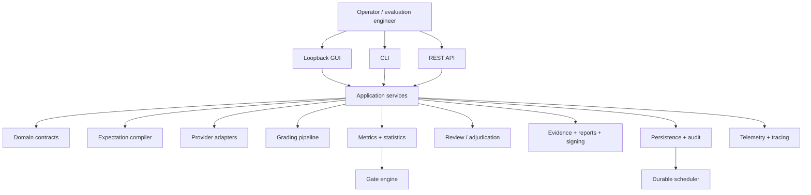
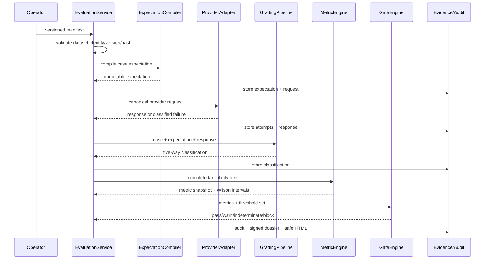
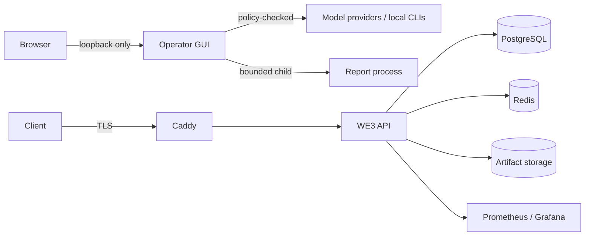

# Architecture

## Design intent

WE3 is a modular Python system that keeps the evaluation contract and evidence lineage central while allowing local deterministic execution and more production-oriented services to coexist.

## Evaluation data flow

## Execution modes

### Foundation/local path

`EvaluationService.run_manifest()` is synchronous by design. It is suitable for deterministic local development, CI, and recovery diagnostics. It defaults to the deterministic mock provider registry and local artifact storage.

### Production-oriented path

The repository also contains PostgreSQL job leasing, review/adjudication, encrypted object-storage, OIDC/project authorization, observability, backup/recovery, and production deployment components. Source presence does not prove these components have been integrated and runtime-validated as one production certification platform. [STATUS.md](STATUS.md) is the authority for that distinction.

## Storage and evidence

The foundation path uses content-addressed local artifacts and an audit ledger. A separate encrypted storage implementation provides AES-256-GCM at-rest encryption, envelope-key interfaces, project scoping, retention policies, and legal-hold semantics. Its local KMS implementation explicitly exists for development/testing and is not a production key authority.

## Provider boundary

Provider execution is behind a canonical adapter interface. The registry defaults to `mock` and can register hosted, local, and CLI adapters. GUI provider handling adds endpoint policy and credential management. The operator must still control which destinations, models, credentials, and data are approved.

## Review boundary

Human review is modeled independently from automated grading. Review tasks can be assigned to qualified reviewers, support dual review and recusal, and escalate disagreement to adjudication. Keeping review as its own domain prevents an automated grader from becoming the final authority by default.

## Statistical boundary

Wilson intervals are implemented for proportions. Gate decisions retain their threshold set and individual checks. Current comparison code includes unfinished bootstrap/p-value work and current metric snapshots approximate independent prompt-family count in one path; those limitations are documented in [STATUS.md](STATUS.md).

## Operator and deployment trust boundaries

Production Compose exposes Caddy and keeps API, PostgreSQL, Redis, Prometheus, and Grafana on internal networks. The public repository does not substitute for private deployment evidence; see [Private Runtime Assurance](security/PRIVATE_RUNTIME_ASSURANCE.md).

## Package map

| Area | Primary responsibility |
|---|---|
| `domain/` | Versioned contracts, enums, state, validation |
| `application/` | Evaluation orchestration |
| `execution/` | Rendering, idempotency, execution support |
| `providers/` | Canonical provider adapters and registry |
| `expectations/` | Expected-treatment compilation |
| `grading/` | Automated grading/judge primitives |
| `metrics/`, `statistics/`, `gates/` | Measurement, uncertainty, comparisons, release decisions |
| `evidence/`, `reports/`, `security/` | Artifacts, dossiers, signing, controls |
| `persistence/`, `storage/` | State, audit, jobs, encrypted artifacts |
| `review/` | Human review and adjudication |
| `gui/` + `gui/static/` | Operator workspace and local control plane |
| `telemetry.py`, `tracing.py` | Metrics, correlation, traces |
| `assurance/` | Public/private assurance primitives |

The detailed historical build plans remain under `docs/Plans_/` and are not the current architecture authority.
