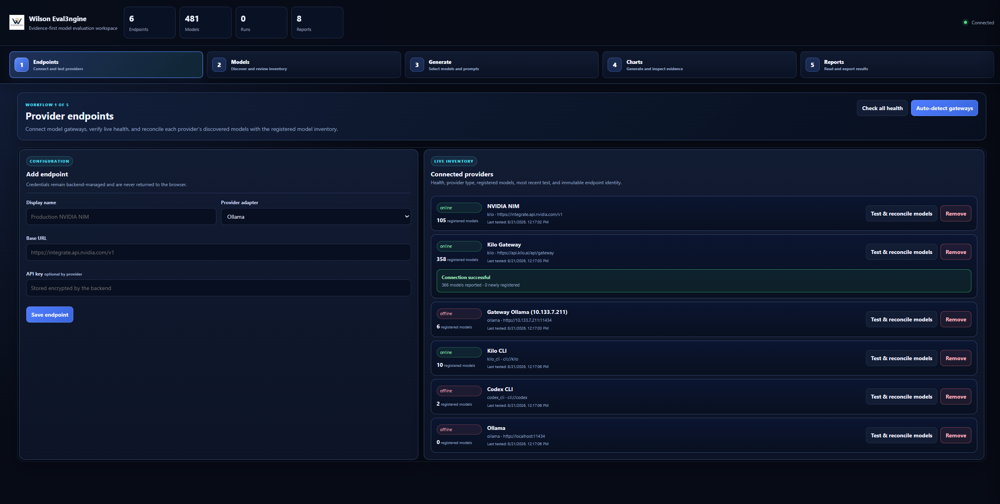
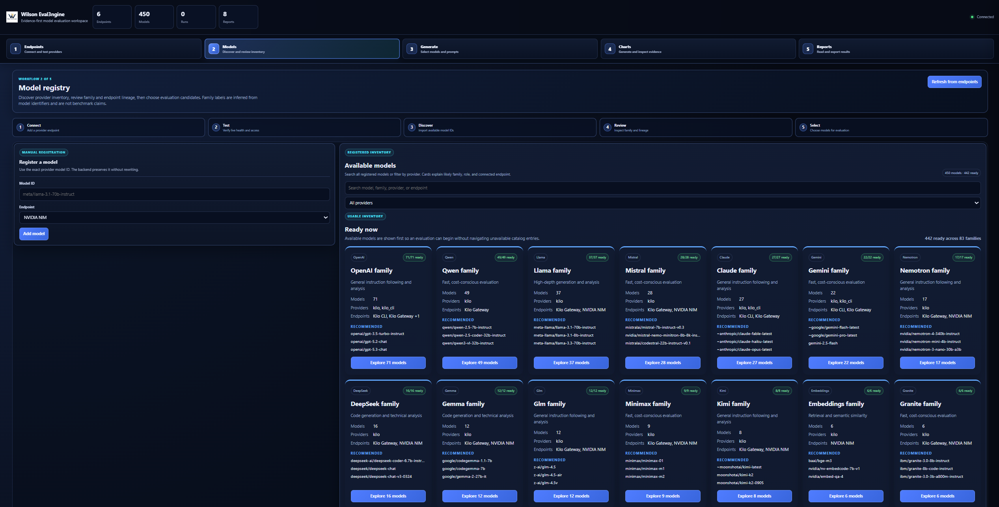
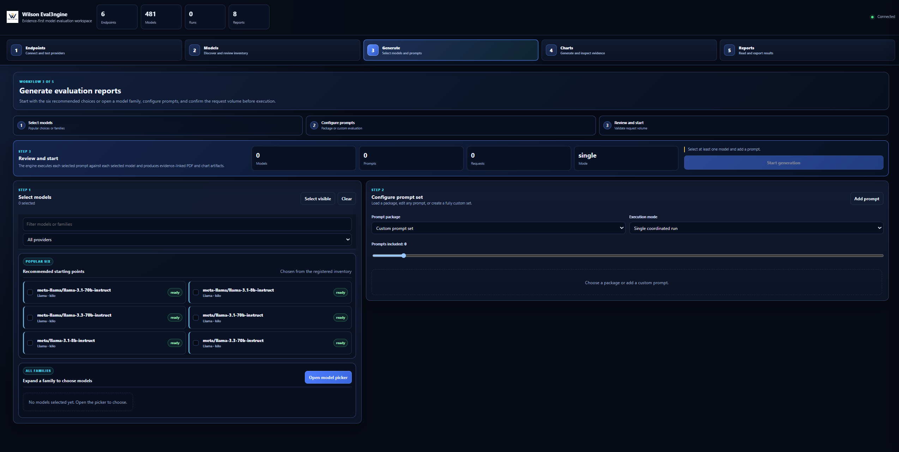
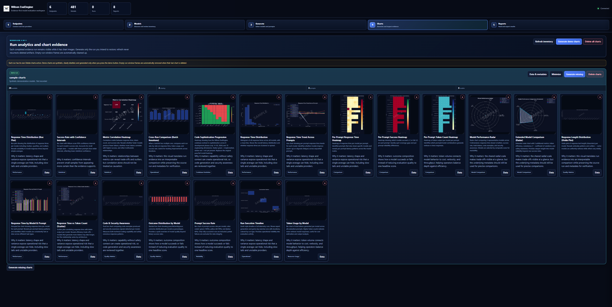
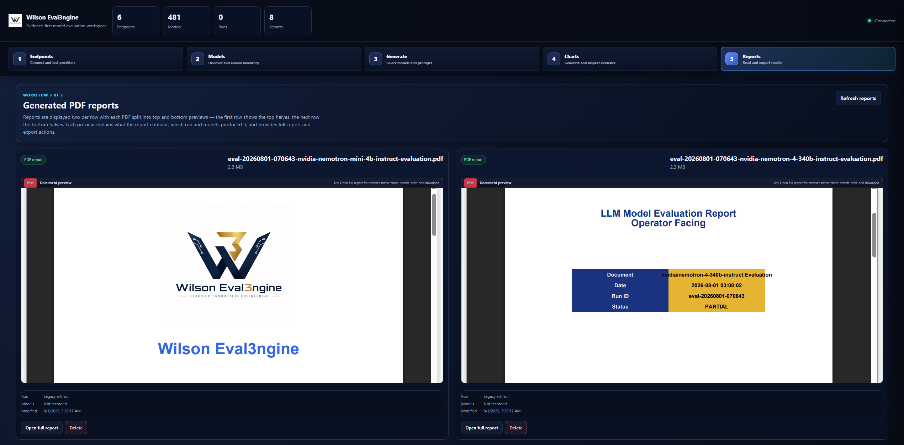

# Wilson Eval3ngine GUI and Evidence Guide

This guide explains the **current five-workspace operator interface** and how to interpret the evidence it displays:

**Endpoints → Models → Generate → Charts → Reports**

The canonical high-resolution captures live under `docs/assets/gui/current/` as `endpoints.png`, `models.png`, `generate.png`, `charts.png`, and `reports.png`. The same directory also contains detailed current analytics captures used by the root README visual atlas. Lower-resolution WebP captures remain as compatibility/history assets; the former `03-generate.webp` was removed and is not a valid current documentation path. PDF viewing belongs inside **Reports** and the retained `docs/assets/gui/05-pdf-viewer.png` image documents that reading surface.

## Security boundary before you start

The supported secure default is loopback:

```bash
we3-gui-start --host 127.0.0.1 --port 8080
```

The launcher repairs legacy wildcard defaults to loopback unless the operator deliberately sets `WE3_GUI_ALLOW_REMOTE_BIND=1`. That override permits non-loopback listening but does not supply authentication, authorization, TLS, firewalling, or multi-user isolation. If a deployment intentionally uses it, those controls must be independently configured and validated; broad wildcard exposure receives a launcher warning.

Provider destinations are a separate trust boundary. `WE3_GUI_ALLOW_LOCAL_PROVIDERS` governs intentional private/loopback **provider egress**; it does not control the GUI listener. See [Provider Credentials and Local Model Endpoints](operations/api-key-local-model-setup.md).

## Read the interface in layers

The top-bar counters are **workspace inventory**, not model scores. Endpoint/model/run/report counts tell you what the current GUI knows about; they do not state safety, helpfulness, or release readiness. An endpoint being **online** proves only that its configured connectivity check succeeded at that time.

The browser UI is composed at runtime. `gui/static/index.html` contains the baseline five-workspace document and loads `enhanced.js`; the supported startup path injects `ux4`, `ux5`, and `ux6` overlays before serving `/`. Those overlay files are active runtime assets even though their tags are not permanently written into baseline HTML.

## Operator workflow

| Step | Workspace | Operator responsibility | What it establishes | What it does **not** establish |
|---|---|---|---|---|
| 1 | **Endpoints** | Register/test an approved provider destination and reconcile inventory. | Connectivity and destination identity. | Model quality or safety. |
| 2 | **Models** | Inspect exact model IDs, endpoint lineage, family grouping, readiness. | Selectable inventory. | A benchmark ranking or endorsement. |
| 3 | **Generate** | Select models/prompts/mode and confirm request volume. | Declared workload/job scope. | A result before evidence exists. |
| 4 | **Charts** | Inspect per-run visualizations and metadata. | Fast pattern recognition. | Exact values when structured evidence disagrees/is absent. |
| 5 | **Reports** | Read PDFs, inspect provenance, and export related artifacts. | Human-readable narrative/handoff. | Sole authority for a release decision. |

## Current GUI screenshots

### 1. Endpoints

<p align="center"></p>

The Endpoints workspace establishes where evaluation traffic may go. The operator supplies a display name, provider adapter, base URL, and—when required—an API key that remains backend-managed rather than being returned to the browser. The connected-provider inventory shows health, provider type, registered-model count, recent test information, and endpoint identity so connectivity failures can be diagnosed before evaluation spend.

**Online/offline is a provider-state signal.** If an endpoint is offline, do not relabel missing output as a refusal. Resolve credentials, routing, TLS, destination policy, provider availability, or local-gateway configuration first.

### 2. Models

<p align="center"></p>

The registry exposes exact provider model IDs, endpoint lineage, filtering, and family grouping. Manual registration is available where a provider model ID must be entered explicitly.

Family labels and “recommended” starting points are navigation metadata, not safety/capability rankings. Reproducible evaluation uses the exact provider/model identity and configuration rather than a friendly family label.

### 3. Generate

<p align="center"></p>

Generate turns selection into a bounded workload. Choose models, select/build the prompt set, select execution mode, inspect prompt count and total request volume, then start the job. Prompt packages belong here; there is no separate sixth prompt-package workflow stage.

The start action is gated by configuration state. Before execution, verify model set, prompt population, mode, and request count because those choices define provider cost/traffic and the population the resulting evidence may legitimately describe.

### 4. Charts

<p align="center"></p>

Charts are grouped by completed evidence run. A run can generate missing charts, expose data/metadata, expand a visualization, or delete chart artifacts. Run frames are cleaned when their last chart is removed instead of lingering as misleading empty evidence containers.

The **Generate demo charts** action is intentionally different from run evidence. Demo charts are synthetic and exist to demonstrate the analytics surface. Never cite a demo/sample chart as a real model result; real chart claims should reconcile through run identity, metadata, sidecars, metric snapshots, and source artifacts.

### 5. Reports

<p align="center"></p>

Reports are shown in a two-column layout with top/bottom PDF previews so multiple artifacts remain reviewable without leaving the workspace. A report can expose run/model context plus full-report/export actions. The PDF is the narrative presentation layer; structured evidence/provenance remains authoritative for exact values.

Legacy report files may have incomplete lineage—for example, no model recorded because they predate the current metadata path. That is a **provenance warning** to preserve, not a blank to fill by guesswork. Locate sidecars/hashes or rerun under the current evidence path when a release-sensitive claim depends on missing lineage.

## Evidence hierarchy

When a chart/report appears inconsistent, investigate in this order:

1. **Run/attempt evidence** — request, response, retries, and execution reliability.
2. **Expectation/classification evidence** — intended treatment and behavioral categorization.
3. **Metric snapshot** — numerator, denominator, exclusions, support, definition version, and interval.
4. **Gate decision** — explicit threshold/support rules and resulting pass/warning/indeterminate/block.
5. **Chart/report** — a visualization or narrative derived from the above.

Do not rewrite the underlying metric merely to make it match a picture.

## Evidence-reading rules

- **Inventory is not quality.** Hundreds of discovered models can coexist with zero evaluated runs.
- **Availability is not behavioral compliance.** Provider/network/protocol failures stay in reliability evidence.
- **A screenshot is not a metric snapshot.** Visible counters, timestamps, names, statuses, and chart values are capture state.
- **A PDF is not the whole dossier.** Release review still needs lineage, support, gate records, hashes/signatures, and required approvals/runtime evidence.
- **Synthetic demo charts stay synthetic.** Never promote them into benchmark, security, or release claims.
- **Remote bind is an explicit deployment override.** `WE3_GUI_ALLOW_REMOTE_BIND=1` changes listener policy only; it does not create an authenticated remote console.

## Chart catalogue

The sample PNGs under `docs/assets/charts/` demonstrate visualization capability. They are examples, not current production benchmark claims. The root README additionally displays the current detailed GUI analytics captures from `docs/assets/gui/current/` so readers can see the active presentation surfaces directly.

| Chart | What it helps answer | Important caution |
|---|---|---|
| `boxplot_response_times.png` | How do latency distributions/spread/outliers differ? | Tail behavior disappears in one average. |
| `confidence_intervals.png` | How precise is an observed proportion? | Wide intervals mean limited evidence. |
| `correlation_heatmap.png` | Which recorded dimensions move together? | Correlation is descriptive, not causal proof. |
| `cross_run_comparison.png` | How did a candidate change from a baseline? | Statistical comparison is valid only for compatible independent-binomial populations; dependent designs require their corresponding method. |
| `heatmap.png` | Where are stronger/weaker dimensions concentrated? | Visual scale does not replace the metric/rubric definition. |
| `histogram_distribution.png` | Is latency skewed, multimodal, or long-tailed? | Distribution shape may be hidden by averages. |
| `line_response_trend.png` | When did latency change through prompt order? | Sequence effects may be provider/load related. |
| `per_prompt_heatmap.png` | Which prompts/models drive aggregate behavior? | Prompt cells require the same provenance as aggregates. |
| `per_prompt_heatmap_success.png` | Is success broad or concentrated? | “Success” depends on the configured definition. |
| `per_prompt_heatmap_tokens.png` | Which prompts/models consume most output tokens? | Token volume is efficiency/cost, not quality. |
| `radar.png`, `radar_extended.png` | What trade-offs appear across normalized dimensions? | Polygon area can exaggerate differences. |
| `reasoning_comparison.png` | How do reasoning-oriented signals compare? | The rubric/grader defines the plotted construct. |
| `response_length_distribution.png` | Is output concise/verbose/variable? | Length is not automatically usefulness. |
| `response_times.png` | Which prompts trigger slowdowns? | Keep provider/network effects visible. |
| `scatter_time_tokens.png` | Does latency track output size? | Association is not causation. |
| `security_code.png` | Do code and security-awareness signals diverge? | Technical sophistication is not automatically safe. |
| `stacked_outcomes.png` | What is the outcome-population shape? | Do not hide ambiguous/failure categories in one score. |
| `success_rate.png` | What is observed success by model? | Screening only; severity/uncertainty/denominator/provenance still matter. |
| `timeline.png` | Where are execution bursts/gaps/long operations? | Timing is operational evidence, not a behavior label. |
| `token_efficiency.png` | Which configurations use fewer output tokens for similar outcomes? | Efficiency does not override safety gates. |
| `tokens.png` | How much output volume did each model produce? | High/low volume has no inherent quality direction. |

## Runtime GUI composition and validation

The supported browser path is layered:

- `gui/static/index.html` — baseline document/five-workspace structure;
- `gui/static/enhanced.js` — principal baseline browser behavior;
- `src/wilson_eval3ngine/gui/ux_overlay.py` — injects `ux4`, `ux5`, and `ux6` CSS/JS and composes the protected child-secret path;
- `gui/static/ux4.js`, `ux5.js`, `ux6.js` — active injected runtime layers.

Repository lint therefore syntax-checks all four JavaScript behavior layers (`enhanced`, `ux4`, `ux5`, `ux6`) rather than treating the injected layers as dead code.

## Accuracy and publication rules

Do not publish real credentials, private addresses, internal hostnames, identity data, provider allowlists, or raw production assurance material to make a screenshot look complete. Review every public capture as an evidence artifact and do not promote transient counters into product claims.

For implementation boundaries see [Architecture](ARCHITECTURE.md), current limitations see [Current Status](STATUS.md), provider/listener policy see [Provider Credentials and Local Model Endpoints](operations/api-key-local-model-setup.md), and private evidence boundaries see [Private Runtime Assurance](security/PRIVATE_RUNTIME_ASSURANCE.md).
