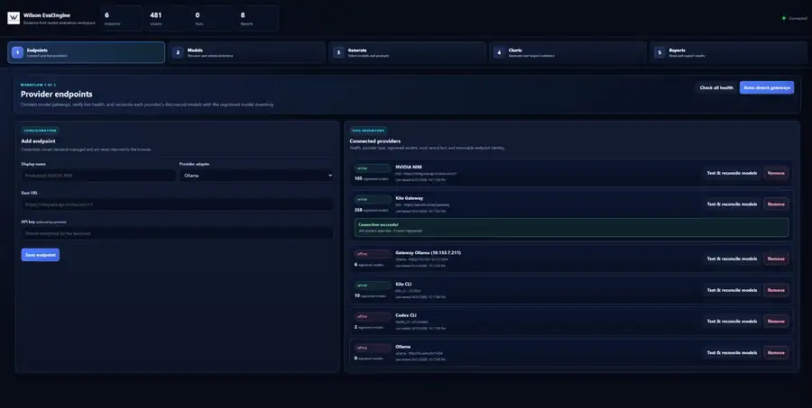
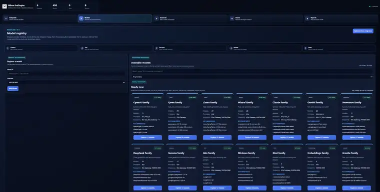
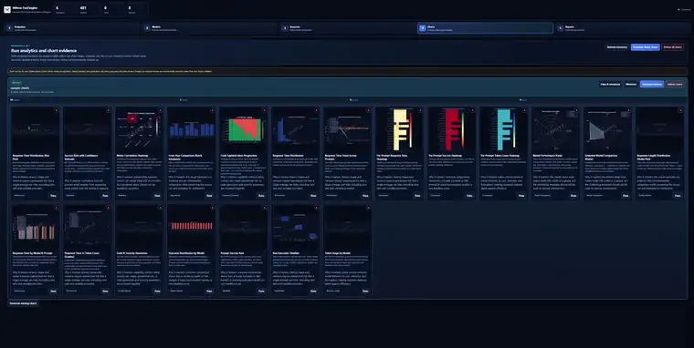
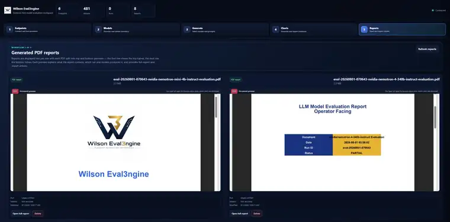

# Wilson Eval3ngine GUI and Evidence Guide

This guide explains the **current five-workspace operator interface** and how to interpret the evidence it displays. The canonical workflow is:

**Endpoints → Models → Generate → Charts → Reports**

The current captures live under `docs/assets/gui/current/`. Older six-image captures remain under `docs/assets/gui/` as historical point-in-time evidence, but they are no longer the primary walkthrough because PDF viewing is part of **Reports** and prompt-package configuration is part of **Generate**, not separate workflow stages.

## Security boundary before you start

The supported launcher binds to loopback:

```bash
we3-gui-start --host 127.0.0.1 --port 8080
```

Open `http://127.0.0.1:8080` on the same host. The GUI has administrative authority over provider endpoints, credentials, model inventory, jobs, charts, reports, exports, and deletion. Direct LAN/public binding is therefore intentionally rejected; remote use belongs behind a separately authenticated and authorized TLS proxy.

Provider destinations are also a trust boundary. Public providers should use approved HTTPS endpoints; intentional local/private gateways require the corresponding policy enablement and network controls. Credentials should enter through the supported provider workflow rather than source code, committed YAML, shell history, or screenshots. See [Provider Credentials and Local Model Endpoints](operations/api-key-local-model-setup.md).

## Read the interface in layers

The top-bar counters are **workspace inventory**, not model scores. Endpoint count, model count, run count, and report count tell you what the current GUI knows about; they do not state safety, helpfulness, or release readiness. Likewise, an endpoint being **online** proves only that the configured destination passed the relevant connectivity check at that time.

The browser UI is composed at runtime. `gui/static/index.html` contains the baseline five-workspace document and `enhanced.js`. The supported startup path installs the `ux4`, `ux5`, and `ux6` overlays before the server begins accepting requests. Those overlay files therefore remain active runtime assets even though their script tags are injected rather than written directly into the baseline HTML.

## Operator workflow

| Step | Workspace | Operator responsibility | What it establishes | What it does **not** establish |
|---|---|---|---|---|
| 1 | **Endpoints** | Register/test an approved provider destination and reconcile inventory. | Connectivity, destination identity, provider boundary. | Model quality or safety. |
| 2 | **Models** | Inspect exact model IDs, endpoint lineage, family grouping, readiness. | Selectable evaluation inventory. | A benchmark ranking or endorsement. |
| 3 | **Generate** | Select models/prompts/mode and confirm request volume before execution. | Declared workload and job scope. | A result before execution/evidence exists. |
| 4 | **Charts** | Inspect per-run visualizations and metadata. | Fast pattern recognition over available evidence. | Exact values if structured sidecars disagree or are missing. |
| 5 | **Reports** | Read PDFs, inspect provenance, and export related artifacts. | Human-readable narrative and handoff surface. | Sole authority for a release decision. |

## Current GUI screenshots

### 1. Endpoints

<p align="center"></p>

The Endpoints workspace is the first operational boundary. An operator supplies a display name, provider adapter, base URL, and—where required—an API key that remains backend-managed rather than being returned to the browser. The connected-provider inventory then exposes health, provider type, registered-model count, recent test information, and immutable endpoint identity so connectivity problems can be diagnosed before evaluation traffic begins.

The important interpretation rule is that **online/offline is a provider-state signal**. If an endpoint is offline, do not treat downstream missing output as a refusal or behavioral failure. Resolve credentials, route, TLS, provider availability, destination policy, or local-gateway configuration first.

### 2. Models

<p align="center"></p>

The Models workspace turns provider discovery into an inspectable registry. Exact model IDs are retained, models can be filtered by provider, and family cards group related identifiers while preserving endpoint lineage. Manual registration exists for cases where an exact provider model ID needs to be added explicitly.

Family labels are inferred organizational metadata, not benchmark claims. A “recommended” model in the interface is a starting point from the registered inventory, not a claim that it is safer, more capable, or approved for release. Evaluation provenance should use the exact provider/model identity and configuration.

### 3. Generate

<p align="center"></p>

Generate is where selection becomes a bounded workload. The operator chooses models, selects or builds a prompt set, chooses execution mode, reviews prompt count and total request volume, and only then starts generation. The model picker and prompt-package controls belong to this workspace, which is why the current navigation has five—not six—workflow stages.

The start control is intentionally gated by configuration state. If no models or prompts are selected, the interface should not imply that a meaningful run can begin. Before execution, verify the model set, prompt population, mode, and request count because those choices define both provider cost/traffic and the population the resulting evidence can legitimately describe.

### 4. Charts

<p align="center"></p>

Charts are grouped by completed evidence run. A run can generate missing charts, expose data/metadata, expand a chart into a dedicated evidence window, or delete its chart artifacts without silently resurrecting them on refresh. When the final chart for an empty run frame disappears, the frame is cleaned up rather than preserved as a misleading shell.

The **Generate demo charts** action is deliberately different from run-derived evidence. Demo charts are synthetic and should be clearly labelled; they exist to demonstrate the analytics surface. Never cite a demo/sample chart as a real model result. For real evidence, use the run identity, chart metadata, structured sidecar values, metric snapshots, and source artifacts together.

### 5. Reports

<p align="center"></p>

Reports are displayed in a two-column layout with PDFs split into top/bottom previews so multiple reports remain reviewable without leaving the workspace. Each report can expose run/model context plus full-report and export actions. The embedded PDF is the narrative presentation layer; the structured evidence and provenance behind it remain authoritative for exact values.

Older report files may legitimately appear with incomplete lineage—for example, a legacy artifact may have no model recorded because it predates the current metadata path. That is a **provenance warning**, not something the UI should invent around. If a release-sensitive claim depends on missing model/run lineage, locate the associated sidecars/hashes or rerun the evaluation under the current evidence path.

## What happens after Generate

A GUI job is not merely “make a PDF.” The provider path records attempts and responses; evaluation logic produces classifications and metrics; chart/report generation creates human-readable views over those results; and evidence metadata preserves the connection between those views and the underlying run.

Use this hierarchy when investigating a discrepancy:

1. **Run/attempt evidence** — what request was sent, what came back, and whether execution was reliable.
2. **Expectation/classification evidence** — what treatment was expected and how behavior was categorized.
3. **Metric snapshot** — numerator, denominator, exclusions, method/version, support, and interval.
4. **Gate decision** — which explicit threshold/support rule produced pass, warning, indeterminate, or block.
5. **Chart/report** — a visualization or narrative derived from the above.

If a chart or PDF appears inconsistent with structured evidence, investigate the transformation/rendering path rather than rewriting the underlying metric to match the picture.

## Evidence-reading rules

### Inventory is not evidence of quality

A provider can expose hundreds of models and still have no completed evaluation run. Model count describes discoverability, not model quality. A run count likewise says how many run records are available, not whether any run passed a gate.

### Availability is not behavioral compliance

A green endpoint status means the destination was reachable under the configured test. A timeout, authentication failure, malformed response, or retry exhaustion belongs to reliability evidence and should not be relabelled as a model refusal.

### A screenshot is not a metric snapshot

Screenshots are useful to explain workflow, layout, and operator state. Visible counts, timestamps, model names, provider statuses, and chart values are point-in-time capture data. Exact release claims should come from machine-readable evidence and retained provenance.

### A PDF is not the whole dossier

PDFs make results readable for humans. Release-sensitive review still needs the associated run identity, hashes, classifications, metric support, gate record, and—in a governed release—the required approvals/runtime assurance evidence.

### Synthetic demo charts must stay synthetic

The Charts workspace can intentionally generate demo charts. Their value is usability and analytics demonstration, not measurement. A demo should never be promoted into a model benchmark, security claim, or release result.

## Chart catalogue

The sample PNGs under `docs/assets/charts/` demonstrate the kinds of visual analysis available. They are documentation examples, not current production benchmark claims.

| Chart | What it helps answer | Important caution |
|---|---|---|
| `boxplot_response_times.png` | How do latency distributions, medians, spread, and outliers differ? | Tail behavior matters; do not reduce it to one average. |
| `confidence_intervals.png` | How precise is an observed proportion? | Wide intervals mean limited evidence even when the point estimate looks strong. |
| `correlation_heatmap.png` | Which recorded quantitative dimensions move together? | Correlation is descriptive, not causal proof. |
| `cross_run_comparison.png` | How did a candidate change relative to a baseline run? | Current comparison significance has provisional portions; see `STATUS.md`. |
| `heatmap.png` | Where are stronger/weaker dimensions concentrated? | A visual scale does not replace the underlying rubric/metric definition. |
| `histogram_distribution.png` | Is latency skewed, multimodal, or long-tailed? | Distribution shape can be hidden by averages. |
| `line_response_trend.png` | When did latency change through prompt order? | Sequence effects may be provider/load related rather than behavioral. |
| `per_prompt_heatmap.png` | Which prompts/models drive aggregate performance? | Prompt-level cells need the same provenance as aggregates. |
| `per_prompt_heatmap_success.png` | Is success broad or concentrated in easy cases? | “Success” depends on the configured evaluation definition. |
| `per_prompt_heatmap_tokens.png` | Which prompts/models consume the most output tokens? | Token volume is an efficiency/cost signal, not a quality score. |
| `radar.png`, `radar_extended.png` | What trade-offs appear across normalized dimensions? | Radar polygon area can exaggerate small differences. |
| `reasoning_comparison.png` | How do reasoning-oriented signals compare? | The rubric/grader defines what the measure actually means. |
| `response_length_distribution.png` | Is output consistently concise/verbose or highly variable? | Length is not automatically usefulness. |
| `response_times.png` | Which prompts cause model-specific slowdowns? | Keep provider/network effects in view. |
| `scatter_time_tokens.png` | Does latency broadly track output size? | Association is not a causal model. |
| `security_code.png` | Do code-capability and security-awareness signals diverge? | Technical sophistication is not automatically safe behavior. |
| `stacked_outcomes.png` | What is the shape of the outcome population? | Preserve ambiguous/failure categories instead of hiding them in one score. |
| `success_rate.png` | What is the observed success rate by model? | This is a screening view; severity, uncertainty, denominator, and provenance still matter. |
| `timeline.png` | Where are execution bursts, gaps, or long operations? | Timing context is operational evidence, not a behavior label. |
| `token_efficiency.png` | Which configurations achieve outcomes with lower output cost? | Efficiency does not override safety gates. |
| `tokens.png` | How much output volume did each model generate? | High/low token use has no inherent quality direction. |

## Runtime GUI composition and validation

The active GUI is deliberately layered rather than represented by a single monolithic browser file:

- `gui/static/index.html` — baseline document and five-workspace structure;
- `gui/static/enhanced.js` — principal browser behavior loaded by the baseline document;
- `src/wilson_eval3ngine/gui/ux_overlay.py` — supported runtime composition that injects `ux4`, `ux5`, and `ux6` CSS/JS assets and replaces the historical regular-file credential handoff with the supported one-shot secret transport;
- `gui/static/ux4.js`, `ux5.js`, `ux6.js` — active injected runtime behavior layers.

For that reason repository lint should syntax-check all four runtime JavaScript layers, not only the baseline script. Historical/alternate assets can remain for provenance or source evolution, but active documentation should describe the composed supported path rather than infer runtime behavior from `index.html` alone.

## Accuracy and publication rules

Do not publish real credentials, private addresses, internal hostnames, identity data, private provider allowlists, or raw production assurance material merely to make a screenshot look complete. Before publishing a capture, review it as an evidence artifact: identify what session it represents, remove or avoid secrets, and do not promote transient counters into product claims.

For implementation boundaries see [Architecture](ARCHITECTURE.md), for maturity and known limitations see [Current Status](STATUS.md), and for the public/private assurance split see [Private Runtime Assurance](security/PRIVATE_RUNTIME_ASSURANCE.md).
